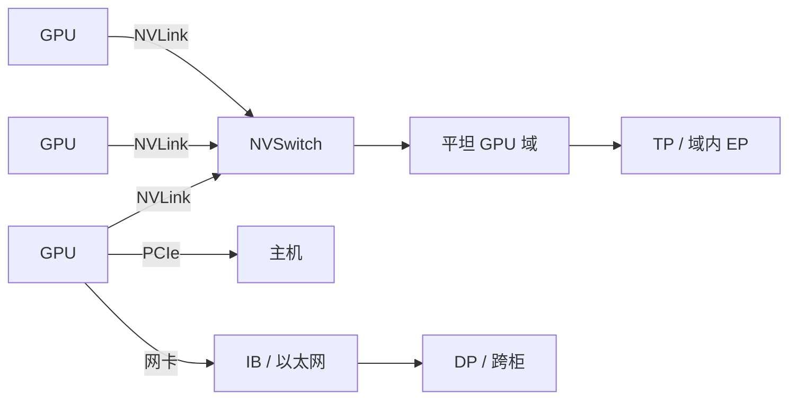

# NVLink / NVSwitch

    
NVLink 是 GPU 之间的专用互连；NVSwitch 把多条 NVLink 收成一个平坦域。没有交换，链路只是点对点；没有链路，交换无物可转。

    <footer>—— NVIDIA NVLink / NVLink Switch 产品说明与各代 GPU 数据手册中的已公布带宽</footer>

PCIe 把 GPU 连到主机，也勉强能做 GPU 间拷贝，但带宽与协议开销按 I/O 总线设计。NVLink 从 Pascal 起做成 GPU–GPU 的高速串行互连，代数加链路、加速率。NVSwitch 从 DGX-2 一类系统起，把多条 NVLink 接到交换芯片，使域内任意两张 GPU 不必经主机或经邻居转发。H100 产品页写第四代 NVLink 900 GB/s；A100 数据手册写第三代 600 GB/s；Blackwell 产品与 GB200 技术博客写第五代每 GPU 1.8 TB/s，约为 PCIe Gen5 的 14 倍。NVL72 再用 NVLink Switch System 把域扩到 72 卡、聚合 130 TB/s。本篇写链路与交换如何分层，以及软件怎样踩中它们。不编造未公开的单 lane 波特率或未发布的下一代带宽。

系统形态见 [NVL72](/llm/gb200-nvl72)；拓扑对比见 [全互连 vs Clos](/llm/all-to-all-vs-clos)；集合通信见 [预训练通信](/llm/pretrain-comm)。

## 问题

只有 NVLink、没有 Switch 时，拓扑往往是 GPU 之间的有限全连接或环：8 卡 HGX 靠底板把每张卡的链路接到其他卡或接到板上的 Switch。链路数不够时，最远一对要转发，All-Reduce 的最慢边拖住一步。NVSwitch 把「转发」收进交换芯片，软件看见的是对称域。问题变成：域有多大、每 GPU 注入带宽多少、域与 PCIe / 网卡如何并存。

公开对照（NVIDIA 手册 / 产品页）：A100 第三代 NVLink 600 GB/s；H100 SXM 900 GB/s，H100 NVL 形态写 600 GB/s，不可混列；Blackwell 第五代 1.8 TB/s。PCIe Gen5 在 H100 产品页为 128 GB/s。NVLink-C2C 把 Grace 与 GPU 相连，技术博客写双向 900 GB/s，那是 CPU–GPU，不是 GPU–GPU 的第五代 1.8 TB/s。三组数字出现在同一 Superchip 上，规划时必须分开。

### 点对点、板上交换、柜级交换

点对点：两张卡直连若干条 NVLink，适合 2 卡桥接。板上 / 节点内 Switch：HGX 8 卡，NVSwitch 让 8 张卡全互连，每卡仍按该代的 600 / 900 / 1800 GB/s 注入。柜级 Switch：NVL72 的 9 个交换托盘，72 张卡一个域，注入仍是每 GPU 1.8 TB/s，聚合写成 130 TB/s。三代都是「链路 + 交换」，变的是链路代数与域的半径。没有柜级 Switch 时，不要假设 16 张卡仍是 NVLink 平坦域——跨节点通常是 InfiniBand，除非某代 DGX 明确提供多节点 NVLink 域，且以那份产品说明为准。

600、900、1800 GB/s 是每 GPU 的双向聚合规格，不是「每条物理 lane 的用户可用吞吐」。把它们除以链路条数去还原单条速率，若手册没写，就不要写进容量规划。

## 方法

软件侧只做一件事：让最密的通信走 NVLink 域，而不是 PCIe 或网卡。NCCL 会查询拓扑；用户要保证进程绑定、`CUDA_VISIBLE_DEVICES`、以及并行网格与域一致。P2P 必须使能，否则拷贝绕道主机。`nvidia-smi topo -m` 上看 NVLink 连接；若两张本应在域内的卡之间显示走 PHB / PIX，先修 PCIe / 绑定，再谈算法。

集合通信在域内应显示 NVLink 传输，`nccl-tests` 的 busbw 应接近该代规格的一个合理分数，而不是接近网卡。达不到时，先查是否混进了跨域 rank、是否关掉了 P2P、是否在 MIG 切片之间强行 P2P。超节点上，18 个计算托盘的 GPU 都要经交换托盘互达；把 NCCL 绑到 Socket 等于绕开 Switch。同一条 All-Reduce 在 NVLink 上是加速器互连档的延迟，落到网卡就变成数据中心 hop；调 TP 度之前用微基准确认路径，比先改模型并行网格更便宜。

### 与 C2C、PCIe 的分工

NVLink GPU–GPU：模型并行、域内 KV。NVLink-C2C：Grace 与 GPU 之间的主机侧批量、统一内存叙事，900 GB/s 双向是官方数。PCIe：插卡、与不在 NVLink 域里的设备、部分网卡。H100 的 128 GB/s PCIe Gen5 相对 900 GB/s NVLink 差一档，所以「经主机转发的 GPU 拷贝」会把 TP 打死。不要用 C2C 的 900 GB/s 去满足 72 卡 All-to-All——那条路不经过 NVSwitch 的 GPU 交叉。

柜外仍是网卡。第五代 NVLink 再快，也不替代 ConnectX 的 Scale-Out。GB300 产品页写每 GPU 800 Gb/s 的 SuperNIC，与 1.8 TB/s 的 NVLink 同时存在：一个出柜，一个留柜。

## 机制

NVLink 是专用 SerDes 与协议，面向 GPU 内存语义的短消息与块传输，走 NVSwitch 时在交换芯片内部交叉。协议细节以 NVIDIA 公开白皮书为准，本文不复述未公开的 flit 格式。对软件，机制体现为：`cudaMemcpyPeer` 与 NCCL 的 NVLink 路径不经过主机 DRAM；延迟按加速器互连计。NVSwitch 提供多端口交叉，使域的直径不随「邻居转发」变长。SHARP 一类网内归约若在某代 NVSwitch 上提供，那是交换侧的计算，不是 GPU Tensor Core；是否启用看该代文档，不要假设每一代 Switch 都有同样的网内归约。

代数上，A100 用更多链路堆出 600 GB/s，H100 再堆到 900 GB/s，Blackwell 把每 GPU 提到 1.8 TB/s。链路数与每条速率的拆分，以该代白皮书为准；产品页通常只给聚合。规划用聚合。域的扩展靠 Switch 端口：节点内几颗 Switch 芯片，机柜内九个托盘，是封装问题，对 CUDA 仍是 device 之间的 P2P。

「14× PCIe Gen5」是 NVIDIA 技术博客对 1.8 TB/s 相对 PCIe Gen5 的对照，用来建立量级，不是某一 kernel 的实测加速比。

### 故障与降级

单条 NVLink 降级，NCCL 可能改走剩余链路或更差路径，busbw 下降。NVSwitch 或交换托盘故障，域的对称性破坏，表现为集体通信超时或部分 rank 极慢。PCIe 故障不影响已建立的 NVLink 域内流量，但会影响主机启动与网卡。监控要把 NVLink 错误计数、Switch 健康与 NCCL 超时分开。维护超节点时按域下线，见 [机柜作为逻辑加速器](/llm/rack-as-accelerator)。

## 边界与工程取舍

不要把 H100 NVL 的 600 GB/s 写进 SXM 集群的规划。不要把 NVLink 聚合当成 HBM 带宽。不要期望 MIG 实例享有完整 GPU 的 NVLink 注入。不要在以太网集群上用「逻辑 NVLink」一类营销词去切 64 路 TP。不要填写 Rubin 或其他未在当前产品页给出聚合带宽的下一代数字。

PCIe 桥接的双卡 NVLink 与 HGX 全互连不是同一拓扑：前者只覆盖一对卡。买了桥不要当 8 卡域。其他厂商的 GPU 互连（Infinity Fabric、华为互连等）名称与带宽以各自文档为准，不能把 1.8 TB/s 抄过去。

出处：NVIDIA A100 数据手册、H100 产品页、GB200 技术博客与 NVL72 产品页、CUDA / NCCL 拓扑行为。单 lane 速率以白皮书已写明者为限，否则只引用聚合规格。

## 小结

- NVLink 是 GPU–GPU 专用互连；已公布聚合：A100 600 GB/s，H100 SXM 900 GB/s，Blackwell 1.8 TB/s。
- NVSwitch 把链路收成平坦域；NVL72 的 Switch System 把域扩到 72 卡、聚合 130 TB/s。
- C2C 900 GB/s 是 Grace–GPU；PCIe Gen5 128 GB/s 是主机 I/O。三者不可加总成一条「GPU 带宽」。
- 最密的集合通信必须落在 NVLink 域；跨柜走网卡。P2P 关闭等于放弃 Switch。
- 规划只用产品页聚合规格，不编造单通道速率；故障按域隔离。
- 出处：NVIDIA 公开规格与 NCCL / CUDA 文档。
