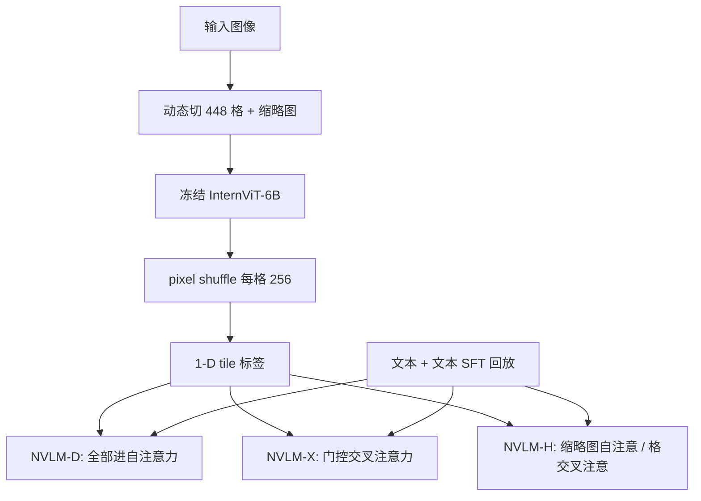

# NVLM

同一套视觉通路上并排放解码器、交叉注意力与混合三种接法；数据质量比堆规模更决定多模态上限，而文本能力要靠显式回放，不能指望冻住骨干就自动保住。

<footer>—— Dai 等，NVLM: Open Frontier-Class Multimodal LLMs，arXiv:2409.11402</footer>

NVIDIA 2024 年 9 月公开 **NVLM 1.0**：默认骨干是 **Qwen2-72B-Instruct** 加冻结的 **InternViT-6B-448px-V1-5**，在同一数据混合上训练三种接法——解码器专用的 **NVLM-D**、门控交叉注意力的 **NVLM-X**、把缩略图走自注意力、高分辨率格走交叉注意力的 **NVLM-H**。主张不是再发明一种注意力核，而是把 LLaVA 式早拼接与 Flamingo 式交叉注意放在同一实验台上比吞吐、OCR 与推理，并声称多模态训练之后纯文本数学与代码相对骨干还涨了约 4.3 分。本篇按 arXiv:2409.11402 写；权重当时放出的是 Hugging Face 上的 **NVLM-D-72B**，不要把 34B 消融骨干或未公开的 X/H 检查点写成同一天下载包。

## 问题

开源多模态在 2024 年秋天的缺口很具体。一边是解码器专用模型把全部视觉 token 铺进语言模型，OCR 与联合推理强，高分辨率一开序列爆炸、训练吞吐掉下去。一边是交叉注意力把图像留在侧路，吞吐友好，却常靠冻结 LLM 来保文本，视觉指令跟不上；Llama 3-V 那条冻骨干的路当时还没放权重。专有模型（GPT-4o）给人的产品印象是**同一张网既能看图又能写代码**，开源对照则经常「视觉榜好看、MMLU / HumanEval 被洗掉」。NVLM 要同时回答三件事：动态高分辨率怎么标格；D 与 X 各自赢在哪、H 能否折中；文本回放要不要做成一等数据，而不是指望门控在推理时关掉交叉层。

### 动态切格缺的是标签，不是再多一个 ViT

视觉通路三家共用：InternViT 以 $448^2$ 为格，最多 **6 块**加一张缩略图，长宽比取 $\{1{:}1,\ldots,6{:}1\}$ 等组合；每格 1024 个 patch，再 **pixel shuffle** 收到 256。这与 [InternVL2](/llm/internvl2) / [AnyRes](/llm/anyres) 同类。论文额外消融的是：无标签拼接会让「2×3 与 3×2、第几格是哪一块」对解码器不可见；二维坐标标签泛化弱；**一维 `<tile_k>`** 插在该格视觉 token 之前，OCR（ChartQA、DocVQA、OCRBench）与部分推理同时最好。标签是给语言模型读的文本符号，不是给 ViT 的二维位置编码。

编码器全程冻结。论文写过：弱 ViT 时联合训 MLP 与视觉塔有收益；换成 InternViT-6B-V1-5 之后增益变薄，于是为简单起见冻住。不要把 NVLM 写成「端到端解开 ViT」的对照实验。

## 方法

NVLM-D：缩略图与各格经 MLP 投到 LLM 宽度，与文本拼成一条，满自注意力。预训练只训随机初始化的 MLP，冻 ViT 与 LLM；SFT 解开 MLP 与 LLM。这是 LLaVA 系，只是视觉前缀因 DHR 变得很长。NVLM-X：去掉 Flamingo / [IDEFICS](/llm/idefics) 的 Perceiver，认为重采样破坏文档空间关系；门控交叉注意力读各格，tile 标签接到文本侧。NVLM-H：缩略图进自注意力，提供全局与跨模态推理；其余格走交叉注意力，换细粒度、少占解码器长度。34B 消融用 Nous-Hermes-2-Yi-34B 加速，主结果仍钉 Qwen2-72B。

### 生产级多模态是数据主张

论文把 GPT-4o 那种「图文任务与纯文本任务都能打」叫做 production-grade multimodality。NVLM-X 可以像 Flamingo 那样冻 LLM、只训交叉层，文本不掉，但视觉指令会让步。他们最终选择：SFT **解开 LLM**，同时混入高质量纯文本，使 D/X/H 在文本数学与代码上相对骨干不降、甚至上升。主张是**数据质量与任务多样性重于堆预训规模**，三套结构共用同一混合，差异才归因于接法。Megatron-Core 训练代码与 D-72B 权重按论文开放；不要假设 X 与 H 的 72B 当时一并上架。

## 机制

解码器专用把视觉与文本放进同一套 $QK^\top$，图表里的数和题目里的符号可以在同一层里对齐，这是 OCR 与「看表写代码」涨点的物理原因；代价是序列按格数线性涨，KV 与训练吞吐按平方变差。交叉注意力把图像当记忆、文本当查询，解码器长度近似纯文本，高分辨率更便宜；空间结构若再经 Perceiver 压扁，文档任务先受伤，故 NVLM-X 选择不压。混合结构把「全局该进联合推理」和「局部细节只需被读」拆开：缩略图短、必须进自注意力；多格长、适合侧路。tile 标签则让模型在切格之后仍能用语言点名「第 k 块」，否则注意力只看见一袋 256 维块。

### 和冻骨干、和 Pixtral 切法不是同一旋钮

Llama 3-V 冻 LLM 保文本，是用容量换不掉点；NVLM 用文本回放换解冻后的指令跟随。不要把「文本不掉」写成同一种机制。[Pixtral](/llm/pixtral-paper) 从零训可变分辨率 ViT 加 RoPE-2D，格的语义在编码器里；NVLM 的格是冻结 448 编码器加语言模型可读的一维标签。MMMU、OCRBench 谁高取决于协议与切格预算，不能只抄论文雷达图的一圈。

论文对照 Llama 3-V 70B/405B 时写明：对方冻骨干故文本不降，NVLM-D-72B 则在解冻后靠文本数据把数学与代码平均准确率抬高约 4.3 分。引用「多模态训练提升纯文本」必须带上「混了文本 SFT」，否则会读成视觉数据本身在教数学。

## 边界与工程取舍

公开主卡是 D-72B，服务应按「最多 6 格 + 缩略图 × 256 token」预留预填充，而不是按平均图尺寸配卡。X/H 的交叉层是额外参数，论文拿 Llama 3-V 405B 加了约 100B 交叉参数当反例：侧路不是免费。编码器 448 固定，极细字仍靠加格，不是原生动态 patch。评测对标 GPT-4o、Llama 3-V、InternVL2，数字是该报告协议，不要和各家博客峰值混行。

不要把 NVLM-H 写成「把 D 和 X 的权重平均」。不要把 Qwen2-72B 的许可与 NVIDIA 放出的检查点许可混成一张卡；再分发前读模型卡。32B 以下的故事不在这篇主文里。测试期若把格数加到训练未见过的组合，1-D 标签仍可能外推，但 InternViT 没见过那种拼接统计，OCR 会先碎。

生产上应把「纯文本请求是否短路视觉塔」做成显式开关：D 路径即使无图也载入 6B ViT，显存账与「骨干是 Qwen2-72B」不是同一句话。切格与 InternVL 同源，服务实现可以共用 tile 选择器，但 `<tile_k>` 的词表与模板必须跟 NVLM，不能复用另一家的 break token。文本回放若在继续训里被拿掉，视觉继续涨、代码掉点会立刻回来——这是解冻 LLM 的对称风险。

出处钉 Dai、Lee、Wang、Yang、Liu、Barker、Rintamaki、Shoeybi、Catanzaro、Ping，*NVLM: Open Frontier-Class Multimodal LLMs*，arXiv:2409.11402。项目页 research.nvidia.com/labs/adlr/NVLM-1。不要给 1.0 编造更新的会议号，也不要把后续未写入该 PDF 的型号倒填进 72B 层表。

## 小结

- NVLM 1.0 在冻结 InternViT-6B 与 Qwen2-72B 上比较 D / X / H 三种融合，主发布权重是解码器专用 72B。
- 动态高分辨率用 448 切格、pixel shuffle 与一维 tile 标签；X 去掉 Perceiver，H 把缩略图与细格分路。
- 生产级多模态靠 SFT 混高质量文本，而不是只冻骨干；论文称文本数学与代码相对骨干上升。
- D 赢在联合推理与 OCR 账单，X 赢在高分辨率吞吐，H 是折中，不是第三套视觉定律。
- 出处：Dai 等，*NVLM: Open Frontier-Class Multimodal LLMs*，arXiv:2409.11402。
