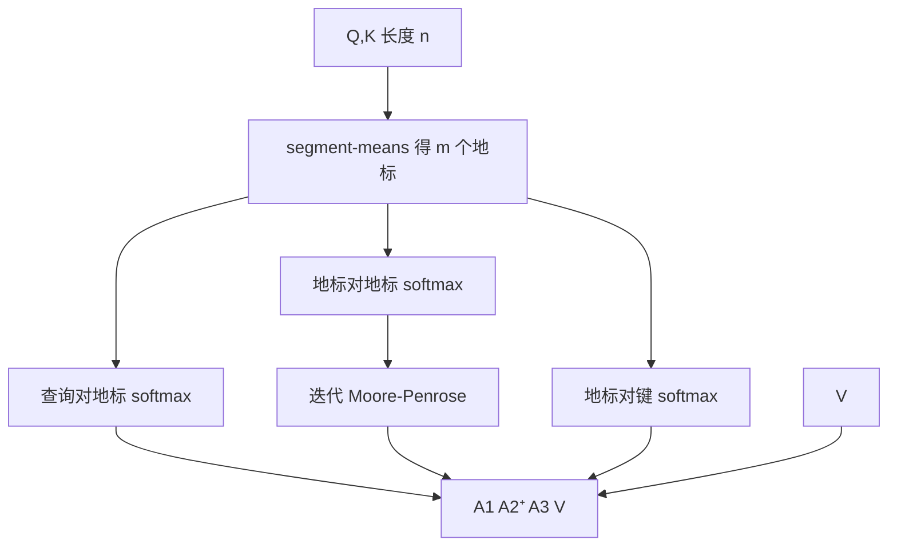

# Nyströmformer 地标

    
用少量地标对已经 softmax 的注意力结构做 Nyström 重构：近似发生在指数化之后的矩阵上，地标质量封顶误差。

    <footer>—— Xiong et al., Nyströmformer: A Nyström-Based Algorithm for Approximating Self-Attention，AAAI 2021</footer>

矩阵 Nyström 方法用若干列重构一个对称半正定核。Xiong、Zeng、You、Liu、Ho、Demmel、Keutzer 与 Stoica 把它接到自注意力：不物化 $n\times n$ 的 $S=\mathrm{softmax}(QK^\top/\sqrt{d})$，而选 $m$ 个地标，用三块较小的 softmax 与伪逆拼出对 $SV$ 的近似。本篇按原文把地标怎么来、重构公式怎么写、伪逆为什么必须稳定化写完。层导读见 [Nyströmformer](/llm/nystromformer)。地标是序列上的代表点（或代表段），不是 Linformer 那种与位置网格解耦的投影行。

## 问题

softmax 矩阵 $A$ 才是进入 $AV$ 的那张行随机表。近似若发生在 softmax 之前（先压键再指数），尖峰可能被混合抹平；若发生在之后，才是在逼近真正的权重。经典 Nyström 要求核矩阵对称 PSD，用指标集 $I$ 写 $K\approx K_{:,I}K_{I,I}^{+}K_{I,:}$。注意力里查询与键来自不同投影，$A$ 甚至不必对称，也不能直接把「选列」理解成选同一个下标集上的 $Q$ 与 $K$。

论文要解决的工程问题是：找出 $m\ll n$ 个地标，使重构只涉及 $n\times m$ 与 $m\times m$ 的块，复杂度落到 $O(nmd)$ 量级，并且伪逆在训练里不 NaN。地标选得差，重构的列空间对不上真实注意力的质量所在；地标选得共线，$m\times m$ 块接近奇异，伪逆爆炸。因此**地标方案是方法的一半**，另一半是稳定的 Moore–Penrose。

### 地标是代表位置，不是随机特征

Performer 的特征是随机方向，与序列下标无对应。Linformer 的 $k$ 个槽是学到的长度混合。Nyström 的 $m$ 个地标绑定在序列上：段均值、均匀下标、或可学习查询。重构试图保住这些代表所张成的核子空间。语义是「用少数代表列去写整张核」，误差界随地标是否覆盖主列空间走，而不是随随机特征的蒙特卡洛方差走。

段均值是低通。段内若只有一根针，平均值代表不了它。这与稀疏选边「展开该块做满注意力」不同：Nyström 没有第二阶段精算，只有一层低秩式重构。针测失败时，应先怀疑地标而不是 softmax 公式。

## 方法

### 段均值地标

原文默认 **segment-means**：把长度 $n$ 切成 $m$ 段，段内对 $Q$ 与 $K$ 分别做平均，得到地标 $\tilde{Q},\tilde{K}\in\mathbb{R}^{m\times d}$。比随机抽 $m$ 个 token 更稳（少一个离散采样噪声），也比可学习地标少一套与内容无关的参数。平均可导，能端到端训练。均匀下标采样是消融项：更尖、更噪。可学习地标离开「代表真实位置」这一解释，更接近一组额外的查询。padding 必须在平均前掩掉，否则地标被 pad 向量拉偏。

### Nyström 重构

有了地标，原文构造三块 softmax（尺度仍是 $\sqrt{d}$）：

$$
A_1=\mathrm{softmax}\Bigl(\frac{Q\tilde{K}^\top}{\sqrt{d}}\Bigr)\in\mathbb{R}^{n\times m},
\quad
A_2=\mathrm{softmax}\Bigl(\frac{\tilde{Q}\tilde{K}^\top}{\sqrt{d}}\Bigr)\in\mathbb{R}^{m\times m},
\quad
A_3=\mathrm{softmax}\Bigl(\frac{\tilde{Q}K^\top}{\sqrt{d}}\Bigr)\in\mathbb{R}^{m\times n}.
$$

近似注意力作用于 $V$ 的形式为 $A_1 A_2^{+} A_3 V$，其中 $A_2^{+}$ 为 Moore–Penrose 伪逆。$A_1$ 是全体查询对地标键的权重，$A_3$ 是地标查询对全体键的权重，$A_2^{+}$ 把两套地标坐标系对齐。大 $n\times n$ 不物化。细节以 AAAI 文本的矩阵排列为准；要点是指数与行归一化出现在小矩阵上。

### 迭代伪逆

直接 `pinv` 对小特征值极敏感，fp16 下易 NaN。原文用迭代法（矩阵多项式逼近伪逆）做稳定化，避免每步显式 SVD，也更适合当时的框架。迭代步数与截断阈值是新超参：步太少，对不正；步太多，放大噪声。地标太共线时，任何伪逆都会难受——应先改善地标，而不是只加阻尼。

## 机制

Nyström 误差在地标张成的子空间上小，在正交补上大。若真实注意力质量集中在少数段（相关段落），段均值可能碰巧抓住；若质量是散落的针，段均值正好把针滤掉。$m$ 增大，段变短，低通变弱，向满注意力靠拢，线性优势变薄。这把 $m$ 钉成精度–费用的同一旋钮：不是「越大越好直到显存满」，而是过了某点不如改回精确核。

### 地标网格与内容无关

段均值绑在位置网格上，不看内容。文档边界跨段、对话轮次切在段中间，地标语义会混。内容自适应地标（按范数、按聚类）更接近 Routing Transformer 的簇中心，但引入离散选择，离开原文默认。原文选盲而稳的网格，是为了先训起来：盲是误差来源，稳是优化能走下去的原因。训练足够久时，模型可能学会避开依赖精确对齐的解，改走 FFN，表面上 GLUE 可接受。下游若需要拷贝罕见标识符，应单独测。

伪逆对尺度敏感。softmax 之后 $A_2$ 的行和为 1，谱仍可能贴零。迭代法里的初始化与阻尼相当于隐式正则。把这一段换成框架自带的 SVD 伪逆，必须同步扫截断阈值，否则「同一公式、不同稳定化」会对不齐论文分数。

### 因果化为什么难

段均值若包含未来 token，泄漏。若每段只用过去，地标集合随 $t$ 变，$A_2^{+}$ 每步更新，生成不再是 $O(md)$ 的简单状态。对 $A_3$ 加下三角掩码并不能拯救已经混入未来的地标。原文主设定是编码器式双向。把 Nyströmformer 写进自回归服务前，必须另写合法的因果地标（例如只在已生成前缀上重算段均值，并接受每步代价），不能只加因果掩码。

## 边界与工程取舍

主场是用线性层替换编码器自注意力，并在 GLUE、Long Range Arena、IMDB 等协议上展示可行性。LRA 上的赢面常常来自「能跑到更长」，应同时给出同 $n$ 的满注意力对照（若显存允许）。它不是 FlashAttention 的竞品：Flash 算精确分块 softmax，Nyström 算近似矩阵。今天短到中等 $n$ 上精确核往往又快又准；Nyström 地标的动机回到 $n$ 大到连精确核也不想付 $n^2$ 语义的场景——而那种场景现在更多被滑窗、检索、分块选择占据。

实现陷阱：地标平均忘记 padding 掩码；伪逆在半精度发散；把 segment-means 误做成不可导的硬池化。$m$ 涨到几百，线性优势消失，数值却更稳。与 Reformer 哈希桶、Routing 的 k-means 相比，段均值最盲、也最不依赖离散分配的 Straight-Through。作者列表跨体系结构与系统，提醒这是「算法近似 + 训得动」；只抄重构公式、不抄地标与稳定伪逆，很容易得到理论上的线性层和一次实际的 NaN。

不要把 $m$ 和 Linformer 的 $k$ 直接换数字。$k$ 是 softmax 之前的槽数；$m$ 是 softmax 之后重构用的代表列。同一数字对应的误差机制不同，扫超参应分开。

### 何时该换地标方案

段内针、极不均匀的文档（极短句与极长段拼接）、以及需要对齐到单个 token 的抽取，段均值先验不足。此时均匀采样可能更尖，内容聚类可能更准，但都要付稳定化与可导性的新代价。原文贡献是给出默认可训的一套地标加伪逆，不是封死地标必须是段均值。

## 小结

- Nyströmformer 用地标对 softmax 注意力做 Nyström 重构，近似在指数化之后。
- 默认地标是 segment-means；$m$ 个代表段决定列空间，也决定误差上限。
- 迭代伪逆是可训条件，不是实现细节；地标共线时先改地标。
- 主场双向编码器；因果生成需要另写合法地标。
- 与 Linformer 预投影、Performer 随机特征分工明确，超参不可直接抄。
- 出处：Xiong et al.，*Nyströmformer: A Nyström-Based Algorithm for Approximating Self-Attention*，AAAI 2021。
