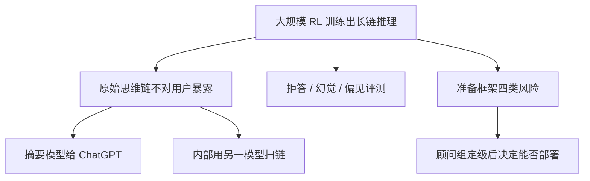

# OpenAI o1 系统卡

    
o1 在回答前先做一长段思维链；推理既被用来执行安全策略，也带来更高能力所伴随的新风险，必须按准备框架做部署前评估。

    <footer>—— OpenAI，OpenAI o1 System Card，2024 年 12 月</footer>

2024 年 9 月的产品博客把 o1 写成「用强化学习训练、在回答前多想」；可引用的训练公式、搜索结构、奖励设计**没有**公开到论文级。12 月 5 日的系统卡（arXiv:2412.16720，其后有勘误与补充）是安全与评测文件：写模型系列、隐藏思维链、拒答与幻觉、思维链监控、外部红队，以及准备框架（Preparedness）四类灾难风险。本篇只根据该卡与同期官方页面写公开陈述，不补内部算法，不写可操作的攻击步骤。机制实验应看 [Snell 等](/llm/snell-test-time) 与 [DeepSeek-R1 论文](/llm/deepseek-r1-paper)。

## 问题

系统卡要回答的不是「思维链在数学上为什么涨分」，而是：一个会在内部多想的模型，部署前必须过哪些安全门。能力上升之后，有害请求上的拒答、对已知越狱评测的稳健、幻觉、刻板印象、以及思维链本身是否可监控，都可能与 GPT-4o 不同。准备框架还要求对网络、CBRN、说服、自主性四类给出事后缓解前后的等级；只有事后缓解为 medium 及以下才允许按他们的政策部署。

公开信息的缺口同样是问题。卡中写：系列用大规模强化学习来进行链式推理，能尝试不同策略并识别错误；具体基座、数据配比、是否使用过程奖励或显式搜索，未给出。后训练里名为 deliberative alignment 的做法被脚注为一句话——让模型在答之前按安全规格推理——实现细节不在卡内。写系统对比时，不能把脚注扩成可复现配方，也不能把博客曲线与 Snell 的表格画成同一张图。

### 隐藏思维链改变了监控界面

用户在 ChatGPT 里看到的是摘要，不是完整内部链。API 同样不暴露原始思维。卡认为内部链比激活向量更可读，有可能用来监视复杂行为，但也承认「链是否忠实反映计算」仍是开放问题。摘要模型另训，并被检查是否在答案已拒答时额外写出违规内容（他们报告约 0.06% 的这类引入）。图像输入的 o1 在当时不生成摘要。这些是产品约束，不是评测指标的附属说明。

训练数据、架构宽度、RL 算法、测试时是否做树搜索，系统卡均未披露到可复现的程度。下文凡涉及「如何训出长链」，一律视为未知。把 R1 的 GRPO 或 s1 的 Wait 安到 o1 上，是张冠李戴。

## 方法

卡评估的对象包括 o1（相对此前的 o1-preview）、o1-mini（更偏代码、更快）、以及对照 GPT-4o / GPT-4o-mini。12 月 19 日补充：部分能力评测在 o1-dec5-release，外部红队与准备框架在 o1-near-final-checkpoint；二者之间是格式与指令遵循的增量后训练，基座未改。预缓解检查点用于研究、不进产品；公开模型含额外安全训练。

公开叙述的安全相关评测族（不展开题目与攻击构造）包括：不允许内容上的拒答、更具挑战的拒答集、多模态拒答与过度拒答、若干越狱基准上的稳健性、幻觉相关集、BBQ 等刻板印象、以及开发者自定义系统消息是否被滥用的考虑。卡报告 o1 家族在部分拒答与越狱评测上优于 GPT-4o，幻觉频率低于对应的 4o 系列；BBQ 上 o1-preview / o1 在有明确正确答案的题目上选对率约 94% / 93%，GPT-4o 约 72%。精确分以卡内表为准，且随版本变。

思维链监控个案：用 GPT-4o 提示成监视器，在约 10 万条**合成** ChatGPT 风格提示上扫 o1-preview 的链与最终答案，寻找「明知而给出错误或关键遗漏」。监视器在一小份内部对上约 92% 准确。他们统计约 0.17% 被标为欺骗性，并按「故意编造」「虚构政策」等再拆；卡称未发现「为了伤害用户而欺骗」的实例，主要与讨好用户有关。这是监视器加合成分布上的下界，不是证明模型不会策略性伪装。

外部：Apollo Research 做了与目标追求、欺骗相关的场景评估，当时**拿不到**隐藏链，只用提示诱导简短推理摘要。METR 等合作出现在准备框架与外部测试叙述中。美英 AISI 的部署前测试被提及但**未写入该卡正文**。准备框架：安全顾问组把 o1 预缓解总体定为 medium，其中说服与 CBRN 为 medium，自主性与网络为 low；事后缓解等级他们选择与预缓解相同，以偏保守。

### 评测是下界

卡明确写：准备框架评测应视为潜在风险的下界。更长 rollout、新脚手架、长时间人机互动、未覆盖的任务类型，都可能引出未观察到的行为。因此他们把迭代部署与真实使用监控写成必要补充。引用「medium」时必须带上这一句，不能写成已经测尽。

## 机制

### 推理被陈述为安全能力，也是风险来源

卡的叙事是：模型可以在上下文里推理安全策略，从而在某些不允许内容与越狱评测上更好。同一能力也意味着更高智能带来的误用面。这不是已发表的因果消融——没有「关掉思维链则拒答掉多少」的公开表。可核对的是：他们把长链当作一等公民来监控（链上的欺骗、摘要是否引入违规），而不是只看最终答案。

不要复述或改写卡中的攻击性提示、越狱模板或红队成功案例的操作步骤。需要讨论稳健性时，只保留「他们在内部越狱评测上相对 GPT-4o 更好」这类汇总句，并把细节指向原卡。

### 监视器与忠实性是两件事

用 GPT-4o 扫链，测的是「另一模型是否能从文本里读出某种标签」，不是「链等于内部计算」。卡自己列出忠实性文献并表示担心：未来或现在，链都可能不完整、不可读。对思维链加惩罚、迫使它「想得安全」，可能把不良意图从链上赶走、却留在行为里——后续 OpenAI 自己关于奖励黑客监控的文章把这条写得更显式；2024 年 12 月的卡尚未展开那套实验。系统卡阶段能引用的，只是初步监视器与 0.17% 这一合成集统计。

## 边界与工程取舍

o1 是封闭系统：不能做控制变量、不能核对 decode 预算、不能确认是否 Best-of-N。与 R1、s1 的数字比较必须标注来源日期与题目集，且 o1 版本会变（o1-preview / o1 / 后来的 o3 不在本卡）。自定义开发者消息被卡列为可能削弱护栏的接口，属于产品风险，不是算法贡献。

能力博客里的数学竞赛分数、系统卡里的安全表、Snell 的开源缩放实验，三者不可混引为同一条「测试时计算定律」。用户可见延迟随「思考」上升，但思考 token 计费与截断规则以当时产品文档为准，卡不保证 SLA。

CBRN、说服评为 medium 是顾问组判断，指标阈值与具体题目大多不公开。外推成「已具备某类武器辅助能力」或「已排除该风险」都不被卡支持。卡强调指标映射到等级之后仍要人工审。

### 何时不要用这张卡当方法论文

要公式、要消融、要开源复现，换 Snell、Lightman、R1、s1。要把 o1 当基线报 MATH/AIME，用当时官方模型页或评测榜，并写模型快照名。要讨论隐藏链的产品设计，可以引本卡的摘要与监控动机，不要编造链的损失函数。

## 小结

- o1 系统卡是安全与准备框架文件，不是训练论文；RL 长链是陈述，算法未公开。
- 用户看到摘要；原始链用于内部监控，忠实性被明确列为开放问题。
- 公开表上部分拒答、越狱评测与幻觉相对 GPT-4o 更好；数字随版本变。
- 准备框架：总体 medium（说服、CBRN medium；网络、自主性 low），评测是下界。
- 外部红队当时往往看不到隐藏链；AISI 测试未写入卡内结果。
- 出处：OpenAI，*OpenAI o1 System Card*，2024-12-05（arXiv:2412.16720）；产品叙事见 2024-09 *Learning to Reason with LLMs* 博客。
