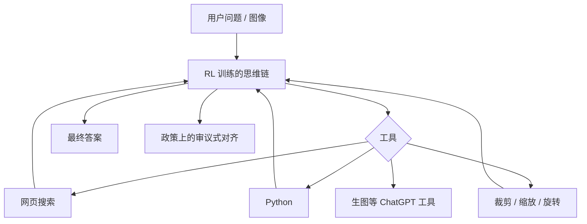

# o3 / o4-mini 公开信息

    
o 系列在思维链上做大规模强化学习；o3 与 o4-mini 第一次能在思维过程中代理式地调用 ChatGPT 里的全部工具，包括对图像做裁剪与变换。

    <footer>—— OpenAI，Introducing OpenAI o3 and o4-mini（2025-04-16）；o3 and o4-mini System Card</footer>

2025 年 4 月 16 日 OpenAI 发布 o3 与 o4-mini，并附系统卡。这是 Preparedness Framework **第 2 版**下的首次上线：跟踪类改为生物/化学、网络安全、AI 自我改进；Safety Advisory Group 认定二者在三类上均未达到 High。模型叙事相对 [GPT-4 报告](/llm/gpt4-report) 与 [4o 系统卡](/llm/gpt4o-card) 的差别是：**先想再答**，并且把工具写进思维链——网页搜索、Python、文件分析、看图、生图、canvas、自动化、文件搜索与记忆。o3 被写成当时最强推理模型；o4-mini 偏成本与速度，AIME 2025 在配 Python 解释器时 pass@1 99.5%（consensus@8 为 100%），o3 同设定 98.4%。专家对照：困难真实任务上 o3 比 o1 少约 20% 的重大错误。本篇只引用发布博文、系统卡与「Thinking with images」研究博文，**不编参数量、不编内部 MCTS 超参**。

## 问题

o1 已经把「更长思维链 + RL」做成产品，但工具大多在答案阶段才调用，视觉也多是看完再写字。o3/o4-mini 要解决的是多面问题：题目需要查新、算一下、放大图里的坐标轴、再决定输出格式。若工具调用不在思维里，模型会在过时知识上空想，或对模糊白板图一次看错就写到底。RL 的目标因此从「写出对的链」扩成「决定何时调用何种工具」。

安全问题同步升级。思维链可以计划工具使用，也就可能计划滥用；自我改进类评测看的是 SWE-bench 与开放研究任务，因为写代码的能力与「自主改进 AI」的预警相关。框架第 2 版不再用第 1 版那套四项拼盘（卡片写明三类跟踪项）。评测必须回答：缓解后是否仍低于 High，而不是只报 AIME。

### 带工具的竞赛分不能和裸模型比

官方自己写：给计算机/解释器会实质降低 AIME 难度；99.5% 展示的是工具利用，不能与无工具模型的分数画在同一栏。SWE-bench 用内部可跑的 **n=477** 子集，256k 最大上下文使 o4-mini 约 +3%、o3 影响 &lt;1%，并排除 23 道跑不了的题。换脚手架或换 500 题全集，SOTA 声明不可比。系统卡还说 SWE-bench 只能说明会做规定好的软件任务，开放式研究助理评测上仍然差，故自我改进未到 High。

o4-mini-high 是同一小模型上愿意多想一会儿的产品档，不是另一份权重的公开技术报告。ChatGPT 的 Plus/Pro/Team 提供 o3、o4-mini、o4-mini-high；免费档可在 Think 里试用 o4-mini。API 走 Chat Completions 与 Responses。后续 o3-pro（2025-06-10）是「想更久」的 o3，细节见当时 release notes，不要倒填进 4 月 16 日卡片。

## 方法

训练：在思维链上大规模 RL；并 RL 教工具的时机与组合。推理：通常一分钟内给出带格式的答案，但仍随题加长。视觉：图像进入思维，可调用裁剪、缩放、旋转等，再继续推理——研究博文称为 thinking with images。这与 4o 的「看见」不同：4o 是多模态前向；o3 是在链里对图像做工具式操作。

系统卡强调 **deliberative alignment**：模型在上下文里对安全政策做推理，再决定是否回答。这把拒答从「短分类器」部分换成「会想的政策遵循」，也带来新失败模式——思维可能合理化越狱。红队覆盖生物、网络、自我改进，以及工具链上的注入与错误工具循环。

发布同时的 Codex CLI 是本地终端代理实验，开源，可把截图与草图交给推理模型并访问本地代码。它是产品接口，不是 o3 架构说明。

### 测试时计算写进 RL 扩展

博文称：预训练里「更多计算 → 更好」的趋势，在 o3 的 RL 与推理期「想更久」上再次出现；再加一个数量级的训练计算与推理期思考，分数仍升。同等延迟与成本下 o3 已强于 o1；再拉长思考，曲线继续爬。这是公开的定性扩展声明，没有给出 RL 的 KL 系数、是否 MCTS、是否过程奖励。与 [TS-LLM](/llm/alphazero-lm) 的显式树不同，o 系列内部搜索未公开到可复现超参——机制专文已警告不要补一篇不存在的树论文。

## 机制

工具在链内，意味着 KV 里既有自然语言思考，也有工具返回。错误感知（看错图）可以在工具用法正确时仍得到错答案；过长链会重复工具调用。研究博文把这些写成局限。代理式组合让模型能先搜再算再画，也让失败变成多步复合：搜到错页、Python 用错库、裁错图。计费与延迟按思维 token + 工具墙钟走，SLA 若按「最终答案 256 token」切，会截断思考。

准备度第 2 版把「说服」等项从跟踪清单里拿掉（以卡片三类为准），不代表说服力消失，只代表上线门槛改了。生物与网络未到 High，仍有专项缓解。自我改进：SWE-bench 强、开放任务弱，用来区分「会修 issue」与「能当自主研究员」。

公开材料没有参数量、没有训练 token、没有确认或否认 MCTS。可写的是：RL on CoT、工具在思维中、图像工具、审议式对齐、准备度三类均低于 High。

### 与 GPT-4.1 的分工

[GPT-4.1](/llm/gpt41-45) 是短答 API 模型，强在指令与 1M 上下文；o3 是推理模型，强在多步与工具。视觉基准上第三方发现 4.1 在部分感知任务更好、o3 在需要「边想边看」的题更好，二者不必争同一个「多模态第一」。选模型看是否需要显式长思考与代理工具，而不是看代数编号。

## 边界与工程取舍

不要把 AIME 99.5% 写成「数学已解决」。不要把系统卡的低于 High 写成「无风险」。思维链是否对用户完全可见，以产品当时设置为准；API 的 reasoning 摘要与完整链不是一回事。组织验证、价格、上下文上限以 API 文档为准，博文会过时。幻觉、自信错误在长链上可能更像论证，人更难发现——这是推理模型的已知产品风险，卡片与博客均要求高风险场景保持人审。

o3 与 o4-mini 的相对强弱随题型变：官方把 o4-mini 写成 AIME 上最好的被测档之一（在给解释器时），把 o3 写成综合与视觉、真实任务错误率的领先档。部署应按延迟预算与工具权限分开评估，而不是只看型号名。

出处：OpenAI，*Introducing OpenAI o3 and o4-mini*，2025-04-16；*o3 and o4-mini System Card*；*Thinking with images* 研究博文。参数量未公开。

## 小结

- o3 / o4-mini：思维链 RL + 链内全工具；图像可进入思维并被变换。
- 准备度框架 v2：生物/化学、网络、自我改进均低于 High。
- 带 Python 的 AIME 2025 接近饱和，须与无工具评测分列；SWE-bench 用 477 题子集。
- 内部是否树搜索未公开；不要编 MCTS 超参或参数量。
- 出处：上述 OpenAI 博文与系统卡。
