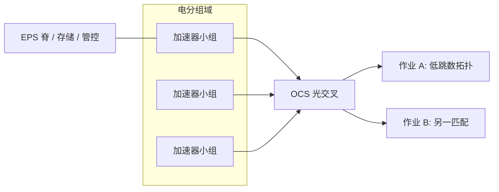

# OCS 光交换 AI 网络

光电路交换把光纤当成可重配的交叉矩阵：一次接通是一条透明光路，不解析包、不按分组排队，适合长时间、可预测的机器学习集合通信。

<footer>—— Google，Lightwave Fabrics，SIGCOMM 2023：大规模 OCS 织物用于数据中心与 ML；TPU v4 Superpod 上相对静态织物最高约 3.3× 的模型相关性能、约 3× 可用度</footer>

电分组交换（EPS）按包转发、按队列消拥塞，是数据中心的默认织物。机器学习训练的通信却往往是：同一作业里，几百到几千加速器按固定并行网格反复做 All-Reduce 或点到点流水，模式稳定、流量大、持续分钟到小时。Optical Circuit Switch（OCS）用 MEMS 微镜或其他光学交叉，把入纤接到出纤，中间没有包缓冲。Google 在 SIGCOMM 2023 的 *Lightwave Fabrics* 里报告了自研 Palomar OCS 与光模块在生产数据中心和 ML 集群中的部署，并给出 4096 颗 TPU v4、超过 1 ExaFLOP 的 Superpod 数字：光织物不到系统成本的 6%，却带来最高约 3 倍的系统可用度，以及相对静态织物、随模型而异、最高约 3.3 倍的性能。本篇写 OCS 作为 AI 织物的一层：它补什么、不替代什么。不编造未公开的 MEMS 端口表或某云的光纤芯数。

柜内 GPU 互连仍是 [NVLink](/llm/nvlink) 一类电域；OCS 出现在柜间或 Pod 间、需要重配拓扑的那一跳。

## 问题

Clos 电网络用多级交换机把任意一对主机连起来，过订阅比决定成本。AI 作业若在一段时间内只需要「这 1024 张加速器之间满带宽、低跳数」，多级 Clos 仍按最坏任意到任意计费，且包交换的队列延迟会进集合通信的尾部。静态光纤 mesh 可以把某一种拓扑焊死，换作业就要改线。OCS 要的是：在秒到毫秒量级（具体切换时间依器件，Google 文中强调可重配、速率无关、双向光纤上的高带宽）把物理拓扑改成当前作业的通信图，光路一旦接通，延迟接近光纤传播，带宽等于收发器速率，与分组大小无关。

OCS 的对手是它的电路语义：未接通的对之间没有包可达，除非另有一层 EPS。所以生产形态几乎都是**混合织物**：叶子或 Pod 内用电分组，Pod 之间或维度之间用 OCS 提供可重配的直连。Google TPU v4 把加速器收成 Cube / Superpod，用 OCS 做环绕与故障绕行，而不是让每一跳都经过电脊。后续公开材料（包括 OCP 关于 AI 光电路交换的白皮书）把同类思想写到 GPU 集群：作业到达时，按并行策略把 OCS 配成环面、全图或其它低跳数图。没有调度器与作业信息，OCS 只是一台慢速配线架。

### 电路交换不是光模块换皮

光模块把电信号变成光，仍可以打进以太网或 InfiniBand 交换机，那是 EPS 的介质。OCS 的交换元件在光域做端口交叉，不读包头。速率无关：换 400G 为 800G 模块，交叉矩阵不用跟着换 SerDes 代际——这是 Google 强调的成本与演进点。代价是：重配期间链路中断；小消息、突发、以及真正任意到任意的短流，OCS 单独扛不住。AI 训练的长集合、推理 PD 分离里的稳定 KV 通道，才是电路语义的主场。

*Lightwave Fabrics*（SIGCOMM 2023）把 Palomar 写成因商用 MEMS OCS 在规模、可靠与运维集成上不够而自研的结果。引用 3× 可用度与 3.3× 性能时必须带上：对象是该文的 TPU v4 Superpod 与静态织物对照，模型相关，不是 GPU Clos 集群的普遍加速比。

## 方法

把加速器先收成电域小组（节点内 NVLink、柜内交换、或 TPU Cube），小组上联的光纤进 OCS。控制面根据作业的并行网格——数据并行、流水线、张量/专家并行——计算一张匹配：哪些小组之间需要满带宽边。OCS 配好后，NCCL / 厂商集合库看见的是一组稳定的高带宽对等体，而不是每次 All-Reduce 都在拥塞的脊链路上排队。作业结束或故障时再配。Google 文中还强调 WDM 与环形器，使单纤双向高带宽，提高光纤利用率。

故障是 OCS 的第二用途。静态织物上坏一条脊，可能切掉一个切片。OCS 可以把受影响的立方绕到备用端口，Google 把可用度收益写到最高约 3 倍——含义是减少因互连故障导致的整作业不可用，而不是光器件永不失效。运维要把 OCS 纳入与交换机同等的监控：镜像位置、插入损耗、光纤脏污，故障半径是「当前接通的那些作业」，不是单台 ToR。

与 InfiniBand / RoCE 的关系：许多 GPU 集群仍用 IB 做 Scale-Out，OCS 可以插在 IB 交换机之间当可重配的核心，或直接在网卡光纤上做直连 mesh。两种都出现在公开讨论里。不要把 OCS 写成「取代 NCCL」：集合算法仍在跑，变的是物理边是否存在、跳数是多少。SHARP 一类网内归约发生在电交换机上，见 [NVLS / SHARP](/llm/nvshmem-nvls)；OCS 透明，不在光域做 add。

### 何时重配、何时保持

重配的时间尺度必须短于作业步时间才有意义，或至少短于作业排队时间（为下一个作业配拓扑）。训练一个数小时的作业，启动时配一次、故障时再配，是已验证路径。若每步都想改拓扑，MEMS 的毫秒级切换和光功率恢复会把步进打死——除非器件与调度明确按这个目标设计。MoE 的 All-to-All 若在大域上持续满带宽，OCS 配成该域内的 dense 图有用；若专家并行的对集每步都变，电路交换跟不上，应把那一层留在电分组或 NVLink 域。推理在线服务的请求到达是随机的，OCS 更适合「预置若干 PD 分离通道」，而不是按每个请求改光纤。

## 机制

MEMS OCS 用微镜把入射光打到目标端口，插入损耗、端口数（radix）、切换时间、以及是否阻塞交换，决定能做多大的织物。Google 强调与自研光模块、同步织物共设计，以及高可用。硅光无机械交叉是后一代路线，公开产品仍在演进，本篇不把某创业公司的端口密度写成生产事实。光学上，电路一旦建立，传播延迟约 $5\,\mu\mathrm{s/km}$ 量级的光纤时延，没有商店-and-forward；这对集合通信的尾延迟是质变，前提是电路已建立。

控制面是软件定义网络伸到第 1 层：拓扑成为调度器的资源。需要知道作业的集合模式（Megatron 三维并行、All-to-All 推荐模型等），否则只能配通用 Clos，OCS 的价值消失。安全与多租户：光路是独占的，隔离性好；错误配置会把租户 A 的光纤接到租户 B，管理面认证与审计必须按第 1 层来做，而不是只做 VLAN。

OCP *Optical Circuit Switching for AI* 一类产业白皮书把 Google TPU 立方、可分子拓扑与故障绕行写成可对照的架构模式，并讨论 GPU 集群上的混合 EPS+OCS。引用时区分：已发表的 TPU 生产经验，与面向 GPU 的提案。

### 和柜内光、CPO 的边界

机柜内短距正在走向铜缆或共封装光学（CPO），那是模块位置与功耗的故事，交换仍可以是电的。OCS 是**拓扑可重配**的光交叉，对象是柜间、Pod 间、数据中心跨排。把 CPO 写成 OCS，会把「少一个光模块」和「能改图」混成一件事。跨柜 UB 光模块把超节点收成逻辑节点，见光模块专文，那是固定拓扑的延长线；OCS 是延长线还可以换接线。

## 边界与工程取舍

不要在小规模、通信已被 NVLink 域吃掉的 8 卡训练上为 OCS 做成本辩护。不要用 3.3× 去乘自己的 GPU 集群规划。不要假设 OCS 能做拥塞控制或自适应路由——没有包，就没有这些机制。不要在重配窗口内运行不能容忍链路闪断的集合库。光纤清洁与备件是新的值班面；光交换的故障模式是「错连」和「损耗超标」，电交换机的经验不能完全覆盖。

多租户云上，OCS 匹配与虚拟网络编排必须一体，否则租户看见的 IB 拓扑与物理光路不一致，NCCL 调优会失效。存储与管控平面应留在 EPS 上，避免训练织物重配时把检查点路径一起拆掉。

出处：Leon Poutievski 等（Google），*Lightwave Fabrics: At-Scale Optical Circuit Switching for Datacenter and Machine Learning Systems*，SIGCOMM 2023（Palomar、4096 TPU v4、成本低于 6%、可用度与性能对照）。OCP 关于 AI OCS 的公开白皮书作产业对照。未写入这些材料的端口级 MEMS 规格不写。

## 小结

- OCS 在光域做端口交叉，提供速率无关、低排队的电路，适合稳定、长寿命的 ML 通信图。
- 生产形态是 EPS + OCS 混合；调度器必须按作业并行网格配拓扑。
- Google Lightwave Fabrics 给出 TPU v4 Superpod 上的公开收益，数字绑定该文对照，不可当 GPU Clos 的普遍倍数。
- OCS 不做网内归约，不替代 NVLink 柜内域，也不替代存储以太网。
- 重配时间、故障绕行和光纤运维是工程主体。
- 出处：SIGCOMM 2023 Lightwave Fabrics；OCP OCS 公开论述。
