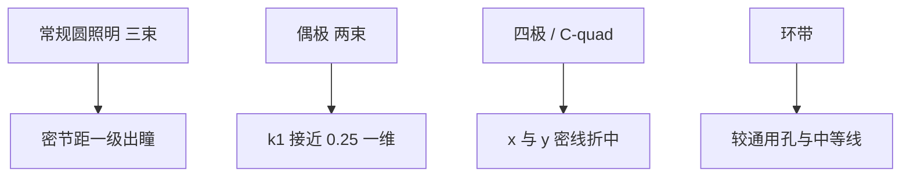

# 离轴照明与偶极/四极光瞳

$k_1$ 囊括除波长与 $\mathrm{NA}$ 以外、一切能改善分辨率的手段。离轴照明与相移掩模属于这类分辨率增强，而不是新的光源。

<footer>—— 归纳自 Chris A. Mack 关于降低 $k_1$ 与 RET 的讲义表述</footer>

投影光刻的照明不是均匀灌满光瞳那么简单。部分相干因子 $\sigma$ 描述照明光瞳相对投影 $\mathrm{NA}$ 的填充半径。常规圆照明让零级与正负一级衍射都进光瞳，形成三束干涉，离焦时对比度掉得快。离轴照明（OAI）把能量放到光瞳环或极上，使密线条主要走「零级 + 一个一级」的两束成像，对比度与焦深在特定节距上变好，$k_1$ 可以往 0.3 甚至接近 0.25 的物理下限推。偶极与四极（quad / C-quad）是这一思想的具体光瞳图案。本篇讲光瞳如何选节距与方向，以及它为什么不能当通用开关。

## 问题

密线栅的衍射级间距是 $\lambda/p$（在适当的归一化下）。$p$ 变小，一级移向光瞳边缘，常规照明下很快有一级掉出光瞳，空中像只剩零级，调制为零。把照明移到轴外，零级落在光瞳一侧，一级落在对侧，两者都可以进 $\mathrm{NA}$，相当于用照明角给衍射级「预偏置」。代价是：这一偏置只对某一节距窗口、某一取向最优。水平密线与垂直密线要的偶极方向相反；二维接触孔更吃四极或环带，而不是最极端的偶极。

问题因此是在光瞳上分配能量：为哪一类图形买对比度，牺牲哪一类图形的工艺窗。光源–掩模协同优化（SMO）把这句话做成算法；本篇停在照明几何。

### 部分相干 σ 不是「越相干越好」

$\sigma=0$ 是相干平面波，某些稀疏图形可以极高对比，但密图形与旁瓣行为差，而且光源亮度利用差。$\sigma$ 接近 1 是大填充、偏非相干，工艺窗形状另一类。OAI 用环形、四极、偶极这些中空或离散填充，而不是简单把 $\sigma$ 拧到 0。Mack 把 RET 与胶、OPC 并列进 $k_1$，就是反对只拧一个标量 $\sigma$。

偶极照明对「沿着偶极连线方向」的密线栅友好，对正交方向不友好。一张只含单一取向栅极的层可以用强偶极；金属层两向都有密线，就要四极、环带或 SMO 自由光瞳，不能照搬栅极光瞳。

## 方法

环形照明：能量在 $\sigma_\mathrm{in}$–$\sigma_\mathrm{out}$ 的环上，对中等密图形与孔类较通用。四极 / C-quad：四个极放在与 x/y 密线栅匹配的方位，是浸没机产品页常用的二维模式；ASML NXT:2050i 公开写生产分辨率 C-quad 约 40 nm、偶极约 38 nm（半节距量级）。偶极：两个极，把几乎全部能量给一个取向的两束成像，一维极限最激进，$k_1$ 最接近 0.25。自由光瞳（自由形状照明）由微镜阵列生成，供 SMO 使用，仍是 OAI 家族，不是新波长。

掩模侧要配合：散射条（SRAF）与 OPC 按光瞳重新解。换照明等于换空中像核，旧 OPC 不能沿用。剂量与扫描速度也会变：偶极挡住大部分光瞳，晶圆面光强下降，可能拉长曝光时间、吃产能。

### 两束成像与 k₁ 下限

两束干涉的空间频率由两束在光瞳中的间距决定，焦深对离焦引入的相位更宽容（两束光程差对称）。三束时零级与正负一级的离焦相位使对比度振荡。这是 OAI 改善 DOF 的机制。$k_1=0.25$ 对应投影光瞳刚好容纳零级与一个一级、再密则一级出瞳。Mack 称之为单次图形的物理下限。产线实用 $k_1$ 略高于此（讲义中曾举约 0.28 量级的「当今最佳」），因为要留窗给 CD、套刻与胶。

## 机制

空中像是掩模频谱与光瞳函数的乘积再逆变换。OAI 改变的是照明每个角度对应的「有效入射」，从而改变哪些衍射级被传递、它们的相对振幅与偏振。高 $\mathrm{NA}$ [浸没](/llm/arf-immersion) 下矢量效应强烈，偶极方向还与偏振联立优化（切向偏振等），标量模型会高估对比度。

对接触孔，四极可以同时照顾 x 与 y 的最近邻，但对角方向的旁瓣与 SRAF 冲突要单独管。对切线（cut mask），照明可能为稀疏图形优化，与鳍的偶极完全不同。一层一个光瞳；多层不要共用「厂里那个偶极」。

离轴照明不减小套刻误差。它甚至可能让套刻更敏感：两束成像的图形位置随焦点与像差移动的方式与三束不同。套刻预算仍要单独做。

### 与相移掩模的分工

[PSM](/llm/phase-shift-mask) 改的是掩模衍射级的相位与零级强度；OAI 改的是哪些级进入光瞳。二者都降 $k_1$，常叠加：衰减相移 + 环带或四极是 DUV 接触孔的经典组合。强偶极 + 二进制铬掩模也可以走得很低 $k_1$，但只服务一维。不要把「用了浸没」当成已经用了 OAI：浸没改 $n\sin\theta$，OAI 改光瞳填充，公式里两项独立。

## 边界与工程取舍

OAI 把工艺窗变成节距与取向的函数。逻辑金属的多节距、多取向是其天敌，要用较温和的光瞳加 OPC，或把布局限制成严格的一维栅再切。存储器阵列天然适合偶极。光源形状还影响单机匹配：两台扫描机的光瞳误差会变成 CD 与套刻指纹差异。

ASML 公开分辨率数字必须与照明模式绑定。用偶极的 38 nm 去承诺二维 SRAM，是范畴错误。本篇不把 $k_1$ 或纳米半节距换算成任何节点良率。计算光刻后续篇（SMO、ILT）在自由光瞳上继续走，物理对象仍是本篇的衍射级选择。

$\sigma$ 的定义是照明 $\mathrm{NA}$ 与投影 $\mathrm{NA}$ 之比。浸没之后投影 $\mathrm{NA}=1.35$，同一 $\sigma$ 对应的物方角度与干式不同。抄旧干式的 $\sigma$ 食谱到浸没上，光瞳几何不对。

## 小结

- 离轴照明把能量放在光瞳环或极上，让密图形走两束成像，从而降低可用 $k_1$。
- 偶极服务单一取向的最密线；四极/C-quad 折中 x/y；环带更通用。
- 单次曝光 $k_1$ 物理下限为 0.25；实用值略高以保留工艺窗。
- 换光瞳必须重做 OPC；偶极会降低光通量、影响产能。
- OAI 不替代浸没，也不替代套刻控制。
- 引用分辨率时必须写明照明模式。
- 出处：Mack, *Fundamental Principles of Optical Lithography* 及 RET/$k_1$ 讲义；ASML NXT 产品页对 dipole 与 C-quad 分辨率的公开数值。
