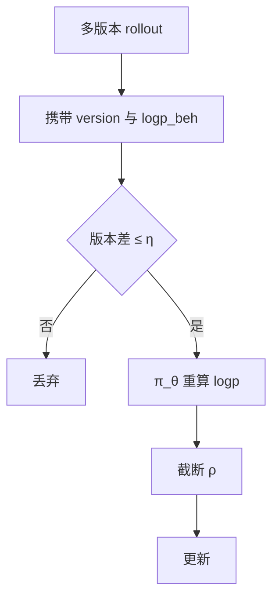

# 离策略校正

异步生成让一个 batch 混着多个权重版本；校正的是期望算子，不是把 off-policy 假装成 on-policy。

<footer>—— 对照 IMPALA / V-trace；AReaL、OpenRLHF、verl 对 staleness 与版本号的工程约束</footer>

[上一课](/llm/truncated-importance-sampling)给出截断比率。缺口是：**系统已经在混合版本时，公式要定义「校正到哪一个 $\pi$」，以及不能校正时就丢弃。** 已有异步架构课写时序；本课写算法侧：staleness 上限、重算 logprob、partial rollout。接到 [PPO](/llm/ppo-llm) / [GRPO](/llm/grpo) 的仍是同一套优势，只是期望的采样分布变了。

## 问题

同步栅栏：$\pi_{\mathrm{beh}}=\pi_{\mathrm{old}}$，IS 近似 1，PPO epoch 造成轻度 off-policy。一步重叠：差一个版本。完全异步：batch 内 $\pi_{\mathrm{beh}}$ 不同，甚至一条序列中途换权重。未校正就把梯度当 on-policy，优势的期望不对，长链上表现为莫名崩溃。校正要：每条轨迹带 `weight_version`，用当前 learner 的 $\pi_\theta$ 重前向得 $\log\pi_\theta$，与存储的 $\log\pi_{\mathrm{beh}}$ 比。

不能无限校正。版本差过大时 $\rho$ 几乎全被截断，有效样本为零，应丢弃或限制 $\eta$（AReaL 的 staleness）。Partial rollout 接新权重续写，KV 与 logprob 必须重算前缀，否则前半段是旧策略、后半段是新策略，一条轨迹两个行为分布。

### 校正不等于可以无限复用

截断 IS 降低方差，不把旧数据变成新 on-policy 数据。复用次数仍应限制。PPO 的 epoch 上限与异步 staleness 是同一类旋钮：用过期轨迹的预算。

RM / 校验器通常只依赖 $y$ 文本，不依赖生成它的版本。要校正的是策略梯度项，不是奖励本身。奖励过期是另一回事（RM 未迭代）。

## 方法

协议字段：`prompt_id`、`y`、`logp_beh`、`version_beh`、`truncated`。Learner step $i$ 只接受 $i-v\le\eta$ 的样本。更新前重算 $\log\pi_\theta$，得逐步 $\rho_t$，截断后进目标。GRPO 的组：同一 prompt 的 $G$ 条最好同版本，否则组内 $r$ 可比、$\rho$ 不可比，相对优势与 IS 拧在一起。做不到则拆组或降级为 RLOO 单条基线。

价值函数若用，应对当前 $\pi_\theta$ 重算 $V$，不要用生成时的 $V$。GAE 的 $\delta$ 对过期 $V$ 极敏感。

## 机制

V-trace 一类方法把截断后的 $\rho$ 沿轨迹回传，修正 $V$ 的 off-policy 偏差。LLM 上常简化为：重算 logprob + PPO clip + 丢过期样本。简化成立的前提是 $\eta$ 小。$\eta$ 大时，简化不够，应减小异步程度，而不是加大 $c$ 假装校正。

生成引擎量化 / 编译图与训练精度不一致，会造成「假 off-policy」：版本相同，logprob 仍系统偏。见后课训练-推理精度不匹配。

## 边界与工程取舍

小规模同步训练不必上本课全套，避免过度设计。推理模型长链才被迫异步。组相对方法对「同组同版本」更苛刻。下一课 rollout 引擎与权重同步，把 version 这条边落到 NCCL / 广播实现，公式在本课已经定完。

## 小结

- 混合版本 batch 必须带行为 logprob 与版本号，重算 $\pi_\theta$ 再截断 IS。
- staleness 上限 $\eta$：校正不动就丢弃。
- GRPO 组内应同版本；partial rollout 要重算前缀。
- 奖励通常不校正；过期的是策略项。
- 出处：Espeholt 等 IMPALA / V-trace；Fu 等 AReaL；Sheng 等 HybridFlow；OpenRLHF / verl 的版本化实践。
