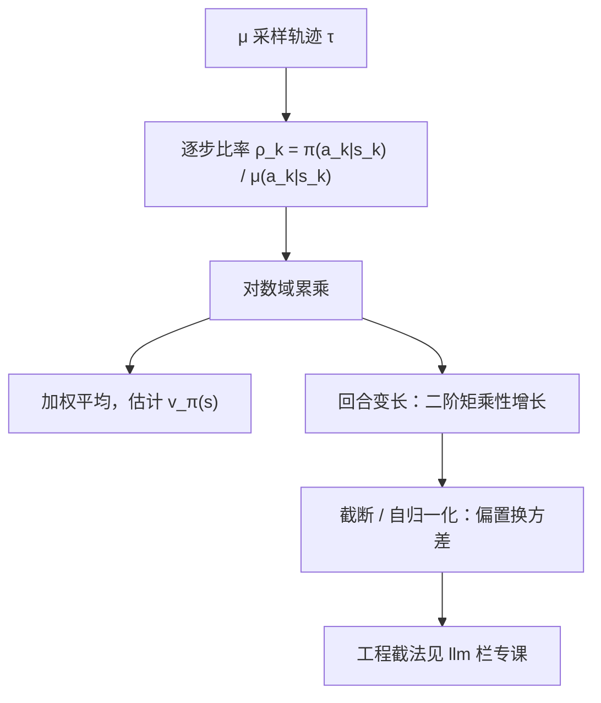

# 离策略与重要性采样

拿别人的轨迹评自己的策略，概率比率的连乘就是汇率；汇率连乘一千次，方差先于偏差爆炸。

<footer>—— 据 Sutton & Barto, 2018, §5.5；Precup, Sutton &amp; Singh, ICML 2000 整理</footer>

[上一课](/llm/sarsa-q-learning)的离策略只到目标为止：Q 学习对 max 自举，数据仍由自己的行为策略生成。真正的离策略数据更彻底——重放的旧轨迹、人类演示、以及 LLM 训练里旧版本模型产出的 rollout——行为策略 $\mu$ 与被评估的策略 $\pi$ 不是同一个。缺口：不同分布下的直接平均估的是 $v_\mu$，不是 $v_\pi$。本课写重要性采样的校正，并钉住它的病根：方差随回合长度乘性增长。LLM 栏已有工程课[截断重要性采样](/llm/truncated-importance-sampling)回答「截多少、截谁」；本课给它的统计骨架。

## 问题

数据按 $\mu$ 采样，想要 $v_\pi$。轨迹在两个策略下的似然不同，校正系数是似然比

$$\rho(\tau)=\frac{\Pr_\pi(\tau)}{\Pr_\mu(\tau)}=\prod_{k}\frac{\pi(a_k\mid s_k)}{\mu(a_k\mid s_k)} .$$

马尔可夫性让转移概率逐项相消，只剩动作比率——状态分布的偏移，全部由「这条动作序列在 $\pi$ 下本来就常见还是罕见」承担。校正之后做加权平均才是 $v_\pi$ 的估计；不加权，平均里混着 $\mu$ 的访问频率，策略一换答案就错。

## 方法

普通重要性采样：$v_\pi(s)\approx\frac{1}{N}\sum_i \rho^{(i)}G^{(i)}$，其中 $\rho^{(i)}$ 从 $s$ 首次出现累乘到回合末。加权（自归一化）版本 $\sum_i\rho^{(i)}G^{(i)}\big/\sum_i\rho^{(i)}$ 有偏，但把比率的共同尺度消掉，方差通常更小。逐步（per-decision）版本（Precup 等 2000）把比率拆开，每个时步只用截至该步的累乘比率与对应奖励配对，方差进一步降。实现的底线只有一条：连乘必须搬到对数域做加法，回指数前再截断。

## 机制

方差病根在二阶矩。每步比率的期望是 1，二阶矩不是：$\mathbb{E}[\rho_k^2]\ge\big(\mathbb{E}[\rho_k]\big)^2=1$，而连乘把二阶矩也连乘——估计方差随回合长度乘性增长。数字口径：每步比率若只是 1.01，$1.01^{1000}\approx2.1\times10^4$；若每步 0.99，一千步后只剩 $4\times10^{-5}$，有效样本条数坍缩到近零。这不是实现瑕疵，是估计量本身的性质：无偏与低方差在长回合上不可兼得，只能以偏置换方差。

半精度浮点的上界约 $6.5\times10^4$：一千步、每步 1.01 的连乘已贴近上溢，每步 1.02 就冲到 $4\times10^8$。对数域累加不是优化，是正确性。

与 Q 学习的分工要说清：Q 学习绕开重要性采样，是因为它不估 $v_\pi$，直接对 $q_*$ 自举；只要任务是「评估一个具体策略」或「校正控制方法的训练分布」，这类校正绕不开。LLM 的对照：一条几千 token 的完成，序列级比率是几千个 token 比率的连乘，不截断则方差在回合长度上指数回来；截断阈值、行为策略 logprob 的缓存、以及「截校正权重还是截近端代理」的取舍，[截断重要性采样](/llm/truncated-importance-sampling)已按现场写成工程课，本课负责说明那些工程为何不是可选项。

## 边界

支撑条件不可协商：若某动作 $\pi(a\mid s)\gt0$ 而 $\mu(a\mid s)=0$，比率恒零，该区域的 $v_\pi$ 原则上不可估——没采过的东西没有数据，这是可辨识性而非技术细节。加权版本与逐步版本各自牺牲一点无偏性或一致性换方差，报结果时要写清用的是哪一种。马尔可夫性承担了转移项相消：部分可观测或状态定义不一致时，相消不成立，校正自带缺口。最后，回合越长、离得越远，纯重要性采样越像理论工具；活下来的是它的截断与近似变体——这句就是通往 LLM 栏工程课的桥。

## 小结

- 离策略评估靠轨迹似然比校正分布差；马尔可夫性使转移项相消，只剩动作比率。
- 普通 IS 无偏而方差最差；加权与逐步版本以偏置换方差。
- 方差随回合长度乘性增长；$\mu$ 覆盖 $\pi$ 的支撑是可辨识前提。
- 长序列上对数域累加与截断是正确性要求，不是优化偏好。
- LLM 栏的工程课承接本课：阈值、缓存与截法的现场取舍。
- 出处：Sutton & Barto 2018 §5.5；Precup, Sutton & Singh, ICML 2000。
