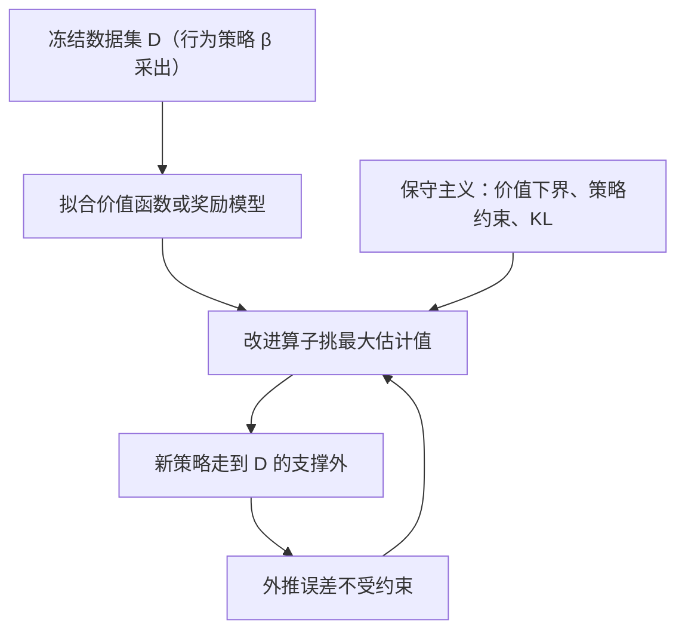
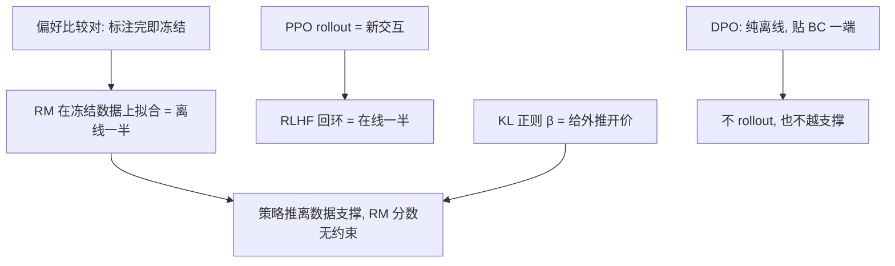

# 离线 RL 与分布偏移

数据集把行为策略走过的路钉死；离线 RL 的全部困难在于：没走过的路上，价值函数说什么都不作数。

<footer>—— 据 Levine 等, Offline Reinforcement Learning: Tutorial, Review, and Perspectives, 2020；Sutton 与 Barto 2018 整理</footer>

[上一课](/llm/contextual-bandits)把上下文 bandit 钉成最小 MDP：动作无长期后果时，课程的时间维机制依次熄火。本课加上第二个约束——不许再和环境交互。此前每个算法都默认数据是自己采的：蒙特卡洛等自己的回合（[蒙特卡洛策略评估](/llm/monte-carlo-evaluation)），TD 每步用自己的转移，Q 学习还要探索补覆盖。现在只有一份冻结的数据集，缺口是：从别人的经验里，能否学出比采集者更好的策略。

## 问题

设数据集 $\mathcal{D}$ 由行为策略 $\beta$ 采出，学习开始后不再有任何新交互。在线设定里，回归误差在**当前策略访问的分布**下被平均掉：网络在见过的地方插值，误差有界。离线设定里策略改进会打破这一点：Q 学习的目标 $\max_a \hat Q(s',a)$（[SARSA 与 Q 学习](/llm/sarsa-q-learning)）挑估计值最大的动作，而数据没覆盖的动作上 $\hat Q$ 是自由外推，误差不受任何分布约束。max 系统性挑中外推虚高的动作，新策略据此更远离 $\mathcal{D}$ 的支撑，可离线设定里没有新数据来纠错——外推误差与分布偏移互相喂养，循环在线时不存在、离线时无法自愈。[致命三要素](/llm/deadly-triad)在离线时更凶：函数逼近加离策略本来就危险，数据冻结等于把第三要素焊死。

直觉类比：像只见过本市地图的人被问另一座城市的最短路——只能把已知规律外推出去，而外推里最乐观的那条往往错得最离谱。max 算子偏偏专挑最乐观的，于是越改进越跑偏，且冻结数据意味着没有新地图来纠错。

数据集的动作覆盖由行为策略决定：用低温采样的日志做数据，高奖励的长尾动作几乎不出现，再保守的方法也只能在日志动作的邻域里选——数据里没有的东西，离线方法变不出来。

## 方法

两条主流修法，方向相反、落点一致。其一，保守价值估计：把数据支撑外的 $\hat Q$ 往下压——多个 Q 网络取下界，或对支撑外动作显式加惩罚——使 max 挑到的数仍然可信。压多低是谱系：压到底就是完全不外推，回到对数据里动作的单纯回归。其二，策略约束：把 $\pi$ 拴在 $\mathcal{D}$ 支撑附近（对行为策略的 KL 或 BC 正则），从根上不问没见过的动作。两个极端界定了谱系：行为克隆是最保守的离线方法，从不评估别的动作，没有外推误差，也永远超不过数据；放开约束换改进空间，每次放开都在买外推风险。

常见误区：把保守主义当免费保险。它压掉外推风险的同时也压掉改进上限——数据只覆盖动作空间很小一角时，再保守也只是在这一角里挑最好的；每放开一分约束换改进空间，就同时多买一分外推风险。

离线评估另有难处：用重要性比率把 $\beta$ 下的数据折算到 $\pi$ 下，比率在长回合上连乘，方差随视界爆炸（[离策略与重要性采样](/llm/off-policy-importance-rl)）；LLM 栏的截断做法（[截断重要性采样](/llm/truncated-importance-sampling)）是拿偏差换稳定。

## 机制

LLM 的对应在于分清哪一半是离线的。偏好数据本身是标准的离线数据集：比较对来自旧模型的样本，标注完即冻结，[奖励模型](/llm/reward-model)在 $\mathcal{D}$ 上拟合。RLHF 回环里 rollout 是新的，但奖励是离线拟合的代理——策略被推离数据支撑后，RM 的分数没有约束，这正是 [RM 过优化与 Goodhart](/llm/rm-overoptimization) 的实证曲线，下一课给它理论骨架。KL 正则在离线语言里就是保守主义的定价：$\beta\,\mathrm{KL}(\pi\,\|\,\pi_{\mathrm{ref}})$ 把策略压在 SFT 邻域，等价于限制离支撑的距离，$\beta$ 是给「允许外推多少」开的价。[DPO](/llm/dpo) 是纯离线的另一极端：比较对上的 log-loss，不 rollout、不评估数据之外的动作，谱系上贴着 BC 一端——数据里没有的解法学不到。

术语翻译：KL 正则里的 $\beta$ 像给「允许偏离参考模型多远」定的价格——$\beta$ 越大，偏离一单位要付的代价越高，策略被压得越贴近 SFT 行为；$\beta\to 0$ 等于解除保守预算，回到无约束外推的风险区。

保守主义的动机因此可以收成一句：离线时，改进算子的每一次贪心都是对无约束外推的支取；KL 预算、早停、价值下界，都是在给这次支取设限额。

## 边界

把离线结论整块搬到 RLHF 会过头。PPO 每轮真的采新轨迹，动作分布随策略移动：状态（前缀）在偏移，但梯度是同策略的，样本会随着策略更新而刷新。真正离线的是**奖励来源**，不是交互本身。所以操作形态不是把策略拴死在数据上，而是拴住奖励的解释力：KL 预算、金标监控、早停。另一处误用是把保守主义当免费保险：它压掉的除了风险还有改进上限，支撑窄的数据上过保守等于原地踏步。数据陈旧要多轮重采：比较对停在旧策略的分布上，迭代式采集才随轮次松动。

## 小结

- 离线 RL 只有冻结数据集：改进算子在支撑外挑到的是自由外推，分布偏移与外推误差互相喂养且无法自愈。
- 修法两轴：压低支撑外价值（保守估计）或把策略拴在支撑附近（策略约束），BC 与放开约束界定谱系两端。
- 离线评估靠重要性采样，比率连乘方差随视界爆炸，截断是偏换取稳定。
- RLHF 里离线的是奖励来源：RM 的分布偏移通往过优化；KL 正则就是保守主义的定价。
- 出处：Levine 等, *Offline Reinforcement Learning: Tutorial, Review, and Perspectives*, 2020；Sutton 与 Barto, *Reinforcement Learning: An Introduction*, 2018。
