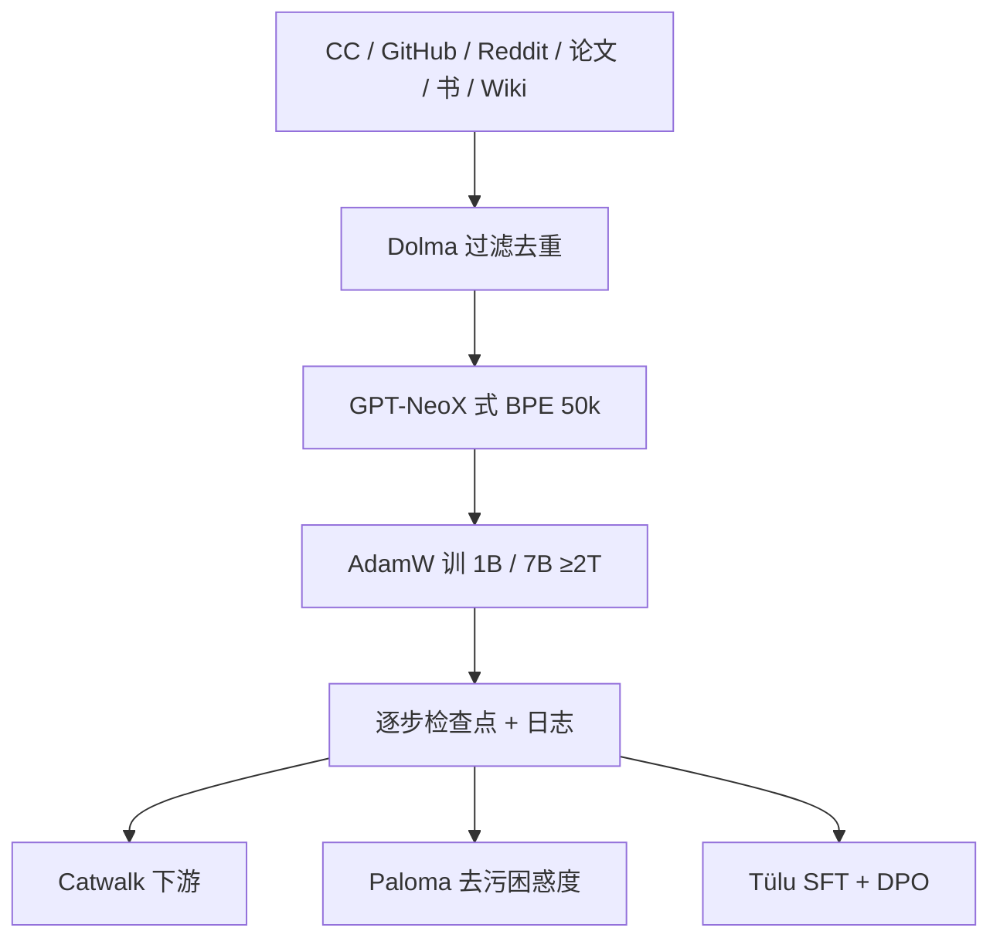

# OLMo 论文

与多数只开权重与推理代码的工作不同，我们把 OLMo 与训练数据、训练与评测代码一起发布，以便科学地研究语言模型。

<footer>—— Groeneveld 等，OLMo: Accelerating the Science of Language Models，ACL 2024</footer>

2024 年 Allen Institute for AI 把「开放」从开权重推进到可复现框架。ACL 长文给出的第一代 **OLMo** 是 1B 与 7B 稠密解码器，训在至少 **2T** token 上，数据是公开的 [Dolma](/llm/dolma-fineweb)。后续 [OLMo 2](/llm/olmo2) 才换成输出侧 RMSNorm、QK-Norm 与 Dolmino 退火。本篇按 arXiv:2402.00838 / ACL 2024 写第一代：架构表、Dolma 构成、在线评测与 Tülu 式适配，不把 2 代稳定性补丁写进来。

## 问题

最强模型把数据、架构与训练日志收进专有接口之后，偏见、记忆、能力从哪条语料长出来，外部无法做因果分析。当时已有不同程度的开放：Mixtral 开权重、Llama 2 写适配说明、MPT 写数据分布但不给数据、Falcon 部分开数据、Pythia 与 BLOOM 把代码、检查点与数据摊得最开。OLMo 认为科学需要的是**整条链**——权重、中间检查点、日志、精确数据集、造数代码、评测器——并且质量要窄到当时 Llama 2 7B 这一档，而不是再做一个只能做通顺英语的 7B。

第二个问题是评测污染。公开数据上做困惑度，若不显式对评测集去污，会系统性低估困惑度。OLMo-7B 被写成当时最大的、为困惑度评测做过段落级去污的模型之一。

### 7B 四变体，不是一个检查点

报告交付：7B 四个变体（不同架构细节、优化器、训练硬件）加一个 1B，全部至少 2T token；Hugging Face 上数百个中间修订。7B 主评估点训到 **2.46T** Dolma，再在 Dolma 上 1000 步把学习率线性收到 0，以抬困惑度与下游。优化器一律 AdamW，$\beta=(0.9,0.95)$，$\epsilon=10^{-5}$。表：1B 为 16 层、$d=2048$、16 头、峰值学习率 $4\times 10^{-4}$、预热 2000 步、绑嵌入、batch 约 4M token；7B 为 32 层、$d=4096$、32 头、2.46T、$3\times 10^{-4}$、预热 5000、不绑嵌入。序列长度 **2048**。词表改自 GPT-NeoX-20B BPE，加 PII 掩码符，**50280**，嵌入矩阵垫到 50304 以对齐 128。

HTML 表有一处把 7B 隐宽印成 4086，实现与后续卡片均为 4096。写配置用 4096。不要把 2048 窗口口头升级成 OLMo 2 的 4096。

## 方法

相对「原版」Transformer 的改动是当时开源 7B 的常规包，而不是新核：去掉全部 bias；用**非参数 LayerNorm**（无仿射），报告认为这比参数 LN 和 RMSNorm 更稳也更快；[SwiGLU](/llm/swiglu)，隐宽约 $8d/3$ 再垫到 128 的倍数（7B 为 11008，门控输入因此是 22016）；RoPE。超参按硬件吞吐与防损失尖峰来选，并用每 1000 步（约 4B token）的在线下游评测做消融。

### Dolma：按源分开的 2.7T

Dolma 管线：语言过滤、质量过滤、内容过滤、去重、多源混合、分词。报告 Table 2（GPT-NeoX 计）：Common Crawl 网页约 2.18T token，GitHub 代码约 342B，Reddit 约 80B，Semantic Scholar 约 57B，Gutenberg 约 5.2B，Wikipedia 约 3.7B，合计约 **2.67T token** / 4.37B 文档。各源在清洗与最终发布里保持分开，便于做「去掉某一源会怎样」。配套开源造数工具与 WIMBD 分析。适配走 Open Instruct / [Tülu](/llm/tulu)：先指令 SFT，再 DPO。评测：Catwalk 做下游，Paloma 做 585 个域的困惑度；核心零样本套件对齐 Llama 2 文里的常识推理八任务。

## 机制

「真正开放」的机制不是多一个激活函数，而是让外部能问：MMLU 这一分是 Common Crawl 过滤、是 2.46T 之后的 1000 步退火，还是某一硬件变体的优化器。四份 7B 变体把架构 / 优化器 / 硬件拆开，避免把一次成功跑当成唯一配方。非参数 LN 去掉仿射，减少再引入一组易炸的增益；无 bias 是当时防尖峰的社区共识。SwiGLU 与 RoPE 则是跟 Llama / PaLM 对齐，降低「因为激活函数不同而无法对照」的噪声。

在线评测每 4B token 给一次下游信号，使数据混合与学习率可以在训练中途改，而不是训完才发现常识任务不动。Paloma 去污把「在训练里见过评测段落」从困惑度优势里拿掉，这样和 Pythia、RPJ-INCITE 等比的是拟合新域的能力。中间检查点让「能力何时出现」变成可画的曲线，而不只是最终一个点。

代码与权重 Apache 2.0。Dolma 各源许可证并不自动等于 Apache：混合里若有更严条款，下游商用要按成分读。报告自己把框架许可写成 Apache，数据要另查 Dolma 文档。

### 和 Pythia、BLOOM、只开权重的 7B

Pythia 与 BLOOM 已经把透明度做到很高，但 2024 年初的英语学业 / 常识分与 Llama 2 7B 仍有可见缺口。OLMo 的主张是把缺口收窄，同时把数据提到万亿级可审计。Llama 2 / Mistral 仍可能在若干榜领先，它们不开 Dolma 原盘。不要把第一代 OLMo 写成已经打赢 Llama 3；那是 2 代 Pareto 叙事。多语不是这一代目标：Dolma 以英语为主，Reddit / 论文 / 维基都偏英。

## 边界与工程取舍

2048 不是长上下文产品。7B 不绑嵌入、1B 绑嵌入，加载时形状不同。词表 50280 与垫到 50304 的嵌入必须一起配，否则最后若干行是未训练填充。在线八任务偏常识补全，对代码与数学信号弱——这解释了为何后来 1.7 与 OLMo 2 要改数据与课程。Tülu 适配证明底座能聊，不等于附赠一个生产助手：偏好数据是蒸馏加人类的混合，安全策略要另做。

不要把 OLMoE 或 32B 写进 2024 这篇。不要给第一代编 QK-Norm。硬件变体若在论文表外，以 Hugging Face revision 名为准，不要合并成「官方唯一 7B」。Paloma 的 585 域是分层抽样，不是「互联网的均匀切片」：在 nytimes.com 上低困惑度，不蕴含在 r/depression 上同样拟合。读中间检查点时要用同一套 Catwalk 任务与 shot 设定，换 Eleuther harness 默认项会把「何时出现」的曲线画歪。1B 绑嵌入、7B 不绑，是吞吐与参数预算的选择，不是「小模型必须绑」。

正式出处：Groeneveld 等，*OLMo: Accelerating the Science of Language Models*，ACL 2024，预印本 arXiv:2402.00838。Dolma 是 Soldaini 等独立报告。OLMo 1.7–7B 是 2024 年中博客迭代（Dolma 1.7、两阶段、4K），不要与 ACL 论文的 2048 / Dolma 1.5 混成一张规格表。

## 小结

- 第一代 OLMo 是 Ai2 的全开放稠密模型：1B 与 7B（四变体），Dolma 上至少 2T，7B 评估点 2.46T。
- 架构为无 bias、非参数 LayerNorm、SwiGLU、RoPE、GPT-NeoX 式 50k 词表，序列 2048。
- 开放覆盖数据、造数代码、中间检查点、日志、Catwalk / Paloma 与 Tülu 适配。
- 设计目标是可科学复现并逼近当时 Llama 2 7B，而不是新注意力。
- 出处：Groeneveld 等，ACL 2024 / arXiv:2402.00838。
