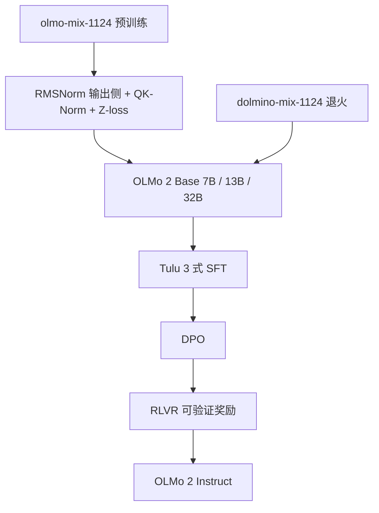

# OLMo 2

OLMo 2 要交付的不只是一份能打的稠密权重，而是数据、代码、日志与中间检查点一起公开——把「开放」从开权重推进到可复现的训练配方。

<footer>—— OLMo Team，*2 OLMo 2 Furious*，arXiv:2501.00656</footer>

Allen Institute for AI（Ai2）的第一代 OLMo 已经把预训练数据与代码摊开。OLMo 2 在 2024 年底到 2025 年初给出下一代稠密解码器：**7B、13B，以及随后的 32B**，并在标题戏仿的技术报告 *2 OLMo 2 Furious* 里把稳定性改动、两阶段预训练和 [Tulu 3](/llm/tulu) 式后训练写成可核对表。与只开权重的 Llama / Qwen 对照，它的主张是：在更少的训练 FLOPs 上走到同类英语学业基准的 Pareto 前沿，同时让外部研究者能重放数据混合与损失尖峰。本篇按该报告写，不把 [OLMoE](/llm/olmoe) 的稀疏路由安到稠密 2 代上。

## 问题

开权重模型可以刷榜，却回答不了「这一分是数据、是归一化，还是某次损失爆炸之后的侥幸」。研究记忆、概念习得、课程学习，需要逐步检查点与可审计语料。OLMo-0424 已经用数据混合补过 MMLU；OLMo 2 要补的是另一块：**更深、更长的训练如何在不发散的前提下把每 token 效率抬上去**，以及退火阶段能否用专门混合（Dolmino Mix）补能力，而不是把全部 5T–6T 都当成同一锅汤。

第二个问题是后训练是否接得上。若底座只在学业多选上好看、Tulu 配方一微调就塌，开放底座的产品价值仍低。报告因此把 Instruct 当成交付物：许可友好的 SFT / DPO，再加可验证奖励的强化学习（RLVR）。

### 稳定性比再堆一层 SwiGLU 更先

相对 OLMo 1 / 0424，2 代改的是归一化位置与数值护栏，不是激活函数：仍无 bias、仍 [SwiGLU](/llm/swiglu)、仍 RoPE。变化包括：RMSNorm 替代非参数 LayerNorm；**归一化改打在注意力与 MLP 的输出上**（重排的 post-norm）；查询与键在算点积前做 RMSNorm（QK-Norm）；最终 logits 加权重 $10^{-5}$ 的 Z-loss；RoPE $\theta$ 从 $10^4$ 提到 $5\times 10^5$；嵌入不做 weight decay。0424 曾用把 QKV 裁到 8 来压抑 logits，2 代改成 QK-Norm，避免注意力分数爆炸导致的损失发散。

7B 与 13B 仍是多头注意力；32B 才改 [GQA](/llm/gqa)（40 个查询头 / 8 个 KV 头）。不要把三档都写成 GQA，也不要把 32B 的日期后缀 0325 与 7B/13B 的 1124 混成同一次预训练。

## 方法

稠密解码器，序列长度 4096。报告中的形状：7B 为 32 层、$d=4096$、32/32 头；13B 为 40 层、$d=5120$、40/40 头；32B 为 64 层、$d=5120$、40/8 GQA。预训练数据 `olmo-mix-1124`，中训 / 退火数据 `dolmino-mix-1124`。7B/13B 的余弦日程按约 **5T token** 量级写；家族叙述为最多约 6T。Dolmino 不在第一步就混入，而是在后期课程里打补丁：用小规模 micro-annealing 先评估数据源，再决定是否进入正式退火，降低「为试一种数学混合而重跑 5T」的成本。

### 从底座到 Instruct

后训练跟 Tulu 3：SFT → DPO → **RLVR**（可验证奖励，用于数学等能自动判对的任务）。数据强调可许可来源。检查点、训练日志、数千中间权重与 [Dolma](/llm/dolma-fineweb) 系工具链一并公开，评估走 OLMES 套件，避免「同一 MMLU、三种不同 shot 设定」。API 名称以 Hugging Face 上 `OLMo-2-1124-*` 与 `OLMo-2-0325-32B` 为准。

## 机制

QK-Norm 把 $q,k$ 的尺度钉住，点积方差不再随层深漂到 softmax 饱和区——与 [SDPA](/llm/sdpa) 里 $1/\sqrt{d_k}$ 是同一类「别让 logits 炸」，只是多了一层可学习（或 RMS）的护栏。输出侧 RMSNorm 改变残差流上的尺度积累：入口不再预归一化时，梯度路径不同，报告用消融说明**单独改 post-norm 或单独 QK-Norm 都不够，合在一起才压住梯度范数的尖峰**。Z-loss 惩罚过大的最终 logits，减少半精度下的溢出与训练后期的数值噪声。

Dolmino 的机制是课程而不是神秘新数据：预训练把通用网页与代码铺开，退火提高数学、指令风格、高质量回放的密度。micro-annealing 把「这一锅值不值得」从完整重训里拆出来。Instruct 上，RLVR 只在有 checker 的任务上给奖励，避免纯偏好模型在格式上钻空子；它补的是底座已经具备、但格式不稳定的解题能力，而不是从零教算术。

「完全开放」仍受单份数据许可证的约束：混合里若含 CC-BY-NC 或特定来源条款，下游商用要按成分读，而不能因模型权重 Apache 2.0 就假设语料可任意再分发。报告自己的表述是能 Apache 则 Apache，否则取最宽松的可用许可。

### 和 OLMoE、只开权重模型的差别

OLMoE 用 64 专家 top-8 在约 1B 激活上做稀疏对照；OLMo 2 是稠密容量与稳定性实验。两者共享 Ai2 的开放哲学，不共享 FFN 形状。相对 Llama 3.1 / Qwen 2.5，OLMo 2 的对照句是「更少 FLOPs、可审计数据」，不是「秘密数据量更大」。读图要用报告的 Pareto 图与 Table，不要口头升级成全面超过 405B。

## 边界与工程取舍

上下文默认 4K，不是 128K 叙事；RoPE $\theta$ 加到 $5\times 10^5$ 是为训练长度与外推留余量，不等于已经按 128K 训过。32B 的 GQA 与 7B 的 MHA 在推理栈上 KV 布局不同，不能同一套缓存配置硬套。评测以 OLMES 与报告表为准；第三方 Arena 分数不是论文主表。

不要把 OLMo 2 写成视觉或 MoE。不要给 Dolmino 编造单独的 arXiv。Instruct 的 RLVR 依赖可验证任务，开放聊天上的安全与拒答仍要另做系统层，底座开放不等于对齐完成。

训练栈本身被报告写成研究条件：从 OLMo-0424 到 2 代换了监控与编排，降低失败率、提高集群利用率。这对外部复现的含义是：公开配方仍假设你有稳定的多机通信与检查点磁盘；把 13B 塞进单卡实验，只能验证损失曲线的局部，不能验证他们写的尖峰统计。中间检查点的价值在于画「能力何时出现」，不在于每一个都能当生产 Instruct。选服务权重用最终 Base / Instruct，分析用逐步存档，两套不要混。

第一代 OLMo 的出处是 Groeneveld 等 2024；0424 是 Ai2 博客迭代。引用 2 代时用 *2 OLMo 2 Furious*，arXiv:2501.00656。标题是双关，不是第二篇叫 Furious 的独立论文。

## 小结

- OLMo 2 是 Ai2 的全开放稠密模型：7B / 13B / 32B，数据、代码、中间检查点一起发。
- 稳定性来自输出侧 RMSNorm、QK-Norm、Z-loss 与更高 RoPE $\theta$，而不是新的注意力核。
- 预训练 olmo-mix-1124，退火 dolmino-mix-1124；Instruct 走 Tulu 3 + RLVR。
- 7B/13B 为 MHA，32B 为 GQA；默认训练长度 4K。
- 出处：OLMo Team，*2 OLMo 2 Furious*，arXiv:2501.00656，2024/2025。
