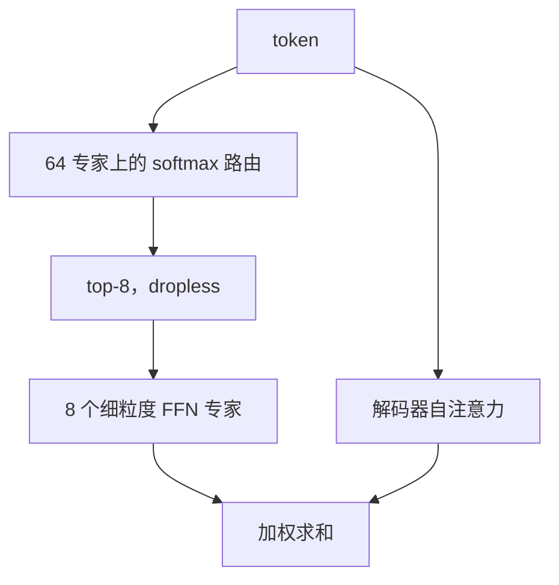

# OLMoE

OLMoE-1B-7B 总参数约 70 亿，每个输入 token 只激活约 10 亿——把 MoE 做成可以完整复现的开放模型，而不只是一份权重。

<footer>—— Muennighoff et al., OLMoE: Open Mixture-of-Experts Language Models</footer>

多数 MoE 语言模型只开权重，数据、日志、路由统计和训练代码缺一块。Allen Institute for AI（Ai2）的 OLMoE 把「开放」从权重扩展到配方：模型、混合数据、代码与训练日志一并发布。旗舰配置写成 **OLMoE-1B-7B**：名称里的 7B 是总参数量级，1B 是每 token 激活量级；论文里更细的数字是约 **69 亿总参数、13 亿激活**，预训练约 **5 万亿 token**。它是开放 MoE 里被引用最多的小规模锚点，用来回答「细粒度专家在 1B 激活预算下能不能打过同激活的稠密模型」。

## 问题

稠密小模型把容量和计算绑死：要 7B 的知识容量，就要付 7B 的前向。MoE 允许总参数涨、激活不涨，但复现成本随之变成「没有数据就无法解释路由」。Mixtral、Grok-1 一类开源权重仍然很难回答：专家是否按领域分化、负载均衡损失改一点会怎样、同样数据训稠密对照会差多少。OLMoE 要填的就是这层空白——在 OLMo 开放稠密模型已经存在的前提下，给出一个**同家族、可对照、可分析**的稀疏版本。

第二个问题是粒度。DeepSeek 一类工作主张专家切细、$k$ 加大；工业界另有 8 选 2 的粗专家传统。开放实验需要一个落在中间、又跑得完的点：专家数足够产生组合，激活又接近 1B 稠密模型的推理费。

### 开放 MoE 缺的不是口号而是对照

只开权重时，外部研究者无法做「同一数据、同一词表、只改 FFN 是否稀疏」的消融。路由是否崩溃、专家是否只记住若干高频词，都需要逐步检查点与数据谱。Ai2 把检查点按步保存、把混合数据 `OLMoE-mix` 与模型一起给出，使这些问题从猜测变成可重复测量。名称 1B-7B 是量级标签，不要和「激活恰好 1,000,000,000」字面相等。写对比时用论文中的 1.3B 激活 / 6.9B 总参，或写「约 1B 激活、约 7B 总参」，并标明口径。

## 方法

结构上，OLMoE 是解码器只 Transformer，把各层 FFN 换成**路由专家**。公开配置的核心是：**每层 64 个专家，token-choice top-8**，无 drop 的容量处理（dropless）。64 选 8 的激活比例是 $8/64=12.5\%$，再计入注意力与嵌入，总激活落在约 1.3B。层数是 16 这一档的小深度，宽度与 OLMo 小模型家族对齐，而不是把 7B 稠密模型的每一层原样拉宽。专家内部是标准的门控 FFN（SwiGLU 一类），路由为线性打分加 softmax。

预训练用 Ai2 公开的混合语料，规模约 5T token，然后做指令微调与偏好学习（SFT 再加 DPO）得到 Instruct 变体。权重发布在 Hugging Face 的 `allenai/OLMoE-*` 系列，代码在 `allenai/OLMoE`。后续还有改进数据或继续训练的日期版本（例如 0924、0125），应以模型卡上的日期后缀为准，不要把不同日期的分数拼成同一条曲线。

### 和 Mixtral、DeepSeek MoE 的粒度对照

Mixtral 是 8 专家 top-2，专家肥、组合少。DeepSeek MoE 把专家切到上百、$k$ 到 6–8，并加共享专家。OLMoE 落在「偏细」一侧：64 个小专家、激活 8 个，组合数 $\binom{64}{8}$ 远大于 8 选 2，但总规模只有 7B，不必上专家并行集群也能研究路由。它**没有**把共享专家写成 Grok/Mixtral 对照里的必选项；分析重点是路由专家是否自发分工。负载均衡仍需要显式项，否则 64 路极易塌成少数热专家——这与 [MoE 路由](/llm/moe-routing) 里的一般结论一致。

## 机制

细粒度加较高 $k$ 的机制是：同样大约 1B 的激活通道，表达力来自「八个小专家的组合」而不是「一个 1B 稠密 FFN」。每个专家只见到 token 的一个子集，梯度稀疏，容易出现领域或词表上的专门化。论文报告的分析方向包括：路由较早饱和（步数还不多时专家选择已经相对稳定）、专家共激活偏弱（经常一起被选中的专家对不多）、以及部分领域 / 词表专门化。这些是**对该检查点的观察**，不是 MoE 的普遍定理；换数据配比后分工可能改写。

训练速度上，同等激活的 MoE 往往比稠密模型收敛更快，因为总参数提供了额外容量。推理时计算接近 1B 稠密，**存储仍是 7B**：端侧或单卡服务要按总参数留内存，不能按激活参数去买。这是所有开放小 MoE 共同的产品错觉来源——宣传「1B 级推理」时漏写「7B 级驻留」。

### 路由可分析，是因为全程开放

有逐步检查点才能画专家利用率随时间的曲线；有原始混合数据才能问「这段法律文本是否总进同一专家」。关闭数据的 MoE 只能做黑盒探针。OLMoE 把 MoE 从「一种更快的大模型」还原成「一种可实验的稀疏算法」：你可以改辅助损失、改 $k$、改专家数，仍然对着同一套数据说话。Instruct 变体说明稀疏模型也可以走常规后训练，并不必须先稠密再蒸馏；但后训练是否改变专家分工，需要看 Instruct 检查点上的路由，而不是假设与基座相同。

开放不等于「训练便宜」。5T token 的 MoE 预训对独立实验室仍然很重；开放的价值是避免第二支队伍从零猜配方。若只想要一个 1B 激活的聊天模型，直接下 Instruct 权重即可，不必复现 5T。

## 边界与工程取舍

OLMoE 的规模锚在 7B 总参，不能外推成「开放 MoE 已经追上闭源数百 B」。它证明的是：在 1B 激活附近，稀疏加开放数据可以明显超过同激活稠密小模型，并在部分基准上接近更大的稠密模型。换到数学竞赛或超长上下文，容量与数据覆盖仍受 7B 存储上限约束，不要写成通用替代。

部署上，64 专家 top-8 比 8 专家 top-2 更碎：batched decode 需要 grouped GEMM 或把 token 按专家分桶，否则墙钟吃掉理论 FLOPs 优势。端侧 NPU 对动态路由不友好，见 [NPU 友好算子](/llm/npu-friendly-ops)；小 MoE 的研究价值大于手机直出价值。没有官方声称它在手机上取代稠密 3B。

引用请用作者与标题：Muennighoff 等，*OLMoE: Open Mixture-of-Experts Language Models*。不要编造 arXiv 编号，也不要把社区复现的层宽表写成论文定理。专家数、$k$、激活量以对应日期的模型卡为准。

第一层是否保持稠密、是否使用共享专家、辅助损失系数，都属于「以该版本配置为准」的细节；不同日期的 OLMoE 若改了混合数据，路由专门化结论要重测。和 Qwen、DeepSeek 的开源 MoE 比分数时，必须对齐：**比激活、比总参、比是否含指令数据**，三件事拆开写。OLMoE 的独特位置是 Ai2 把数据和日志也放到了桌上，而不是某一项基准第一。

## 小结

- OLMoE 是 Ai2 的开放 MoE：权重、数据、代码、日志一起发布，旗舰为约 7B 总参、约 1B–1.3B 激活。
- 典型结构：16 层量级解码器，每层 64 专家、top-8、dropless token-choice；预训练约 5T token，另有 SFT+DPO 的 Instruct。
- 粒度介于 Mixtral 的粗 8 选 2 与 DeepSeek 的上百专家之间，便于单机研究路由与专门化。
- 推理费按激活算、内存按总参算；64 路 top-8 对内核与端侧并不「免费」。
- 分析结论（饱和、共激活、领域分工）绑定于公开检查点，换数据后不要当定理。
- 出处：Muennighoff et al.，*OLMoE: Open Mixture-of-Experts Language Models*；Ai2 / Hugging Face `allenai/OLMoE` 模型卡。不编造 arXiv 编号。
