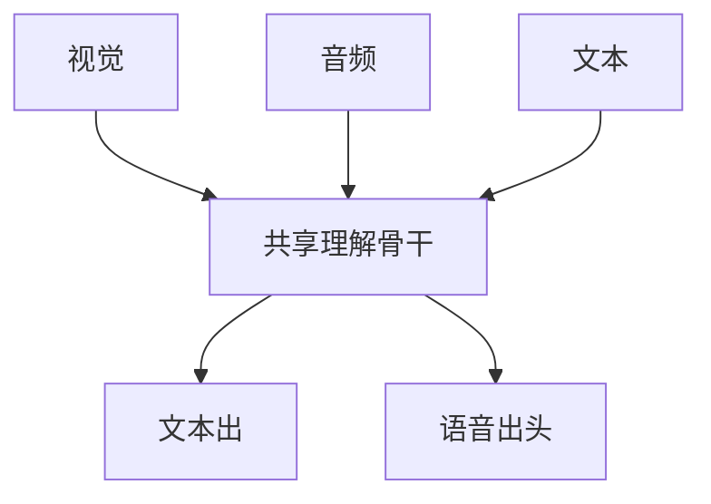

# Omni 模型对齐

看、听、说、写进同一权重之后，对齐不再是单模态 RLHF。拒绝一张图、一段声、一句字，必须是同一套策略。

<footer>—— 对照 Qwen2.5-Omni 等 Thinker–Talker 叙述；指令与安全仍落在共享语言骨干上</footer>

[上一课](/llm/music-generation)与语音、图像生成器可以各训各的。缺口是 omni：多路编码器进共享 LLM，多路解码器出，训练混合与安全策略要一起定。后课音画同步是其中最硬的时间对齐，不替代本课的策略对齐。

## 问题

[LLaVA 投影器](/llm/llava-projector) 只接一路视觉。[CLIP](/llm/clip) 只拉图文。Omni 还要音频编码器、可选视觉生成头、语音出。Qwen2.5-Omni 把 Thinker（多模态理解 + 文本）与 Talker（流式语音出）分开，避免语音解码打乱语言隐状态。对齐问题变成：哪一路允许更新 LLM、如何混合损失、有害图像与有害语音是否共用拒答模板。

若视觉 SFT 与语音 SFT 分阶段且不回放，后训会洗掉先训的模态——和统一理解生成里「一种损失主导」相同。

输入侧越 omni，越要防跨模态越狱：图里写指令、音频里说覆盖系统提示。文本安全层看不见这些通道。

## 方法

架构上声明共享与分离（Thinker/Talker、双塔视觉）。训练：模态混合比例、指令模板跨模态一致、安全数据覆盖图/声/文。评测：各模态任务分列 + 跨模态一致性（同一问题用图问与用嘴问是否同策略）+ 越狱。不要用纯文本偏好模型直接给语音打分而不听。

## 机制

共享骨干让跨模态指代（「你刚才听到的那个，看图里有没有」）走同一套上下文。分离的 Talker 保护流式声学不回流污染文本推理。对齐损失若只加在文本，语音出可以念出文本已拒绝的内容——必须在出声头上也约束，或强制语音与已对齐文本一致。

## 边界

策略对齐不等于时间戳对齐。下一课专门钉口型、节拍与音画同步。

## 小结

- Omni 对齐是混合训练、拒答模板与跨模态越狱，不只是接更多编码器。
- 语音出头必须纳入约束，否则会念出文本已拒的内容。
- 评测要分列模态并做跨模态一致性。
- 出处：Qwen2.5-Omni 等 omni 系统叙述；投影与对比见 LLaVA / CLIP。
