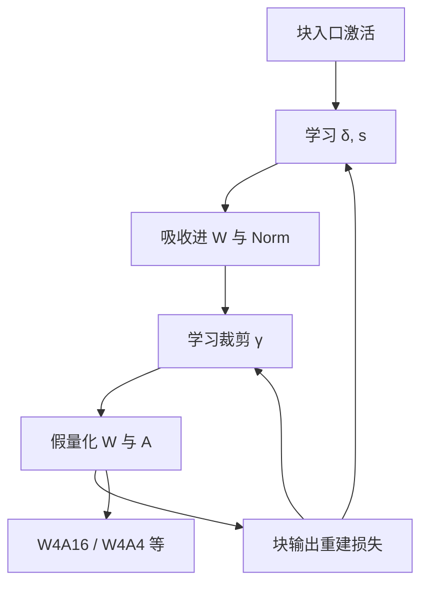

# OmniQuant

    
裁剪范围与通道缩放不必手扫；把它们写成可学习参数，在块输出上校准，低比特权重与激活才能共用同一套 PTQ 流程，而不必退回全网 QAT。

    <footer>—— Shao 等，OmniQuant: Omnidirectionally Calibrated Quantization，ICLR 2024</footer>

Wenqi Shao、Mengzhao Chen、Zhaoyang Zhang、Peng Xu、Lirui Zhao、Zhiyu Li、Kaipeng Zhang、Peng Gao、Yu Qiao 与 Ping Luo 的 ICLR 2024 论文（arXiv:2308.13137）把 LLM 的 PTQ 收成两件可学习的事：**可学习权重量化裁剪**（Learnable Weight Clipping, LWC）与 **可学习等价变换**（Learnable Equivalent Transformation, LET）。校准在 Transformer **块**上重建输出，不回传整网，也不是 GPTQ 那种闭式 Hessian 补偿。上海人工智能实验室与港中文的实验覆盖 W4A16、W3A16、W2A16 以及 W6A6、W4A4，强调「一个框架打多条位宽」，而不是单点刷 4-bit 权重。算法与 [SmoothQuant](/llm/smoothquant)、[AWQ](/llm/awq) 的对角缩放同源，但 $s$ 与裁剪比由梯度决定。

## 问题

RTN 的尺度取自 $\max|W|$，少数离群权重把格子拉稀。手工裁剪能救，但对每层每比特扫阈值不可扩展。SmoothQuant 的 $\alpha$ 是全局手扫，通道 $s$ 由激活与权重的 max 比写出，未必是块输出 MSE 的最优。GPTQ 补偿均匀网格，不改网格边界，也不改激活通道。QAT 能学尺度，但 7B 以上全网假量化太贵。

OmniQuant 要的是：PTQ 的预算（一小校准集、逐块优化、数小时级），QAT 的一部分自由度（裁剪与等价变换可导）。「Omni」指同一套校准同时服务权重量化与激活量化、多种比特，而不是声称所有下游任务无损。对象是 LLaMA、OPT、BLOOM 在 2023 年的开源检查点。

### 可学习裁剪针对权重饱和

LWC 把裁剪阈值参数化。对称情形可写成把有效 max 收成 $\gamma\cdot\max|W|$，$\gamma\in(0,1]$ 可学习，超出部分在假量化前截断。$\gamma=1$ 退回 min-max；$\gamma$ 过小等于丢掉尾部能量。梯度来自块输出重建：若尾部权重对校准激活几乎无贡献，裁掉它们换更细的格子会降 MSE；若尾部是显著通道，梯度会把 $\gamma$ 推回去。这与 AWQ「放大显著列」是不同的误差预算手段：一个改动态范围的上限，一个改通道相对尺度。

LWC 不是训练期的 weight decay，也不是剪枝。被裁掉的权重在假量化里变成饱和值，反向仍可能通过 STE 调整 $\gamma$，权重本体在 PTQ 里通常冻结或只经等价变换改写。

## 方法

LET：对激活做逐通道缩放与平移，$x'=(x-\delta)/s$，再把 $\delta,s$ 吸收进相邻线性层与归一化，浮点函数保持。SmoothQuant 只有正缩放且 $s$ 由公式给出；OS+ 已指出平移对非对称激活重要。OmniQuant 把 $\delta,s$ 当成优化变量，目标是假量化后的块输出接近浮点块输出。LWC 与 LET 可以同时开：先变换再量化，裁剪作用在变换后的权重上。

优化粒度是 **Transformer 块**（自注意力 + MLP，含残差），而不是整网一次反传，也不是单线性层孤立 MSE。块级重建继承 BRECQ 一类 PTQ 经验：层间误差会在块内相互作用，只拟合单层会低估残差通路。校准激活缓存于块入口，对 LWC/LET 参数做数百步量级的下降，再写入等价变换，最后导出量化权重。无需原训练语料标签。

主表：LLaMA-7B 的 W4A16 困惑度贴近 FP16，相对 RTN / 未校准 SmoothQuant 明显更好；W2A16 上与 GPTQ 的差距被拉大——极低比特时，只补偿不改格子边界不够。W4A4 / W6A6 用来表明 LET 对激活异常值也有效，但 4-bit 激活仍远难于 4-bit 权重，数字必须分列。零样本常识任务随位宽下降而降，作者没有把 W2A4 写成产品默认。

### 块级重建而不是全网回传

全网 QAT 让后续层看见量化噪声并适应；PTQ 块校准只让块内参数看见。误差仍会沿深度累积，因此后层校准应用已经量化的前层出激活，而不是全程高精度教师——原文流程若已量化前块，引用时不要改成「每块独立对 FP16 教师」。块级比逐层贵、比全网便宜，是 7B–65B 上能跑完的折中。把 OmniQuant 的墙钟写成「和 QAT 一样」，或写成「和 RTN 一样快」，都不对。

## 机制

等价变换不改变浮点映射，改变的是量化算子看到的动态范围。平移让非对称激活对中，对称 INT 格子少浪费在空半轴上。缩放把难通道的幅度迁到权重，与 SmoothQuant 同构，但通道 $s$ 对齐的是块 MSE 而不是 max 比。裁剪承认：min-max 尺度被极少数权重绑架时，饱和它们换来的格子分辨率，对校准激活的输出更值。STE 穿过 round 与 clip，梯度有偏，校准步数短，所以参数必须少——只有 $\gamma,\delta,s$，没有把整块 $W$ 打开再训。

「Omnidirectional」在文中的操作含义是：同一套 LWC+LET 可以指向权重量化、激活量化、以及不同比特，而不是四个互不相干的配方。机制上它们仍是假量化 + 重建；换比特只换格子。不要把标题读成「一次校准覆盖权重、激活、KV、训练」。

OmniQuant 学的是变换与裁剪，权重值多数仍来自预训练。它不是用校准数据做指令微调。若校准句极少且极偏，LET 会把通道统计拟合到该域，换域后激活量化先坏。

### W4A4 与 W4A16 必须分列

W4A16 的误差在 $W$，decode 带宽故事与 GPTQ/AWQ 同场。W4A4 的误差每层都进残差，深度一深就累积，LET 是在救激活，不是在救加载。论文能报 W4A4，不等于推荐用 W4A4 替代 W4A16 做聊天 decode。硬件上 4-bit 激活 GEMM 当时远不如 INT8 / INT4 权重核成熟。引用加速时看作者是否真的跑了整数核，还是只报了模拟量化的 PPL。

## 边界与工程取舍

### 可学习参数仍是 PTQ，不是免费的 QAT 精度

没有直通梯度的良好尺度时，LWC 可能学死（$\gamma$ 钉在 0 或 1）。学习率、块步数、是否对激活也假量化，都比 GPTQ 的「几乎无超参」脆。实现若把 LET 的平移漏掉，只学 $s$，会退回较差的 SmoothQuant。融合 $\delta,s$ 进 RMSNorm / LayerNorm 时必须与量化权重同一次导出；中途换一份 FP16 Norm，变换作废。OmniQuant 不自带 2-bit 码本，W2A16 仍是均匀格子加裁剪，极低比特上 AQLM / QuIP# 可能更好，那是另一赛道。

65B、指令模型、长上下文要重校准。论文主数字多在 WikiText 与零样本；Vicuna 一类对照弱于 AWQ 原文的强调。工程上常把 OmniQuant 当「可学习 SmoothQuant + 可学习 clip」的校准器，导出后再交给现有 INT4 核，而不是新的文件格式。

出处：Shao et al.，*OmniQuant: Omnidirectionally Calibrated Quantization for Large Language Models*，ICLR 2024（arXiv:2308.13137）。后续官方实现与 Hugging Face 包的默认比特、是否对称，以发行说明为准。

## 小结

- OmniQuant 用可学习裁剪与可学习等价变换，在块输出上做 PTQ 校准。
- LWC 改权重格子边界；LET 含缩放与平移，覆盖激活异常值与非对称。
- 不回传整网，也不是 Hessian 闭式补偿；介于 RTN 与 QAT 之间。
- W4A16 与 W4A4 必须分列引用，后者难得多。
- 出处：Shao et al.，ICLR 2024。
