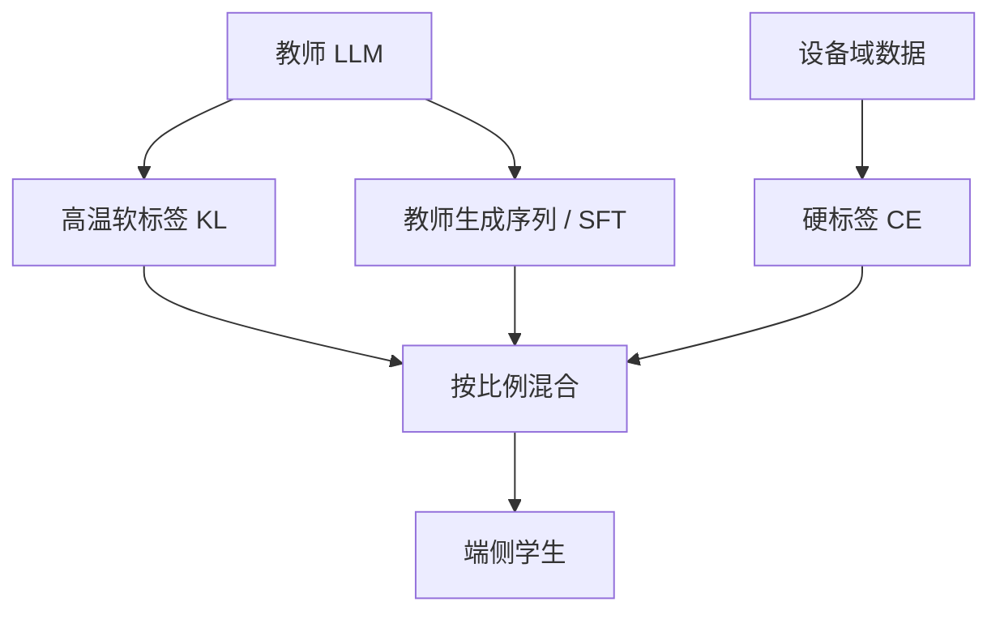

# 蒸馏到端侧的数据与温度

温度把教师的分布摊开，数据配比决定学生究竟模仿哪一块支持集；端侧学生装不下教师的全部记忆，只能选择要印下的那一层暗知识。

<footer>—— Hinton, Vinyals, Dean, Distilling the Knowledge in a Neural Network, 2015；接到 SLM 部署</footer>

把 70B 级教师压到 1B–3B 学生，常用知识蒸馏而不是只做硬标签监督学习。Hinton 等人把教师 softmax 除以温度 $T$，让错误类别上的相对概率变成可学的信号；再用学生去匹配。端侧场景多了两层约束：学生容量有悬崖（见 [SLM 能力边界](/llm/slm-capability)），部署图还得是 [NPU 友好](/llm/npu-friendly-ops) 的。于是真正可调、且经常调错的，是**温度**和**数据配比**，而不是再发明一种损失函数名字。

## 问题

硬标签交叉熵只在正确答案的位置给梯度。教师若对近义词、合理的下一步、格式变体分配了可观的质量，这些信息在 one-hot 里为零。小学生若只学硬标签，会过早变锋利，学不会教师的「哪种错更像对」。蒸馏要的是暗知识：在 $T>1$ 时被抬起来的那些非最大 logit。

端侧的问题是教师分布的支撑集极大，学生参数极少。若蒸馏数据全是教师的开放域长回答，学生会把容量耗在模仿文风，把设备上真正出现的短指令、本地语言、系统 schema 挤掉。若数据全是设备日志的硬标签，又用不上教师。配比是在「教师的一般能力」和「设备的任务测度」之间切容量，不是把两种数据简单加更多。

### 温度不是采样温度

推理时用户调的温度，是在已经训好的学生 logits 上改锋利程度。蒸馏温度是训练目标里教师（以及通常学生）softmax 的 $T$。二者不要共用一个配置项。蒸馏里常用

$$
p_i^{(T)}=\frac{\exp(z_i/T)}{\sum_j\exp(z_j/T)},
$$

损失为 $T^2\,\mathrm{KL}(p^{\mathrm{tea}}\|p^{\mathrm{stu}})$ 再与硬标签交叉熵加权。乘 $T^2$ 是为了抵消高温导致的梯度变小，Hinton 原文已写明。推理采样温度与此无关。

教师若已经非常锋利（指令微调后的 LLM 常如此），$T=1$ 的 KL 接近硬标签，暗知识很少。这时需要更大的 $T$，或改用教师生成的序列再对学生做普通 SFT——后者是序列级蒸馏，不再逐 token 对齐整段词表。

## 方法

端侧蒸馏先定学生结构（稠密、GQA、RMSNorm、固定窗），再定数据混合物，最后才扫温度。混合物至少三桶，显式写比例。

**教师软标签桶**：在通用语料或指令集上跑教师，存 logits 或 top-$K$ logits。这是暗知识的来源，贵，且要与学生词表对齐；词表不同就要先做 tokenizer 映射，否则 KL 无意义。

**教师序列桶**：让教师生成目标域上的回答（含思维链或短答案），学生做标准因果 LM。这是序列级模仿，对小模型往往比全词表 KL 更稳，因为不要求学生在 150K 词表上拟合教师的全部质量。

**设备域硬标签桶**：真实或近似的端侧分布——输入法、系统助手短指令、本地语言、JSON schema。这一桶防止学生变成「云端教师的文风缩小版」，在设备测度上崩盘。

配比示例（只作起点，不是定理）：序列桶 40%–60%，设备域 20%–40%，软标签 KL 10%–30%。通用网页预训若还要继续，应单独占一桶，以免灾难遗忘通顺性。合成数据比例过高时，学生会复制教师的模式崩溃（重复、过度礼貌、虚假引用），要用设备域硬标签拉回来。

### 温度怎么扫

$T$ 太低：软标签退化成 argmax，蒸馏≈硬蒸馏，小模型过拟合教师的最大项。$T$ 太高：分布接近均匀，梯度变成「每个词都学一点」，有效信号被稀释，学生变糊。经验上分类网常用 2–5；对已经很尖的 LLM 教师，有人用 1.0–2.0 做 token 级 KL，同时加大序列桶。应在**设备域验证集**上看，而不是只看教师分布上的 KL——KL 降了只说明更像教师，不说明端侧任务更好。

若学生量化，蒸馏应在量化感知图上进行：温度再正确，训的是 FP16 学生、部署 INT4，缝会裂开。KV 与激活的量化噪声会改变注意力熵，等于在部署时又换了一个温度；训练期至少要把权重量化打开。

## 机制

高温的作用是压缩 logit 差距：若教师最大 logit 比第二名大很多，$T=1$ 时 $p$ 近 one-hot；$T$ 增大后相对排序仍在，但次优类分到足够梯度。小模型宽度不够表达教师的多峰时，应允许学生学「次优集合」，而不是逼它复现精确的峰。这与 [SDPA](/llm/sdpa) 里温度改变 softmax 锋利程度是同一数学对象，只是作用在词表而不是注意力轴上。

数据配比的机制是容量分配。学生的有效记忆格子有限，每个训练 token 都在争这些格子。教师开放域序列在争「文风与世界知识」；设备 JSON 在争「字段名与转义」；软标签 KL 在争「近邻词的几何」。没有显式比例时，梯度会被更长、更密的教师序列抢走——长思维链特别会占满 batch 的 token 预算，使短指令欠拟合。这就是为何端侧蒸馏必须按 **token 比例** 而不是按「文件条数」去配。

思维链蒸馏能把推理步骤写成文本，不增加学生层数。链太长时，学生变成链的语言模型，中间变量仍然对不齐。端侧应优先短链或工具，而不是把教师的 2K 推理轨迹原样灌进 1B。

### 词表与掩码必须先对齐

教师学生词表不同，不能直接 KL。常见做法：只在共享 token 上做 KL；或教师先 decode 成文本再由学生 tokenizer 编码做序列蒸馏（更干净）。因果掩码必须与学生部署一致：学生若是窗口注意力，蒸馏时用满上下文教师会教它依赖窗外键，部署时那些键不存在。教师可以更大、可以双向前缀，但学生看见的上下文集合应是部署时的集合，否则训练—推理不一致会吞掉温度调对的那点收益。

## 边界与工程取舍

蒸馏不能越过容量悬崖：教师会的长尾事实，学生可能只会在蒸馏数据里见过的那几十个实体上装会。评测要含教师没生成过的设备域题目。序列蒸馏便宜、稳，但会放大教师幻觉；软标签 KL 贵、吃存储（整段 logits），对端侧小词表更合适。二者应并存，而不是宗教式二选一。

不要把推理采样温度、注意力温度、蒸馏温度写成同一个超参。不要在动态图上蒸馏再导出静态 NPU 图。数据配比需要版本号：改了设备域比例，所有温度结论作废。公开文献里 Hinton 等（2015）给出的是分类网配方；LLM 端侧蒸馏是同一公式在不同配比下的工程，没有一份万能 $T$。

若只能存 top-$K$ 教师概率，$K$ 太小会丢掉长尾暗知识，$K$ 太大会把存储打回「整表 logits」。端侧词表若已裁到 32K，$K=50$–$200$ 往往够用；仍应以设备域指标为准。

## 小结

- 蒸馏温度摊开教师分布以传递暗知识，并与 $T^2$ 加权的 KL 一起用；它不是生成时的采样温度。
- 端侧数据至少分三桶：软标签、教师序列、设备域硬标签；按 token 比例配，防止长链占满容量。
- 词表、因果窗、量化图必须与部署对齐，否则 KL 下降不等于产品变好。
- 温度过低≈硬标签，过高≈均匀噪声；在设备验证集上扫，而不是只看教师 KL。
- 蒸馏移动悬崖，不取消 [SLM](/llm/slm-capability) 的容量上限。
- 出处：Hinton, Vinyals, Dean，*Distilling the Knowledge in a Neural Network*，2015。LLM 端侧的温度与配比是同一公式上的工程延伸。
