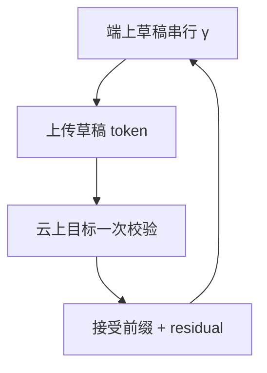

# 端侧投机解码

草稿在设备上免费猜，云上大模型一次校验：接受规则仍可对准目标分布，省下的是跨网络的逐步往返，而不只是 GPU 上的串行步。

<footer>—— Leviathan et al., Fast Inference from Transformers via Speculative Decoding, ICML 2023；草稿在本地见自投机与端侧小模型部署</footer>

[上一课](/llm/edge-cloud-split)禁止每 token 往返。本课把[投机解码](/llm/speculative-decoding)接到这条约束上：端上跑小模型或[自投机](/llm/self-speculative-decoding)浅层，串行产生 $\gamma$ 个 token，一次送给云上目标做并行校验，返回接受前缀与可能的 residual 采样。无损仍相对云上目标。本课关闭「推理系统进阶」：从 KV 会计走到端侧，加速手段始终是减少目标逐步次数或搬字节。下一课程才是集群里的集合通信。

## 问题

端上小模型可以自己 generate，质量不够；云上大模型质量够，RTT×$T$ 不可接受。标准投机假设草稿与目标在同一台机器、KV 共域。端云之间，草稿 KV 在端、目标 KV 在云，不能共享。缺口是：每轮上传 $\gamma$ 个 id（极轻）加当前前缀状态，云做一次宽查询前向，返回接受长度与一个 token。云上仍要为目标维护 KV，容量会计不变；省的是 *往返次数* 从 $T$ 降到约 $T/\mathbb{E}[k]$。

若草稿很弱，接受率低，每轮几乎只前进 1，RTT 几乎不降，还多付端上草稿能量。必须在设备上测接受率，不能用数据中心贪心投机数字。

温度、核、文法掩码必须在端云用同一协议，否则无损失败。端上 [logit bias](/llm/logit-bias) 与云上不一致，是这类系统的典型 bug。

## 方法

端：量化小草稿或早退，[采样器](/llm/sampler-kernel)在本地按产品 $T$ 采样。云：目标模型一次前向校验 $\gamma$ 位置，实现与机内投机相同，见 Leviathan 接受规则。前缀要同步：拒绝后的 residual 在云上采，下发该 token，端追加。结构化确定边可在端上直接写、少问云，与[结构化开销](/llm/structured-output-overhead)的确定边相同。层跳过自投机若目标也在端（整网本地），则无 RTT 问题，退化成设备内自投机，受 DRAM 限制。

## 机制

墙钟 $\approx$ 端上 $c_{\mathrm{draft}}\gamma$ + 一次 RTT + 云上一次宽 decode。当 RTT 远大于云上逐步时，投机的主收益是少 RTT，甚至草稿比目标慢也可能赢——与机内「草稿必须更快」不同。这是端云投机特有的不等式。接受率随 $T$ 降，思考模式更难加速。云上宽查询仍吃目标 KV，[容量公式](/llm/kv-cache-size-math)按用户数计，不按草稿计。

[FlashAttention](/llm/flashattention) 在云上校验拍 $n_q=\gamma+1$，强度略升；端上草稿用 CPU/NPU 核，走本单元的量化路径。

## 边界与工程取舍

不要在弱网、高抖动上假设 RTT 常数；应用自适应 $\gamma$。不要把端上草稿的输出在拒绝前展示成最终文字（或明确标成草稿）。词表必须一致。本课程不把通信拓扑展开；Ring/Tree 从下一课程开始。

出处：Leviathan et al., ICML 2023；Draft & Verify / LayerSkip 为草稿来源；Splitwise 为阶段拆分背景。不发明 arXiv。

## 小结

- 端云投机用本地草稿减 RTT 次数；无损相对云上目标。
- 草稿与目标 KV 不共享；上传的是 token 不是 KV。
- RTT 主导时，草稿甚至可以较慢仍赢。
- 采样、掩码、温度必须端云一致。
- 接受率要在设备与产品 $T$ 上测。
- 推理系统进阶到此结束。
- 出处：Leviathan et al., ICML 2023。
