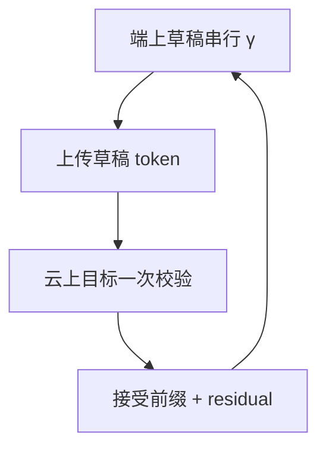
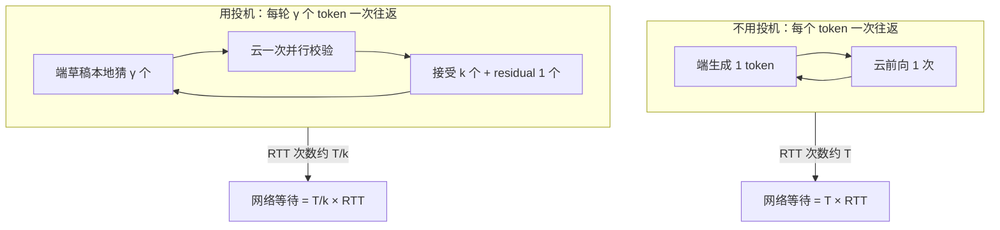

# 端侧投机解码

草稿在设备上免费猜，云上大模型一次校验：接受规则仍可对准目标分布，省下的是跨网络的逐步往返，而不只是 GPU 上的串行步。

<footer>—— Leviathan et al., Fast Inference from Transformers via Speculative Decoding, ICML 2023；草稿在本地见自投机与端侧小模型部署</footer>

[上一课](/llm/edge-cloud-split)禁止每 token 往返。本课把[投机解码](/llm/speculative-decoding)接到这条约束上：端上跑小模型或[自投机](/llm/self-speculative-decoding)浅层，串行产生 $\gamma$ 个 token，一次送给云上目标做并行校验，返回接受前缀与可能的 residual 采样。无损仍相对云上目标。本课关闭「推理系统进阶」：从 KV 会计走到端侧，加速手段始终是减少目标逐步次数或搬字节。下一课程才是集群里的集合通信。

## 问题

端上小模型可以自己 generate，质量不够；云上大模型质量够，RTT×$T$ 不可接受。标准投机假设草稿与目标在同一台机器、KV 共域。端云之间，草稿 KV 在端、目标 KV 在云，不能共享。缺口是：每轮上传 $\gamma$ 个 id（极轻）加当前前缀状态，云做一次宽查询前向，返回接受长度与一个 token。云上仍要为目标维护 KV，容量会计不变；省的是 *往返次数* 从 $T$ 降到约 $T/\mathbb{E}[k]$。

若草稿很弱，接受率低，每轮几乎只前进 1，RTT 几乎不降，还多付端上草稿能量。必须在设备上测接受率，不能用数据中心贪心投机数字。

温度、核、文法掩码必须在端云用同一协议，否则无损失败。端上 [logit bias](/llm/logit-bias) 与云上不一致，是这类系统的典型 bug。

术语翻译：「接受规则」就是一套判定手段，用云上大模型算出的概率来逐个审核草稿 token——接受就白赚，拒绝就在拒绝处改由大模型重采一个，无论哪种结果，最终文字的分布都和直接用大模型生成完全一样。它是投机解码「无损」这句话的数学保证。

数字实例：设 RTT 为 200 毫秒、要生成 100 个 token。不用投机：100 次往返就是 20 秒纯网络等待。用端上草稿一次猜 $\gamma=5$、平均接受 $k=3$（不含奖励 token，每轮实际前进 $k+1=4$ 个）：往返次数降到约 $100/4=25$ 次，约 5 秒——省的是网络等待，云上计算量几乎不变。

## 方法

端：量化小草稿或早退，[采样器](/llm/sampler-kernel)在本地按产品 $T$ 采样。云：目标模型一次前向校验 $\gamma$ 位置，实现与机内投机相同，见 Leviathan 接受规则。前缀要同步：拒绝后的 residual 在云上采，下发该 token，端追加。结构化确定边可在端上直接写、少问云，与[结构化开销](/llm/structured-output-overhead)的确定边相同。层跳过自投机若目标也在端（整网本地），则无 RTT 问题，退化成设备内自投机，受 DRAM 限制。

```mermaid
flowchart TD
  D["端上草稿串行 γ"] --> UP["上传草稿 token"]
  UP --> V["云上目标一次校验"]
  V --> ACC["接受前缀 + residual"]
  ACC --> D
```

## 机制

墙钟 $\approx$ 端上 $c_{\mathrm{draft}}\gamma$ + 一次 RTT + 云上一次宽 decode。当 RTT 远大于云上逐步时，投机的主收益是少 RTT，甚至草稿比目标慢也可能赢——与机内「草稿必须更快」不同。这是端云投机特有的不等式。接受率随 $T$ 降，思考模式更难加速。云上宽查询仍吃目标 KV，[容量公式](/llm/kv-cache-size-math)按用户数计，不按草稿计。

[FlashAttention](/llm/flashattention) 在云上校验拍 $n_q=\gamma+1$，强度略升；端上草稿用 CPU/NPU 核，走本单元的量化路径。

```mermaid
flowchart TD
  subgraph OLD["不用投机：每个 token 一次往返"]
    G1["端生成 1 token"] --> C1["云前向 1 次"]
    C1 --> G1
  end
  subgraph NEW["用投机：每轮 γ 个 token 一次往返"]
    G2["端草稿本地猜 γ 个"] --> C2["云一次并行校验"]
    C2 --> ACC["接受 k 个 + residual 1 个"]
    ACC --> G2
  end
  OLD -->|RTT 次数约 T| SLOW["网络等待 = T × RTT"]
  NEW -->|RTT 次数约 T/k| FAST["网络等待 = T/k × RTT"]
```

这张图回答的问题是：加速到底省在哪里。常见误区是以为省了云上计算——云上该算的一次没少，省的全是往返次数。推论是机内投机「草稿必须比目标快」的教条在端云场景失效：只要 RTT 够大，草稿慢一点、但每轮多前进几个 token，总墙钟仍然更短。

## 边界

不要在弱网、高抖动上假设 RTT 常数；应用自适应 $\gamma$。不要把端上草稿的输出在拒绝前展示成最终文字（或明确标成草稿）。词表必须一致。本课程不把通信拓扑展开；Ring/Tree 从下一课程开始。

出处：Leviathan et al., ICML 2023；Draft & Verify / LayerSkip 为草稿来源；Splitwise 为阶段拆分背景。

## 小结

- 端云投机用本地草稿减 RTT 次数；无损相对云上目标。
- 草稿与目标 KV 不共享；上传的是 token 不是 KV。
- RTT 主导时，草稿甚至可以较慢仍赢。
- 采样、掩码、温度必须端云一致。
- 接受率要在设备与产品 $T$ 上测。
- 推理系统进阶到此结束。
- 出处：Leviathan et al., ICML 2023。
