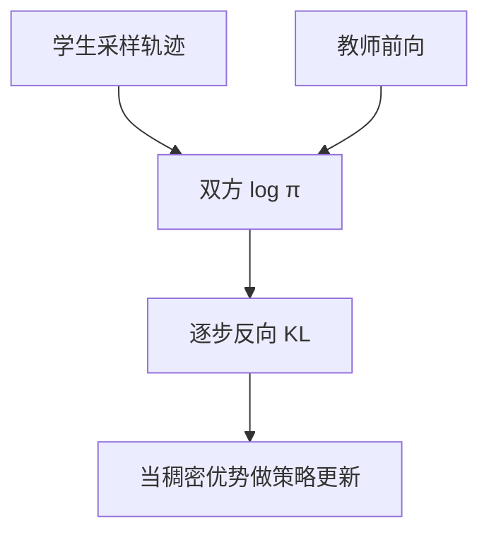

# On-policy Distillation

    
学生在自己采样的轨迹上，用教师的逐步反向 KL 当稠密奖励；既保留 on-policy 的状态覆盖，又避免 RL 整段只有一个对错比特。

    <footer>—— Lu 等，Thinking Machines，On-Policy Distillation，2025；Agarwal 等 2023；Qwen3 Technical Report</footer>

[R1](/llm/deepseek-r1) 把教师长链写成 SFT 数据，学生从不在自己的错误前缀上受训——那是 **off-policy 蒸馏**。Agarwal 等人 2023 年的 *On-Policy Distillation of Language Models: Learning from Self-Generated Mistakes*、Gu 等人的 MiniLLM，以及 [Qwen3 报告](/llm/qwen3-report) 的强到弱蒸馏，把监督改到学生自己的 rollout 上。Thinking Machines 2025 年 10 月的博客用 Tinker 复现：Qwen3-8B 上 on-policy 蒸馏以大约十分之一的 RL 代价达到更高的 AIME。本篇写反向 KL 奖励、与 R1 蒸馏 / [RLVR](/llm/rlvr) 的分工，不把 Tinker 产品细节当成算法本身。

## 问题

Off-policy SFT 在教师常去的状态上模仿，学生一旦早出错，后续上下文是教师从未示范的，误差复合（Bengio 等 scheduled sampling 指出的暴露偏差）。长链上更严重：R1 式 800k 轨迹仍是教师风格的草稿纸。Gudibande 等人还警告：模仿闭源模型容易学到语气与自信，学不到事实。

On-policy RL（[GRPO](/llm/grpo)、PPO）在学生自己的轨迹上优化，但结果奖励每条回复往往 1 bit。学生不知道错在换序还是算错。PRM 能逐步打分，又要人标或另训验证器。需要一种稠密、逐步、且不依赖可验证环境的信号：教师在**学生刚走出的前缀**上给下一步分布。

### 棋的类比只说明粒度

博客用棋引擎给每步标 blunder / brilliant：RL 像整局输赢，SFT 像看大师棋谱，on-policy 蒸馏像有人评你自己的每一步。类比的边界：LLM 的「步」是 token，教师是 $\pi_{\mathrm{teacher}}(\cdot\mid x_{1:t})$，不是外部规则引擎。没有教师对数概率，方法退化为请教师重写整段——又变回 off-policy。

Ross 等 DAGGER（2010）已经在学生访问的状态上查询专家。Agarwal 2023 把该思想接到 LM 蒸馏并比较多种散度。2025 博客的贡献是规模化配方与成本对照，不是发明「学生采样」本身。

## 方法

学生 $\pi_\theta$ 采样轨迹。教师只做一次前向，算同一前缀上的 $\log\pi_{\mathrm{teacher}}$。逐步反向 KL

$$
\mathrm{KL}\bigl(\pi_\theta(\cdot\mid x_{1:t})\,\|\,\pi_{\mathrm{teacher}}(\cdot\mid x_{1:t})\bigr)
=\mathbb{E}_{x_{t+1}\sim\pi_\theta}\bigl[\log\pi_\theta-\log\pi_{\mathrm{teacher}}\bigr]
$$

作为该 token 的代价（优势取负 KL）。折扣他们设为 0：只优化即时下一步。用现成 RL 代码路径：把参考模型换成教师，KL 正则变成主奖励。不必等序列结束，可用短 / 部分 rollout。教师不必反传，只要 `compute_logprobs`。

**与 Qwen3 表 21 对齐的叙事。** 报告：off-policy 蒸馏后 AIME'24 55.0% / GPQA 55.6%；再 RL 17,920 GPU 小时到 67.6% / 61.3%；改 on-policy 蒸馏 1,800 GPU 小时到 **74.4% / 63.3%**。博客在 Qwen3-8B-Base 上用 Qwen3-32B（实验中实际教师常取同族 8B instruct，算力仍按 32B 计）先对 OpenThoughts-3 做 40 万提示 SFT 到 AIME 约 60%，再 on-policy 约 150 步（约 7.7 万提示、每提示 4 条）到约 70%。相对外推到 200 万条 SFT 的成本，他们估 9–30× 的 FLOPs 优势（是否计入教师生成 off-policy 数据）。LoRA 在海量 SFT 上落后全参更多，on-policy 阶段差距缩小。

初始化很关键：反向 KL 是 mode-seeking，学生支持里要先有教师会用的 token。领域知识仍靠 mid-train / off-policy SFT；on-policy 段教的是**在自己会走到的状态下对齐教师行为**。个性化实验：在内部文档上继续训会伤 IF-eval；随后用 on-policy 蒸馏对齐助手教师，比继续混聊天 SFT 更能找回指令遵循。

## 机制

反向 KL 在学生分布下求期望，故梯度集中在学生实际访问的状态，直接惩罚「教师不会走的分叉」。博客例子里，SimpleBench 的学生把「平底锅上的冰块」做成纯算术，教师把高 KL 打在带偏的推理起势 token 上，而不是只打最终错误选项——最终答案在错误前缀下是可预测的。这与结果 RL 只打终点、PRM 打人类步骤，粒度介于 token 与步骤之间。

计算上，采样由小模型完成，教师一次前向即可；相对 RL 的长 rollout + 组采样 + 验证器，墙钟更像「学生 RL、教师当稠密 RM」。相对 off-policy logit 蒸馏，不必存储教师全词表轨迹，但训练期必须在线跑教师。

他们不做 top-$k$ logit 蒸馏。用教师样本轨迹无偏估计教师分布，与对全分布 KL 在期望上同类。工程上省的是存 logits，不是改目标。

### 与 R1 蒸馏、RLVR 的分工

R1 蒸馏：固定教师文本，交叉熵，off-policy，便宜、会复合误差，R1 报告还把学生再 RL 留给社区。RLVR / GRPO：环境或验证器给稀疏 $r$，不需要更强教师，但要可验证任务。On-policy 蒸馏：要一个始终更强、且对数概率可查的教师；不需要答案检查器，因而能教风格、工具惯例、内部文档上的助手行为。三者可串：SFT 铺支持 → on-policy 蒸馏对齐 → 可选 RLVR 钉可验证域。

## 边界与工程取舍

教师错，学生会在自己的轨迹上**更高效地**学会同样的错。教师与学生词表、聊天模板必须一致，否则 KL 打的是格式而不是推理。没有 mid-train 时，学生采样全在教师支持外，反向 KL 没有可学的 mode。长链上逐步 KL 可能过度约束探索，Qwen 仍用 RL 冲竞赛上限；蒸馏更像低成本对齐，不是测试时计算的替代。

Tinker cookbook 后来把实验模型换成 Qwen3.5 档，数字以当时博客表为准，不要把 76.7% AIME 与 Qwen3 表 21 的 74.4% 混成一次运行。折扣因子 >0 他们未观测到收益，不意味着理论上逐步回报不该折。教师前向可以跨 GPU 批处理，墙钟优势往往大于按 FLOPs 算出来的 9×；把教师 logprob 当成必须与学生同步的逐步瓶颈，会低估该方法在分离式训练—推理框架里的实际吞吐。

「稠密奖励不可黑客」只相对于学坏的 RM：KL 低等于像教师。教师自身的奖励黑客（冗长、套话）会原样迁移。

### 何时不必做 on-policy

没有比学生强且可部署的教师，无法定义 KL。任务有可靠验证器、没有教师 GPU，用 RLVR/GRPO。只要把教师题解灌进小模型、不在乎学生自己的错误分布，off-policy SFT 更简单。DAGGER 式逐步查询专家若只能得到离散标签而不是对数概率，目标要改，不能假装在最小化反向 KL。

## 小结

- On-policy 蒸馏：学生采样，教师逐步反向 KL 当稠密优势，用 RL 更新器训练。
- 结合 on-policy 覆盖与蒸馏的逐步信号；SFT 仍负责把教师 token 放进支持集。
- Qwen3 报告：1,800 GPU 小时蒸馏到 AIME 74.4%，对照 RL 17,920 小时的 67.6%。
- 与 R1 的离线长链 SFT、与验证器 RL 互补，不互相替换。
- 出处：Agarwal 等，*On-Policy Distillation of Language Models*，2023；Gu 等，*MiniLLM*，2023；Qwen Team，arXiv:2505.09388 表 21；Lu 等，Thinking Machines，*On-Policy Distillation*，2025。
