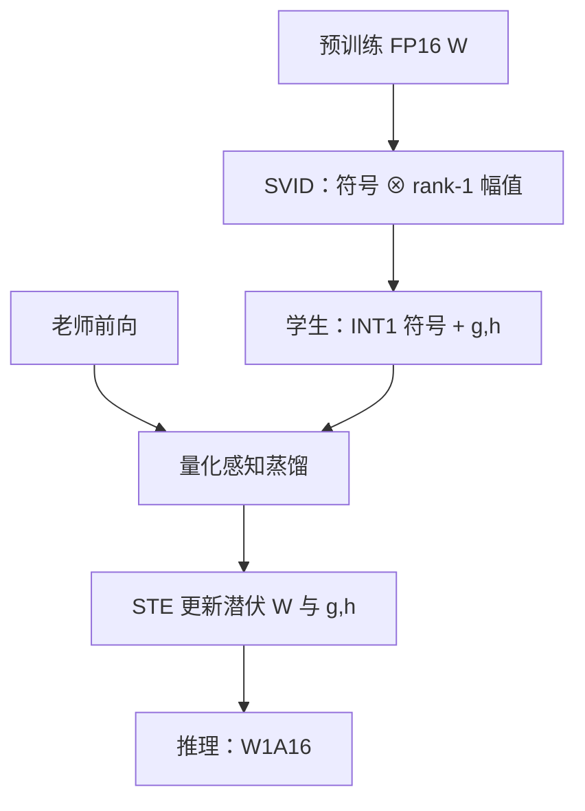

# OneBit / 1.58-bit 训练

    
把现成的全精度矩阵拆成符号加两个短向量，再在蒸馏里做量化感知训练，1-bit 权重建模才不必从随机初始化重跑一遍预训练；三元 1.58-bit 从零训则是另一条、更贵的配方。

    <footer>—— Xu 等，OneBit，NeurIPS 2024；对照 Ma 等 BitNet b1.58 的从零训练食谱</footer>

[BitNet](/llm/bitnet) 证明：符号或三元权重可以从头训到可用。工程上更常见的起点却是已经花掉万卡时的 LLaMA / OPT 检查点。Yuzhuang Xu、Xu Han、Zhiyuan Liu、Wanxiang Che 等人的 **OneBit**（NeurIPS 2024，arXiv:2402.11295）走这条路：把每层 $W$ 表示成 INT1 符号矩阵加两个 FP16 值向量，用符号–幅值分解（SVID）初始化，再量化感知蒸馏，目标是 **W1A16**。它不是 GPTQ 那种 one-shot 取整——1-bit 格子下 RTN 几乎只剩阈值，补偿也救不回来。本篇写「从预训练出发的 1-bit QAT」以及与 b1.58 从零训共享的 STE / 潜伏权重机制，不重复 BitLinear 的架构表。

## 问题

PTQ 在 4-bit 工作，到 2-bit 需要码本、旋转或可学习裁剪，见 [OmniQuant](/llm/omniquant)、[QuIP](/llm/quip)。到 **1-bit**，均匀量化的 $s,z$ 失去意义：每个权重只是阈值两侧的两个电平，层输出 $WX$ 的相对误差爆炸。图 1 一类曲线显示：GPTQ、LLM-QAT、OmniQuant 压到 2-bit 已明显掉点，再压到 1-bit 不可用。需要改表示，而不是再调一轮 Hessian。

从零训 BitNet 能避开「老师权重与学生格子不对齐」，但要重付预训练账单，且老师能力无法直接继承。OneBit 要的合同是：OPT / LLaMA / LLaMA-2 从 1.3B 到 13B，用远少于预训练的蒸馏步数，把能力迁到约 1-bit 权重上，零样本至少保住原文所说的 **LLaMA 上非量化性能的 81%** 量级，并让训练对学习率不那么脆。

### 为什么 RTN 在 $N=1$ 时失效

$N=1$ 时量化网格只有两个代表值。尺度与零点不再分配 bin，等价于一次硬阈值。权重矩阵的秩与浮点动态范围被一次性削掉，线性层作为 LLM 的核心算子先坏。BitNet 原文用 $\mathrm{Sign}(W-\mathrm{mean})$ 加单一 absmean 尺度从零学；直接拿这套去量化已有 $W$，作者观察到既难收敛、精度也差。缺口在于：**幅值结构**被单一标量 $\eta$ 概括得太粗。

OneBit 的 1-bit 是权重；激活主实验是 16-bit。不要写成 W1A8 或与 b1.58 的 W1.58A8 混表。平均比特会因 $g,h$ 两个向量略高于 1，4096×4096 层大约 1.007 bit 量级，不是营销上的「严格 1.000」。

## 方法

OneBit 的线性层在训练时写为

$$
W_{\pm 1}=\mathrm{Sign}(W),\qquad Y=\bigl[(X\odot g)\,W_{\pm 1}^{\top}\bigr]\odot h,
$$

推理时 $W_{\pm 1}$ 打成 INT1，$g,h$ 仍 FP16。$g$ 作用在输入通道，$h$ 作用在输出通道，相当于把被削掉的浮点尺度做成两个 rank-1 方向，而不是 BitNet 的全局 $\eta$。计算顺序写成先缩放 $X$ 再乘符号矩阵，避免把 $W$ 解回 FP16。

初始化用 **SVID**：$\mathbf{W}\approx \mathbf{W}_{\mathrm{sign}}\odot(\mathbf{a}\mathbf{b}^{\top})$，幅值矩阵做 rank-1（SVD 或 NMF）。命题上，带符号的 rank-1 比直接对 $W$ 做 rank-1 的 Frobenius 误差更小，因为符号先保住了高秩模式。把 $\mathbf{W}_{\mathrm{sign}}\to W_{\pm 1}$、$b\to g$、$a\to h$，学生在蒸馏第 0 步就已经是老师的一个粗糙但同构的近似。

知识迁移：量化感知蒸馏，老师为原 FP16，学生带 STE 的 Sign。数据可以是原语料子集或老师生成文本（与 LLM-QAT 同族）。优化 $g,h$ 与潜伏 $W$。主表覆盖 OPT、LLaMA、LLaMA-2 的 1.3B–13B，对照 WikiText 困惑度与零样本；1-bit OneBit 优于当时的 2-bit PTQ/QAT 基线，且随宽度增大更接近 FP16。

### 1.58-bit 从零训：同一套 STE，另一张账单

b1.58 不从老师出发。潜伏 $W$ 用 Adam 更新，前向 absmean 三元量化，激活 8-bit，骨干 LLaMA-alike，数据与 token 数必须与 FP16 对照对齐（原文 100B RedPajama，另有 2T 配方）。工程清单与 OneBit 部分重叠：混合精度优化器、STE clip、SubLN/RMSNorm 稳住激活、低比特核只在推理启用。差别是目标函数——语言建模似然 vs 蒸馏对齐——以及权重格子 $\{+1,-1\}$ 加双向量 vs $\{-1,0,1\}$ 加单一 $\gamma$。把「1.58-bit 训练」理解成「把 GPTQ 再跑到 1.58」是错的；没有从零或长程 QAT，三元格子站不住。

## 机制

SVID 把「方向」和「尺度」拆开。符号矩阵容量大、占空间小，负责保持几乎满秩的连接模式；两个向量用 $O(n+m)$ 的 FP16 去拟合每行每列的典型幅度。前向 $Y\approx[(X\odot b)W_{\mathrm{sign}}^{\top}]\odot a$ 与 $XW^{\top}$ 同构，所以蒸馏初期 logits 不会从随机噪声开始。STE 对 Sign 的梯度是直通，真正能学的是潜伏 $W$ 如何把质量推过 0，以及 $g,h$ 如何吸收剩余尺度。学习率过大时，Sign 频繁翻转，等于每步换拓扑；SVID 把起点放到老师附近，翻转率下降，这是原文强调「对超参更稳」的机制来源。

与 BitNet 单一 $\eta$ 相比，双向量允许不同输出通道有不同增益，更接近逐通道量化的自由度，却几乎不加平均比特。与 LLM-QAT 的可学习量化参数相比，OneBit 把自由度做成结构化的符号加 rank-1，而不是在均匀网格上再学一组 $s$。

蒸馏对齐的是老师的条件分布，不是用户任务。老师若已有幻觉或安全拒答，学生会学走。评测应报相对老师的保持率，并写明 WikiText / 零样本套件，不要把 81% 写成所有基准的下限。

### 训练显存并不等于推理 1-bit

QAT 前向可以假量化，反向与 Adam 仍是全精度潜伏张量。13B 级蒸馏需要的 GPU 小时远小于预训练，但仍是 PTQ 的几十到几百倍。若只能接受校准级预算，应回到 3–4 bit 的 [GPTQ](/llm/gptq) / [SpQR](/llm/spqr)，而不是强行 1-bit。推理核要能把 INT1 与两个向量融合；先解包成 FP16 再 gemm，只省存储、不省算。

## 边界与工程取舍

OneBit 不提供与 b1.58 同场的「同 token 从零训到匹配 FP16」。它压缩已有模型，能力上限受老师与蒸馏数据约束。W1A16 在 decode 上省权重带宽；prefill 大 batch 仍可能是计算墙，且激活仍 16-bit。lm_head、嵌入是否 1-bit 按实现；原文聚焦 Linear。与 BitNet 选型：没有预训练预算、要新架构新核，走 b1.58；有强检查点、接受蒸馏与约 81% 保持，走 OneBit。不要把微软后续 2B4T 开源权重的评测表写进 2024 年清华大学 / 哈工大这篇 NeurIPS。

出处：Xu, Han, Yang, Wang, Zhu, Liu, Liu, Che，*OneBit: Towards Extremely Low-bit Large Language Models*，NeurIPS 2024，arXiv:2402.11295。从零三元食谱见 Ma et al.，arXiv:2402.17764。PTQ 对照见 GPTQ / OmniQuant。

## 小结

- 1-bit PTQ 的 RTN 退化为阈值，必须改表示或从零训。
- OneBit：符号矩阵 + 双 FP16 向量，SVID 初始化，QAT 蒸馏，W1A16。
- b1.58 从零训共享 STE 与潜伏权重，但不继承老师，账单是完整预训练。
- 训练时优化器仍是高精度；推理红利取决于 INT1 核。
- 出处：Xu et al.，NeurIPS 2024；对照 Wang/Ma BitNet 系列。
