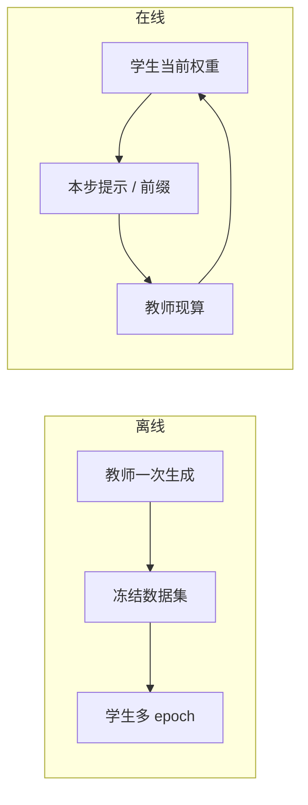

# 在线 vs 离线蒸馏

离线把教师一次写完的序列冻成语料；在线让教师留在训练环里，对着学生当前会错的提示再写。贵的是谁在环里，不是损失叫什么名字。

<footer>—— 对照 Hinton 等人的离线软标签；序列侧接到 Kim &amp; Rush 的教师假设</footer>

蒸馏有两种时间表。离线：教师先在固定提示集上写出软标签或完整序列，存盘，之后训练只更新学生。在线：每个（或每隔若干）训练步仍要跑教师，针对当前 batch 的 $x$、有时甚至针对学生此刻的错误前缀，再给目标。Hinton、Vinyals、Dean 的分类网蒸馏通常是离线 logits；Kim 与 Rush 的序列级蒸馏在翻译里也是先得到教师假设再训学生。大语言模型把这条分界推到工程前台：70B 教师无法在 1B 学生的每个 step 上同卡前向，离线几乎是默认；要对齐学生自己的生成分布，又不得不把教师请回环内。

## 问题

教师分布 $p_T(y\mid x)$ 与学生 $p_S$ 同构时，任何固定数据集都只是 $p_T$ 的一个快照。学生一开始模仿快照，权重一更新，$p_S$ 就离开当初写标签时的前缀分布。词表 KL 若仍在「教师前缀或语料前缀」上算，监督是离策略的；序列蒸馏若只用冻住的 $y^{(T)}$，学生后来自己会走的前缀更是从未被教师点评过。这与 RL 里的离策略问题同类，只是标签来自教师而不是奖励。

在线蒸馏要回答：值不值得在训练期持续查询教师，把标签刷新到学生当前会访问的状态上。代价立刻是算力与吞吐——教师前向往往比学生更新贵一个数量级，且要在训练集群里常驻。离线要回答：快照过期之后，用多大的数据覆盖、多少轮再生成，才能把分布缝控制在可接受范围。

### 三种过期方式

提示集过期：上线后用户 $x$ 不在当初的生成清单里，教师从未写过对应 $y$。解码协议过期：存盘时用温度 0.7，部署学生时用贪心，序列统计对不上。学生能力过期：学生已经学会某类格式，仍反复用早期的笨拙教师样本去梯度，等于把进度拉回去。离线流水线必须给这三项打版本号；在线则把后两项变成「此刻的教师、此刻的学生」自动对齐，但第一项——提示覆盖——仍然要靠数据，不靠在线二字。

「在线」容易和「在线 RL」混用。这里只描述蒸馏：教师给序列或软标签，学生做模仿。策略梯度、KL 惩罚、价值函数是 [RLHF](/llm/rlhf-pipeline) 的对象。教师在环里不等于已经在做 PPO。

## 方法

离线流程：定提示集与解码超参 → 教师生成（序列或 top-$K$ logits）→ 过滤与格式化 → 按 token 比例混入学生训练。可重复、可审计、可用大规模离线推理引擎。失败时回放同一份数据即可。在线流程：学生训练循环内取 $x$，教师现算 $p_T$ 或采样 $y^{(T)}$，立即构成损失。变体包括：只对学生自己采样的前缀查询教师（把教师当在线点评器）；隔 $N$ 步刷新一小份缓存，介于两者之间。

$$
\mathcal{L}_{\mathrm{off}} = \mathbb{E}_{x\sim\mathcal{D},\, y\sim p_T^{\mathrm{frozen}}}[-\log p_S(y\mid x)]
$$

$$
\mathcal{L}_{\mathrm{on}} = \mathbb{E}_{x\sim\mathcal{D}_t}\bigl[\mathrm{D}\bigl(p_T(\cdot\mid x),\, p_S(\cdot\mid x)\bigr)\bigr]
$$

$\mathcal{D}_t$ 可以含学生当前会生成的状态；$\mathrm{D}$ 可以是序列 NLL 或词表 KL。实现上要先对齐词表与模板，否则在线 KL 没有定义，只能退回「教师 decode 成文本再让学生编码」的序列接口。

### 刷新频率是超参

完全离线零刷新，最便宜，分布缝最大。完全在线每步查教师，缝最小，集群利用率最差。中间策略更常见：每过若干学生 epoch，用当前提示集（可含学生失败案例）再生成一版教师数据，替换或部分替换旧桶。这仍是离线接口，只是数据有生命周期。失败案例挖掘把「学生当前会错的 $x$」送回教师，接近在线的数据效果，却能用批推理做。应记录每次刷新的解码温度、束宽、过滤规则，否则两版数据不可比。

## 机制

离线序列蒸馏把教师的生成流形切成有限样本。学生的最优是在这些样本上的最大似然，不是在 $p_T$ 全体上的投影。样本之外的 $x$，泛化靠的是语言模型的插值，不是教师的实时纠正。在线把投影点跟着 $p_S$ 走：学生刚开始写错的前缀，教师可以给出「在这个错误前缀上下一步该怎样」，这更像在补曝光偏差。代价是教师会在学生的垃圾前缀上浪费容量，若学生早期乱解码，在线标签本身也很吵。

词表 KL 的在线版本要求教师对学生前缀打整表分布，通信与存储都贵，通常截断为 top-$K$。序列在线版本只传文本，便宜，但把教师的不确定性压成一条样本，方差大，需要同一 $x$ 多采。选择哪一种，先看词表是否共享，再看能不能负担教师常驻。

教师若也在更新（师生同训、共蒸馏），那是第三条轴，不要并进「在线」这个词。本篇的在线默认教师冻结、查询不冻结。师生同训要另控教师的学习率与谁当锚，否则两人一起漂。

## 边界与工程取舍

### 不要用在线掩盖提示集不够

环里有教师，并不能补上从未采样过的用户域。端侧日志、工具 schema、本地语言仍要进 $\mathcal{D}$。反过来，提示集已经覆盖产品测度时，把 70B 教师塞进每个 step 常常是浪费：离线生成加失败案例刷新，性价比更高。只有当学生必须在自己的长前缀上得到教师的逐步纠正——例如要对齐教师的逐步熵而不是一条轨迹——在线词表 KL 才变得难以替代。

吞吐账要算墙钟，不是算「看起来更正确」。教师与学生异构并行、不同量化、不同最大长度时，在线环的气泡会吞掉学生本该有的 token/s。此时应把教师放到独立的推理服务，异步填缓存，接受秒到分钟级的标签延迟——那已经是「近线」，不是教科书上的逐步在线。

[推理链蒸馏](/llm/cot-distill) 的长样本会让在线教师的 decode 变成训练步的主导延迟。长链更适合离线批量写盘，再用拒绝规则过滤；不要在同步训练环里现写两千 token 的草稿纸。

## 小结

- 离线蒸馏冻结教师产物再训学生，可审计、可扩推理；标签相对学生状态会过期。
- 在线蒸馏在训练环里查询冻结教师，标签更贴学生当前前缀，算力与调度代价高。
- 定期再生成、失败案例回灌，是两者之间可落地的折中。
- 在线不等于 RL；教师更新与否是另一条轴。
- 出处：Hinton, Vinyals, Dean, 2015；Kim & Rush, EMNLP 2016。大模型上的在线/离线是同一模仿目标的工程时间表。
