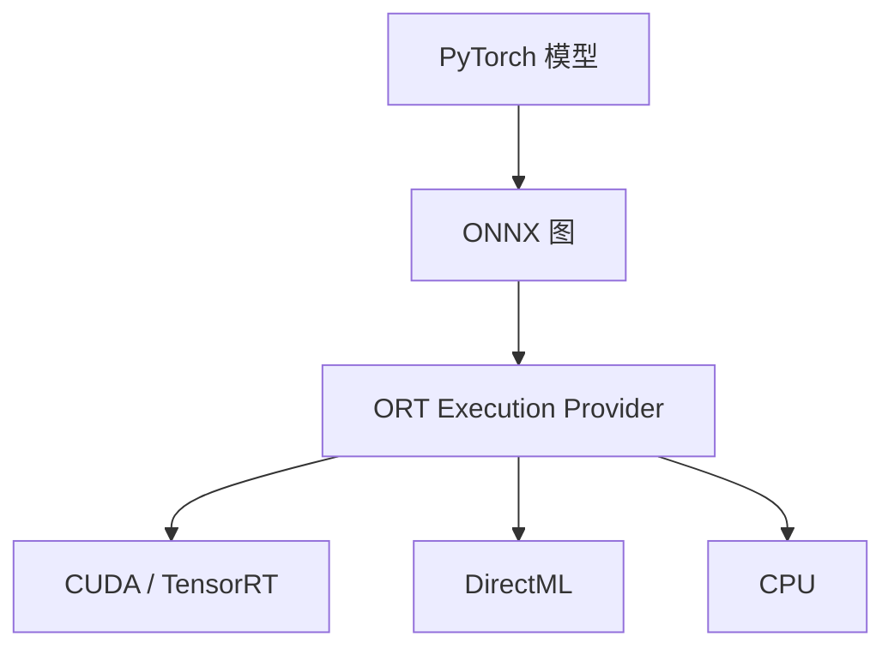

# ONNX Runtime

把计算图画成可移植的算子图，运行时按设备选 EP：同一份导出，可以走 CUDA、TensorRT、DirectML 或 CPU，而不把服务绑死在 eager PyTorch。

<footer>—— ONNX 由 Facebook 与 Microsoft 提出；ONNX Runtime 为 Microsoft 的推理引擎文档与 EP 模型</footer>

[上一课](/llm/safetensors-format)仍在 PyTorch 权重文件里。本单元「GPU 之外」从可移植运行时开始：ONNX 是算子级 IR，ORT 用 Execution Provider 把图画到硬件。LLM 自回归并不天然适合「导出一次、静态图跑到底」——decode 循环、分页 KV、动态 $B$ 会逼出动态轴与自定义算子。本课写 ORT 能接什么、LLM 上缺口在哪，以免把 BERT 式成功故事抄到生成式服务。

## 问题

嵌入模型、重排器、ViT 编码器是静态或半静态图，ORT + TensorRT EP 往往很合适。[嵌入服务](/llm/embedding-serving)那课的画像与 ORT 匹配。LLM decode 需要：动态序列、KV 追加、可能的分页、采样核。缺口是导出范围——把整个 generate 循环留在 Python、只把一步 Transformer 导出，还是用 ORT 的 I/O binding 在 C++ 里循环。后者快，但要自己管 KV 缓冲，接近重写引擎。

自定义算子：Rotary、RMSNorm、分页注意力若未进 ONNX 标准，要登记自定义 op，可移植性立刻下降。这是 ORT 在 LLM 上「看起来通用、实际要绑 EP」的原因。

导出用 `torch.onnx.export` 或 dynamo 导出，动态轴要声明。漏掉动态 $n$，就会在 $n=512$ 上编译、在 $n=513$ 上重编译或报错。

## 方法

适合 ORT 的：编码器、embedding、单步无分页的固定最大长缓冲（给每请求预留 KV，回到碎片问题）。生产级 LLM 服务更多用 vLLM/TRT-LLM；ORT 出现在：Windows DirectML 桌面、CPU、以及与 Azure 工具链绑定的部署。EP 选择：CUDA / TensorRT / DirectML / CPU。TensorRT EP 会再编译引擎，冷启动长，形状桶与[内核自动调优](/llm/kernel-autotuning)同类。

采样仍建议在运行时外做，或用 EP 已有的采样；不要在 ORT 图里塞 Python 回调。

## 机制

ORT 的价值是 *图优化 + EP*：常量折叠、算子融合、把子图交给 TensorRT。LLM 的热核若已是 FA，ORT 未必更快；它赢在没有 PyTorch 依赖的桌面/CPU 路径，以及与 ONNX 工具链的运维。会计仍成立：decode 带宽墙不因换成 ORT 而消失。

## 边界与工程取舍

不要把「已导出 ONNX」当成完成 LLM 服务。不要在分页 KV 上幻想标准 ONNX 注意力。下一课：Intel 侧的 OpenVINO，画像类似但 EP 换成 Intel 硬件。

出处：ONNX 规范；ONNX Runtime 文档。不发明 arXiv。

## 小结

- ORT 用 EP 跑 ONNX 图；适合静态/半静态模型。
- LLM decode 要动态 KV 与自定义注意力，超出「导出即服务」。
- 动态轴与形状桶决定是否反复编译。
- 带宽墙与会计不因运行时更换而失效。
- 桌面 DirectML / CPU 是 ORT 的合理主场。
- 下一课：OpenVINO。
- 出处：ONNX；ONNX Runtime 文档。
