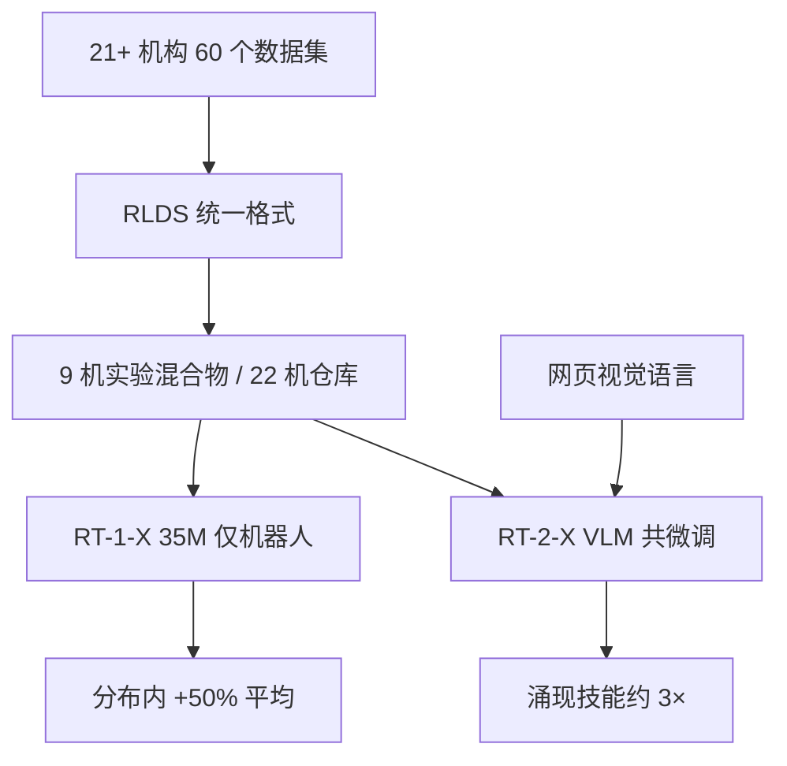

# Open X-Embodiment

    
我们能否训练「跨机器人」的通才策略，并高效适配到新的机器人、任务与环境？

    <footer>—— Open X-Embodiment Collaboration, Open X-Embodiment: Robotic Learning Datasets and RT-X Models, arXiv:2310.08864</footer>

2023 年 10 月，Google DeepMind 与合作实验室发布 **Open X-Embodiment（OXE）** 数据集与 **RT-X** 模型。DeepMind 博客 *Scaling up learning across many different robot types*（Vuong & Sanketi，2023-10-03）把故事写成：机器人一直是专家、不是通才；换机、换任务、换房间往往要从头训。OXE 把许多实验室已经采过的轨迹收成统一格式，检验一件事——**正迁移**：在多本体上共训，是否比只在本机数据上训更好。论文 arXiv:2310.08864，ICRA 2024。arXiv 第一版通讯作者序列以 **Abhishek Padalkar** 等领衔；后续版本改为字母序，署名 Open X-Embodiment Collaboration（Abby O'Neill 等）。引用时两者指向同一工作。项目页 robotics-transformer-x.github.io，代码在 `google-deepmind/open_x_embodiment`。

## 问题

视觉有 ImageNet，语言有网页语料，机器人交互日志既小又窄：同一房间、同一套物体、同一控制频率。再大的单一实验室数据集，也只是「一个岛」。先前跨本体工作往往要设计共享动作空间、域翻译或显式对齐；OXE 的实验立场相反：用最小对齐、高容量 Transformer，看正迁移是否已经出现。

第二个目标是基础设施。没有统一格式，21 个机构的 60 个数据集无法进同一个加载器。OXE 选择 RLDS / TFRecord，允许不同相机数、深度、点云与动作维，并提供并行加载。数据集本身不是新算法；算法贡献是证明 RT-1 与 RT-2 在几乎不改结构的情况下就能吃下混合物。

### 22 个本体不是 22 个可互换的人

论文与项目页：超过 100 万条真机轨迹，**22** 种本体（单臂、双臂、四足等），合作叙述从 21 个机构扩展到博客中的 33 个实验室；**527** 种技能、**160266** 个任务。Franka 场景最多样；xArm 与 Google Robot 贡献大量轨迹。语言指令用 PaLM 抽物体与技能后，主体仍是 pick-place 家族，长尾才是擦拭、装配。动作在训练时被粗对齐成相对夹爪坐标系的 7 维（平移、旋转、夹爪），观测取一个规范相机、统一分辨率。坐标系、绝对/相对/速度、相机外参**不**做精细对齐——同一数字在不同机上是不同运动。

博客写 22 种机器人、500+ 技能、15 万+ 任务、100 万+ episode，与论文摘要的 527 / 160266 一致到数量级。实验用的共训混合物只有 **9** 个操作本体：当时完整仓库还在涨。后来 π₀、GR00T 把 OXE 当开源底座，用的是仓库而非 2023 年那 9 机混合物。

## 方法

**RT-1-X**：35M 级、专为机器人设计的 Transformer。15 帧历史图像经 ImageNet 预训练 EfficientNet，语言经 USE 嵌入，FiLM 融合后约 81 个视觉—语言 token，解码器输出离散动作桶。只在机器人混合物上训。**RT-2-X**：把离散动作写成数字文本，与网页视觉语言数据大约 1:1 共微调，骨干是 RT-2 的 PaLI-X（ViT + UL2，WebLI）。动作每维 256 桶，外加终止维。损失都是词表上的交叉熵。推理 3–10 Hz；RT-1 本地，RT-2 当时走云端查询。

评测分两条。分布内技能：在合作实验室用各家「原方法」与只在本机上训的 RT-1 对照。博客与论文：RT-1-X 平均成功率约 **+50%**。涌现技能：在 Google 机器人上测 RT-2 训练域里没有、但其他本体数据里有的空间关系与介词（apple *on* cloth 对 *near* cloth）。RT-2-X 相对 RT-2 约 **3×**。容量表：在 Bridge、RT-1 原论文数据这种大岛上，35M 的 RT-1-X 会欠拟合、低于本机 RT-1；55B 的 RT-2-X 才能在大数据域上持平或超过——通才不是无条件的，要够宽。

### 格式统一是方法，不是预处理脚注

没有 RLDS，就无法在同一批里混 WidowX 与 Google Robot。粗对齐 7 维末端，是故意把「embodiment gap」留给网络，而不是先做运动学重定向。这解释了后续 VLA 为何仍要零填充更高维关节：OXE 证明正迁移在末端空间成立，不证明任意人形全身动作可以同一套 7 维桶。

## 机制

正迁移的机制假设是：抓、放、推在视觉—语言上共享统计，本体差异可被当作输入条件（通过不同视觉外观与未对齐的动作尺度）吸收。小模型在大岛上变差，说明混合物增加的是需要容量去记忆的多峰分布，而不是免费的正则。RT-2-X 的 3× 涌现被解释为：其他机器人的轨迹提供了原 RT-2 数据里缺失的空间介词与物体组合，高容量 VLM 才能把网页语义接到这些新动作上。介词实验是机制证据：只改 *on* / *near*，轨迹形状改变，说明语言条件真正调制了低层行为，而不是忽略指令、重复示范均值。

开放仓库的机制是社会性的：单个实验室采不到互联网级交互，但可以约定格式。ImageNet 类比是 DeepMind 博客原句，指的是评测与预训练习惯的转移，不是 OXE 已经达到 ImageNet 的清洗程度。

「Original Method」指各数据集作者为自己数据调过的模型，是强基线而不是弱随机策略。+50% 是多实验室、多机平均，单机可能更小或更大。RT-2-X 55B 权重并未像 RT-1-X 那样完整开源推理包；开放的是数据集、部分检查点与 RT-1-X。

### 跨本体并不消除控制频率与安全栈

3–10 Hz 的离散末端增量适合当时的移动操作演示，不适合 50 Hz 灵巧手。π₀ 后来用流匹配动作块，正是因为 OXE 式 tokenization 在高频上不够。OXE 也几乎不谈力控、接触安全与人机共享空间；它提供的是学习起点，不是控制器。

## 边界与工程取舍

技能长尾薄，多数仍是桌面操作。粗对齐会把「看起来可迁移」的失败藏进动作尺度：同一输出在另一机上可能过冲。评测由各实验室执行，场景与评分不完全同一协议。数据集持续追加，论文数字是快照；引用时写 arXiv:2310.08864 与项目页当时的统计。RT-2-X 的云端推理延迟与隐私不在开放复现范围内。

不要把 OXE 写成已经训出可商用的通用机器人。它证明正迁移存在，并提供至今仍被 π₀、OpenVLA、GR00T 引用的底座。也不要把 Padalkar et al. 与 O'Neill et al. 当成两篇论文——是同一合作的署名演变。后续 Open X 的扩充集、DROID 单独论文，应分开引用。

出处：Open X-Embodiment Collaboration，*Open X-Embodiment: Robotic Learning Datasets and RT-X Models*，arXiv:2310.08864，ICRA 2024，DOI 10.1109/ICRA57147.2024.10611477；DeepMind 博客 https://deepmind.google/blog/scaling-up-learning-across-many-different-robot-types/ ；项目 https://robotics-transformer-x.github.io/ 。RT-1、RT-2 为 Brohan 等先前工作。

## 小结

- OXE 把 22 个本体、100 万+ 轨迹收成统一 RLDS 仓库，用于跨机器人学习。
- RT-1-X 在合作实验室平均约 +50% 相对本机方法；RT-2-X 在涌现技能上约 3× 于 RT-2。
- 动作粗对齐为 7 维末端；不精细对齐坐标系，把本体差留给网络。
- 小模型在大数据岛上会欠拟合，正迁移需要容量。
- 开放的是数据与部分检查点；实验混合物小于后来的完整仓库。
- 出处：arXiv:2310.08864、ICRA 2024 与 DeepMind 2023-10-03 博客；早期版本常引 Padalkar et al.。
