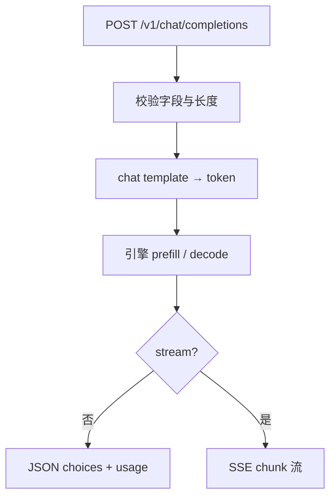

# OpenAI 兼容协议

客户端按 `/v1/chat/completions` 发 `messages`，服务端按同一套字段流式或一次性回 `choices`。兼容的是信封，不是某家闭源模型的权重。

<footer>—— 对照 OpenAI API 参考与 TGI / vLLM / MindIE 的兼容层说明</footer>

开源推理引擎几乎都提供一层「看起来像 OpenAI」的 HTTP：路径是 `/v1/chat/completions` 或 `/v1/completions`，请求里有 `model`、`messages` 或 `prompt`、`temperature`、`max_tokens`、`stream`。TGI 把它做成 Messages API 开关，vLLM 做成 `api_server`，LMDeploy 做成 `serve api_server`，MindIE EndPoint 把该路径列进支持表。本篇写这层协议在工程上承诺了什么、故意没承诺什么。它不是 IETF RFC，也没有一篇叫「OpenAI Compatible API」的经典论文；行为以各引擎文档与 OpenAI 公开的字段说明为准，不要编造协议的 arXiv。

## 问题

业务侧已经用官方 SDK、LangChain、自研网关对着云厂商的 Chat Completions 写完了。若每个开源引擎只暴露私有 `/generate`，适配成本会按引擎数线性涨。反过来，若声称「100% OpenAI 兼容」却在 `tools`、`logprobs`、多模态 `content` 数组、`seed` 上静默丢字段，线上会以「偶发拒答、偶发不流式」的方式失败。需要一份清晰的契约：哪些字段是生成的最小完备集，哪些是扩展，哪些必须在服务端用 [chat template](/llm/chat-template) 落到真正的 token 序列。

另一半问题是 Completions 与 Chat Completions 混用。前者吃原始 `prompt` 字符串，后者吃带 `role` 的 `messages`。基座模型与指令模型对这两种前缀的分布不同。网关若把 chat 请求拼成裸 prompt 却不走模型卡上的模板，表现会像「换引擎后变傻」，根因是协议层帮倒忙。

### 信封兼容与语义兼容

信封兼容：URL、JSON 字段名、流式时的 SSE 帧形状、错误对象大概能被现有客户端解析。语义兼容：同样的 `messages` 在两个后端 tokenize 后是同一串 token，采样字段的默认值相同，工具调用的参数 JSON 能被同一套 schema 校验。生产事故几乎都出在语义层——默认 `temperature`、是否丢弃 think 标签、EOS 与 stop 的优先级——而客户端 SDK 只检查信封。

`model` 字段在兼容服务里常常是路由键，不是权重哈希。同一字符串在 A 集群指向 7B 量化，在 B 集群指向 70B，是运维约定。客户端不应用 `model` 去推断上下文长度或工具调用能力。

## 方法

最小聊天请求是：`POST /v1/chat/completions`，body 含 `model` 与 `messages`（至少一条 `user`）。非流式返回一个 JSON，`choices[0].message.content` 为完整回复，`usage` 里是 prompt / completion token 计数。`stream: true` 时改为 `text/event-stream`，每帧一个 chunk，最后一帧习惯上带结束标记，细节见 [流式输出与取消](/llm/sse-cancel)。Completions 路径 `/v1/completions` 仍被 vLLM 等保留，给续写与旧客户端用；新应用应默认走 chat，以便模板与多轮角色可审计。

服务端必须在引擎之前做三件事：把 `messages` 经 tokenizer 的 `apply_chat_template` 变成字符串或 token；施加 `max_tokens` 与上下文窗的交；把 `stop`、`presence_penalty` 一类采样参数翻译成引擎内部的 `SamplingParams`。缺模板时，兼容层若擅自拼接 `User:` / `Assistant:`，等于发明了第三套格式。多模态消息把 `content` 从字符串变成 part 列表（text / image_url 等），引擎要能把图像编码进前缀；不支持时应返回明确 4xx，而不是忽略图片只读文字。

### 工具调用与结构化输出

OpenAI 后来在同一路径上加了 `tools` / `tool_choice`。兼容引擎若实现，通常是约束解码或后处理 JSON，而不是再训一个隐藏的工具头。TGI 文档把 guidance / schema 当成生成功能；这与「HTTP 字段叫 `tools`」可以对接，也可以各做各的。未实现时，正确行为是拒绝请求或忽略并在文档声明，而不是生成一段看起来像函数调用、却不能通过 schema 的文本。结构化输出（JSON mode）同样是解码约束，不是协议本身的魔法。

鉴权头 `Authorization: Bearer` 在自建集群里往往只是网关的占位；引擎进程可能完全不读它。不要把「兼容 OpenAI」理解成兼容了云厂商的计费、组织与限流语义。限流、API key 轮转、审计日志属于网关，应写在兼容层之外。

## 机制

协议能成为事实标准，是因为它把「对话状态」放在客户端：每次请求带上完整 `messages`，服务端可以无会话。这对无状态水平扩展友好，却把历史重复 tokenize、重复 prefill 的成本甩给引擎——于是需要前缀缓存与 [KV 感知路由](/llm/kv-aware-routing)。流式则把 TTFT 从「整段结束」改成「首 token」，但 `usage` 往往要到流结束才完整，网关不能在第一个 chunk 上做精确计费。

`n`、`best_of` 会把一条 HTTP 请求放大成多条内部序列，显存与计费都按内部序列走。兼容层若只在 HTTP 并发计数上做配额，会被 `n>1` 打穿。`logprobs` 改变返回体积与内核是否物化完整分布，默认应关。`seed` 在张量并行与连续批下通常不能保证跨引擎比特一致，只能当弱可复现，见 [张量并行](/llm/tensor-parallel) 里 All-Reduce 次序对浮点的影响。

TGI 自有 HTTP API 与 Messages API 并存。只测 `/generate` 不能证明 OpenAI 客户端可用；只测 chat 也不能证明旧 Completions 脚本可用。兼容矩阵要按路径列，不要按项目名列。

### 错误形状与版本漂移

OpenAI 风格错误体一般是 `{"error": {"message": ..., "type": ..., "code": ...}}`。引擎用 FastAPI 默认 422 或 HTML 错误页时，官方 SDK 会解析失败，表现为「连不上」而不是「参数非法」。兼容工作有一半是把校验错误翻译成这层信封。字段还会漂移：`max_tokens` 与 `max_completion_tokens`、`functions` 与 `tools`。兼容层应声明自己对齐的文档日期，而不是声称追踪最新云 API。

## 边界与工程取舍

兼容协议不包含模型许可、内容安全、检索增强或代理循环。它也不规定 KV 如何分页、是否多 LoRA。那些是引擎与调度的事，见 [多 LoRA 服务](/llm/multi-lora-serving)。客户端 SDK 的默认超时、代理的缓冲（Nginx 默认可能攒满 SSE）会破坏流式语义，这是运维问题，协议文本写不清楚。

不要用云厂商的模型名去打开源兼容端，除非路由表显式做了别名。不要假设 `/v1/embeddings`、`/v1/audio/transcriptions`、`/v1/images/generations` 随 chat 一起存在；MindIE 把视图生成放在另一套件，就是反例。协议最小核心就是：聊天或补全、可选流式、可选用量。每多一个路径，就多一张测试表。

引用 OpenAI 公开 API 参考、Hugging Face TGI Messages API、昇腾 MindIE EndPoint 列表与各引擎的 OpenAI serving 说明。没有单独的标准编号；互操作靠对照字段，不靠伪造论文。

## 小结

- OpenAI 兼容指 HTTP 信封与常见字段，不是模型等价，也不是完整云平台语义。
- Chat Completions 必须经官方 chat template 再进引擎；不要在网关里发明角色拼接。
- 流式、工具调用、多模态、logprobs 是可选项，未实现应显式失败。
- 无状态 `messages` 便于扩缩，但把前缀成本交给 KV 缓存与路由。
- 错误体与默认采样值属于兼容性的一部分，不是装饰。
- 出处：OpenAI API 参考；TGI / vLLM / LMDeploy / MindIE 各自的兼容层文档。
