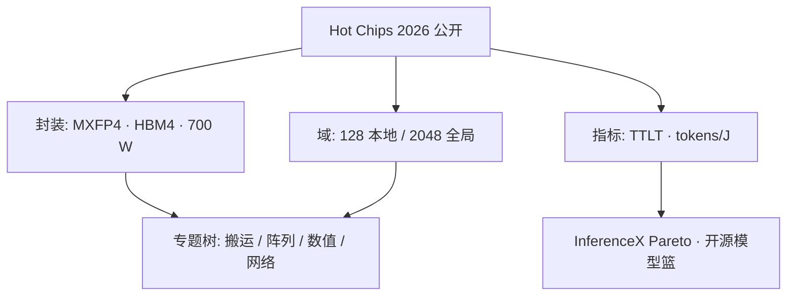

# OpenAI Jalapeño 推理芯片

    
把它读成一块推理平台，而不是一张缩小的 GPU：公开指标是 last token 时间与每焦耳 token，公开规格钉在 Hot Chips 2026 的封装与域上。

    <footer>—— OpenAI，Hot Chips 2026 Jalapeño 环节的公开框架</footer>

OpenAI 在 **Hot Chips 2026** 公开了自研推理 ASIC **Jalapeño**（报道里 Jalapeno / Jalapeño 两种拼写并存）。它不是训练卡，也不是通用 CUDA 设备：硅、主机与机柜按逐步生成来共设计，目标是多芯片工作负载上、低延迟下的性能每瓦。本篇是这块芯片的**公开总表**：时间线、封装数字、评测口径，以及 jalapeno 专题树怎么分读。空白设计动机见 [推理专用](/llm/jalapeno-inference-only)，数据放置见 [减少搬运](/llm/jalapeno-data-movement) 与 [切片 HBM](/llm/jalapeno-sliced-hbm)，矩阵核见 [脉动阵列](/llm/jalapeno-systolic)，数值见 [MXFP4](/llm/jalapeno-mxfp4)，分工见 [Broadcom / TSMC](/llm/jalapeno-openai-broadcom-tsmc)，网络见 [Tomahawk](/llm/jalapeno-tomahawk)。未在演讲与可靠报道中出现的阵列边长、指令集、未发布 Gen 2/3 数字，一律不写。

## 问题

前沿 LLM 服务把一次请求拆成计算偏重的 prefill、可选草稿，以及带宽与 MoE 突发主导的 decode。用户看见的是端到端 last token 时间，电费看见的是每焦耳多少 token。通用 GPU 必须同时付训练、图形与十年 CUDA 生态的税；异构机群（一张卡专门 prefill、一张专门 decode）又会在配比漂移时留下闲置加速器。OpenAI 的公开论点是：从空白做一颗**均衡推理芯片**，阶段用不到的单元门控，KV 留在本地，而不是在阶段边界把 KV 搬到另一类机器上。这与把 [PD 分离](/llm/pd-disaggregation) 做成产品线，是不同的系统答案。

读者容易把「自研芯片」理解成数据手册已经齐了。Hot Chips 给出的是**实验室评测设定下的封装与 Pareto 点**，不是可售 SKU 的全套电气表。问题因此是：如何只引用已经公开的数，并标明口径。

### 公开规格只钉幻灯上的数

现场稿与随后核验报道反复出现的封装级数字是：约 **13.4 PFLOP/s** 的 MXFP4×MXFP4 矩阵算力；**15.4 TB/s** HBM4、**216 GiB**；封装功耗 **700 W**。2048 芯片系统被写成约 27 EFLOP/s、432 TiB。片间：本地 **128** 颗 ASIC 的低延迟域（报道写约 600 GB/s 档），再经 Broadcom Tomahawk 6 的半扁平两级 Clos 扩到 **2048** 颗全局域（约 200 GB/s 档）；张量并行走更高带宽、专家并行走较低带宽。对照封装功耗：Jalapeño 700 W，GB200 1.2 kW，GB300 与 MI355X 1.4 kW——这是评测设定，不是本博客测的。

时间线公开叙述大致是：2024 年底架构概念、2025 年 RTL 冻结、2025 年底 tapeout，之后实验室跑通 Codex，再跑 ChatGPT。九个月量级的 RTL 到 tapeout，被讲者当作全栈协同的证据。Gen 2「已在开发、数月内瞄准 tapeout」、Gen 3 瞄准经济低延迟服务，都没有给出节点或算力数字。

600 GB/s 与 200 GB/s 是域级注入带宽量级，不要理解成任意一对核的点对点速率，也不要理解成 Tomahawk 6 芯片的 102.4 Tb/s 吞吐。六堆 HBM、I/O 小芯片节点等二次报道，在本篇不当作幻灯原文。

## 方法

读这块芯片，按三张表，而不是按「相当于几张 B200」。

第一张是**工作负载表**：只服务 LLM 前向。没有公开把反向、优化器状态、训练集合通信写成一等公民。Gluon 把每个物理核当 thread block，核上有张量、SIMD、标量引擎与本地内存视图。公开说内部模型把功能正确的核优化到高性能，注意力与 MoE 核相对已有专家手写约 1.5×–1.8×，并在芯片上端到端验证——这是设计方法，不是用户 API 保证。

第二张是**评测表**：SemiAnalysis InferenceX，跨开源模型、覆盖 prefill 到 decode、按封装 TDP 做功率归一化。Pareto 幻灯在 GPT-OSS 120B、DeepSeek R1 670B、Kimi K2.5（约万亿参数，名称以幻灯为准）上把 Jalapeño 画在前沿。匹配工作点上约 1.5×–1.9× 每千瓦吞吐、若干倍端到端延迟，都钉**指定模型、指定对照配置**。OpenAI 还指出对照路径上 GPU 侧常用多 token 预测 / 投机，而 Jalapeño 演示多用单 token 预测。亚毫秒 token 间隔、若加 MTP 还有约 3×–5× 延迟改进空间，是公开宣称或预告，需与已测点分开。

### 评测口径不是数据手册

第三张是**工业表**：架构与工作负载在 OpenAI；实现管道、接口 IP 与以太交换点名 Broadcom；板卡机柜点名 Celestica；工艺节点在二次报道里常写成 TSMC 3 nm 级。计算裸片被描述为大部分新写 RTL。网络走量产 Tomahawk 6，而不是再流一片专用 scale-up 交换。Bring-up 用 GPT-OSS、DeepSeek R1、Kimi K2.5 证明并非只能跑共设计的闭源模型；甚至有报道称实验室用 Codex 提示把 Doom 一类程序迁到芯片上——那是逸事，不是产品特性。

Hot Chips 数字来自 OpenAI 自己的测量与公开幻灯。本篇转述时保持「厂商在指定模型上的 Pareto 点」，不把每千瓦倍数写成对任意 Rubin 机柜的普遍定律。

## 机制

空白设计省下的税，公开叙述花在三处：封装功耗预算低于千瓦级训练 GPU；阶段门控让闲置单元不付底噪；空间化执行加本地张量，让人和搜索都能写核。切片 HBM 与集合网络要解决的是「峰值带宽已经很高、利用率却贴不近峰值」——128 芯片聚合带宽被讲者用来估算天花板，并立刻承认真实系统远低于该天花板。权重驻留脉动阵列是随后分析对矩阵热路径的报道口径；阵列几何未公开。MXFP4 把峰值矩阵算力标在 OCP 微缩放格式上，softmax 与归一化仍要更高精度。

与 GPU 的位置：少训练与图形，多针对逐步生成与能量。与 Groq 类 SRAM LPU 的位置：Jalapeño 公开规格走 HBM4 大容量带宽，不是整模常驻 SRAM。不要把三张芯片画成同一条屋顶线。

### 与 GPU、LPU 对照时钉同一套解码

比较若一边开投机、一边单 token，Pareto 点会换位置。比较若停在 Blackwell、而 Rubin 已在出货，基准会过时。实验室工程样品与云上可售容量不是同一阶段。单芯片均衡赌的是**同一次请求内阶段比例会变**；负载若长期极端偏斜，这个赌可能输。

## 边界与工程取舍

不要把 InferenceX 的每千瓦倍数直接换成「替代 N 柜 Rubin」。不要假设训练会在这颗芯片上发生。不要编造未公开的算子白名单、未发布的 Gen 2/3 规格、未在幻灯出现的阵列行列数。生态税转给软件：没有 CUDA 十年的算子库；三个开源模型证明可行性，不是 Hugging Face 上每一个检查点都能当天出生产 SLA。

出处：Hot Chips 2026 OpenAI Jalapeño 环节的现场报道与公开幻灯叙述；InferenceX 为 SemiAnalysis 的公开基准框架。付费通讯里未公开的内部规格不当作官方数据手册。

## 小结

- Jalapeño 是 OpenAI 从空白做起的 LLM 推理平台，公开于 Hot Chips 2026。
- 封装级公开数：MXFP4 约 13.4 PFLOP/s、HBM4 15.4 TB/s / 216 GiB、700 W；域是 128 / 2048。
- 指标是 last token 时间与每焦耳 token，对照钉模型与是否投机解码。
- 专题树分写动机、搬运、阵列、数值、代工与以太；本篇只钉总表。
- 出处：Hot Chips 2026 公开报道。
