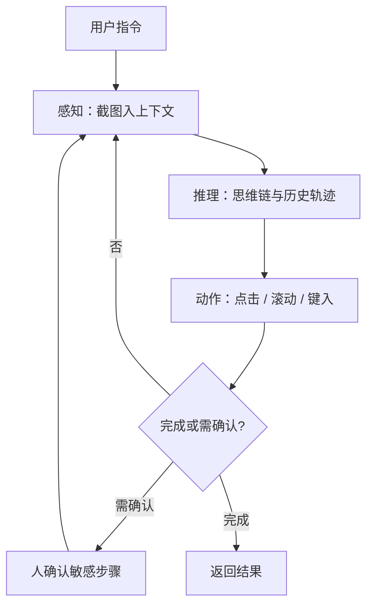

# OpenAI Operator

    
用同一套屏幕、鼠标、键盘接口去操作网页：先看像素，再推理下一步，再点、滚、输入，直到任务结束或需要人确认。

    <footer>—— OpenAI，Computer-Using Agent 研究博客，2025 年 1 月 23 日</footer>

2025 年 1 月 23 日，OpenAI 以研究预览发布 **Operator**：用户给出自然语言任务，远程浏览器里的代理去打开页面、点击、滚动、填表。驱动它的不是一套网站专用 API，而是 **Computer-Using Agent（CUA）**：在 GPT-4o 视觉能力之上，用强化学习训练「看 GUI、选动作」的循环。本篇只写架构与评测合同。不写攻击、越权、绕过认证、对抗网页注入的利用步骤；敏感操作在官方叙述里默认要人确认。

## 问题

多数软件只对人暴露图形界面。没有公开 API 时，工具调用代理只能停在「描述页面」或依赖脆弱的选择器。CUA 要把问题改写成：给定当前屏幕的像素与任务指令，下一步合法的人机动作是什么。动作空间刻意做成通用的——点击、滚动、键入——以便同一模型覆盖电商、内容管理、论坛一类异构站点，而不为每个站点写适配器。

通用接口的代价是评测难、失败模式多。站点改版、弹窗、广告层、动态列表都会让轨迹分叉。官方明确：早期阶段不能指望在所有场景可靠。产品层把模型（CUA）与托管浏览器工作流（Operator，后并入 ChatGPT agent mode）分开：前者是感知—推理—动作策略，后者是远程浏览器、确认门与系统卡里的部署约束。把演示视频里的一次成功订票写成「已解决任意真实网站」，会越过评测合同。

### 像素接口相对 DOM 选择器

DOM 或无障碍树给出结构化节点，但对 canvas、自定义控件、跨源 iframe 经常残缺。像素接口不依赖站点是否提供稳定 `id`，却把定位误差、分辨率、遮挡全部交给视觉编码器。OpenAI 的选择是：训练时用 GUI 元素（按钮、菜单、文本框）作为人使用的同一表面，推理时把截图追加进上下文，用思维链记录中间假设。这与 [function calling](/llm/function-calling) 的 JSON 工具表不同：这里「工具」是虚拟键鼠，观察是图像而不是 API 返回值。

Operator 是产品预览；CUA 是模型。2025 年 7 月官方更新把独立站点 operator.chatgpt.com 收进 ChatGPT agent mode。写复现日期时要声明看的是研究博客里的 CUA 数字，还是后来的产品包装。

## 方法

给定用户指令，CUA 进入迭代循环。**感知**：把计算机当前截图写入模型上下文。**推理**：结合当前与历史截图、已执行动作做思维链，评估观察、跟踪子目标、在偏离时改计划。**动作**：发出点击、滚动或键入，直到判定完成或需要用户输入。登录、验证码一类敏感步骤，官方描述为寻求用户确认，而不是由模型独自提交凭据。评测与产品演示都走这条循环；差别只在环境是基准站点还是远程浏览器。

评测用同一套通用接口，而不是给每个基准特制选择器。计算机使用看 [OSWorld](https://arxiv.org/abs/2404.07972)（Xie 等人，真实操作系统上的开放任务）；浏览器使用看 [WebArena](https://arxiv.org/abs/2307.13854)（Zhou 等人，自托管开源站点模拟电商、CMS、论坛）与 [WebVoyager](https://arxiv.org/abs/2401.13919)（He 等人，Amazon、GitHub、Google Maps 等在线站点）。官方表：OSWorld 成功率 38.1%（此前通用接口 SOTA 约 22.0%，人类 72.4%）；WebArena 58.1%（此前通用接口 36.2%，网页代理 57.1%，人类 78.2%）；WebVoyager 87.0%（与当时网页代理并列，此前通用接口 56.0%）。WebVoyager 任务相对简单，高分不能外推到 WebArena 的复杂工作流。OSWorld 上观察到测试时缩放：允许步数增多，成功率上升。

### 基准量的是成功率，不是「像人」

WebArena 离线自托管，站点版本与评分脚本可冻结。WebVoyager 走在线站点，页面会变，分数必须绑日期与评测脚手架。OSWorld 覆盖 Ubuntu 等完整桌面，任务含文件、浏览器、系统设置，比「只操作标签页」更宽。官方另给 Operator 上手动试次表：同一类提示在不同站点上 3/10 到 10/10 都出现过；提示是否点明「去筛选区」会显著改变成功率。引用时写清：CUA 研究博客的基准表，还是 Operator 上少量手工试次。不要把后者平均成前者。

## 机制

循环改变的条件分布是「当前像素 + 历史动作」，不是单次截图分类。思维链把多步计划留在上下文里，使模型能在弹窗出现后改道，而不是死记一条点击序列。通用动作空间降低对站点 API 的依赖，也把误差累积变成主失败模式：点偏一次，后续观察全错。步数上限与「需要人时停下」是部署侧的正则，不是损失里的 KL。

安全叙述分三层，只作为架构约束来读：误用（拒答、站点黑名单、审核）、模型失误（提交订单前确认、高风险任务拒绝、敏感站点要求人在环）、对抗性页面内容（谨慎导航、额外监控模型暂停执行）。细节以 *Operator System Card* 为准。本篇不讨论如何绕过这些门。预备度评估称相对 GPT-4o 无额外前沿风险增量——这是系统卡语句，不是通用安全证明。

### 与专用网页代理的动作空间

许多网页代理吃 DOM 或无障碍树，动作是「点第 17 个可交互节点」。CUA 吃像素，动作是坐标与键鼠。前者在结构完整时更稳、延迟更低；后者在无结构或结构撒谎时仍可能动。评测若混用两种观察，分数不可比。Anthropic 的 computer use、Google 的 Mariner / Gemini Computer Use 同属「看屏操作」家族，但训练数据、确认策略、是否优化桌面 OS 都不同，见 [Gemini Computer Use](/llm/gemini-computer-use)。开源循环若用 Playwright 驱动浏览器，观察往往是 DOM 加截图，见 [Browser-use](/llm/browser-use-agent)。

数字绑定：OSWorld 38.1%、WebArena 58.1%、WebVoyager 87.0%，出自 2025-01-23 的 CUA 博客。人类对照与「此前 SOTA」同表。换脚手架、换允许步数、换是否给提示，都要重测。

## 边界与工程取舍

### 产品预览不是基准本身

研究预览最初对美国 Pro 用户开放远程浏览器，不是把 CUA 权重交给任意本机。官方后来把能力并入 ChatGPT agent mode，独立 Operator 站点计划关停。API 侧另有 computer use 工具：宿主执行动作、回传截图。工程上必须由宿主缩放坐标、白名单动作、截断轨迹；模型只出结构化动作。本机桌面控制、任意文件删除、支付提交，都不在「默认应自动完成」的集合里。

复杂基准与人类差距仍大：OSWorld 38.1% 对 72.4%，WebArena 58.1% 对 78.2%。不熟悉的编辑器 UI、精细文本编辑是博客点名的弱点。提示里给出日期格式与「使用筛选区」能抬手工试次，说明系统对提示工程敏感，不是站点不变式。网页上的注入与钓鱼属于模型失误的子类，防护是确认、监控与拒答，不是让代理去「测试对方站点的漏洞」。

出处：OpenAI，*Computer-Using Agent* 与 *Introducing Operator*，2025-01-23；评测引用 Xie 等 OSWorld、Zhou 等 WebArena、He 等 WebVoyager。安全细节见 Operator System Card。不要把 ChatGPT agent mode 的产品演示分数写回这篇基准表。

## 小结

- Operator 是托管浏览器里的计算机使用代理；CUA 是看像素、出键鼠动作的模型。
- 循环是感知（截图）→ 推理（思维链）→ 动作（点击/滚动/键入），敏感步等人。
- 官方通用接口分数：OSWorld 38.1%，WebArena 58.1%，WebVoyager 87.0%；人类对照仍明显更高。
- 评测必须冻结基准、步数与日期；手工试次表不能替代基准表。
- 本篇只讨论架构与评测，不讨论对外部系统的攻击或绕过确认。
- 出处：OpenAI CUA / Operator 博客（2025-01-23）；OSWorld、WebArena、WebVoyager。
