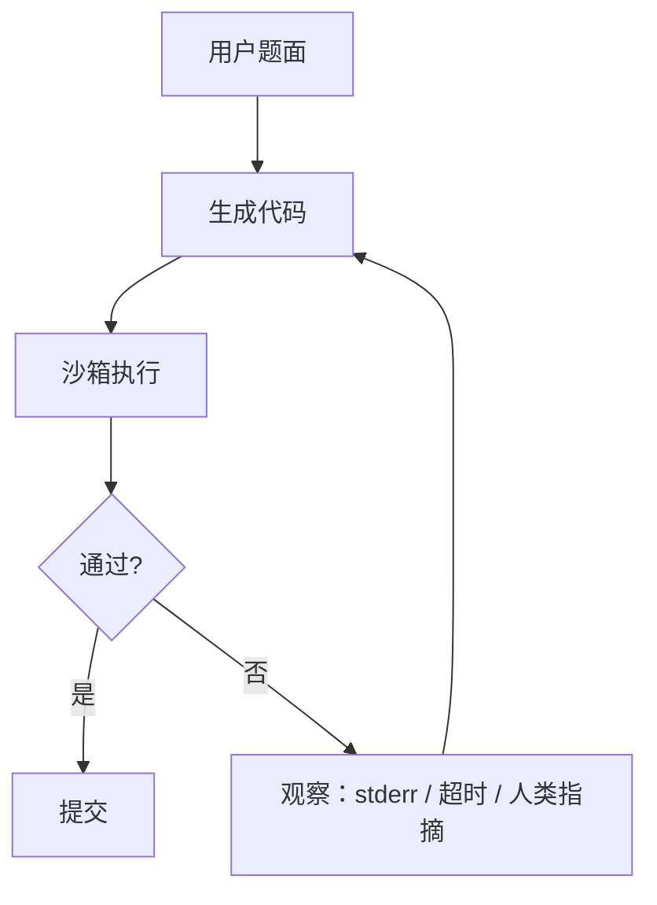

# OpenCodeInterpreter

    
把代码生成接到执行与多轮修正上：模型写出的程序经过解释器，反馈再写回对话，而不是单次采样碰 HumanEval。

    <footer>—— Zheng 等，OpenCodeInterpreter: Integrating Code Generation with Execution and Refinement，arXiv:2402.14658</footer>

HumanEval 默认协议是一次生成、隐藏测试判分。真实写代码几乎总是：跑一下、看报错、改、再跑。Tianyu Zheng、Ge Zhang 等人 2024 年的 OpenCodeInterpreter（OCI，arXiv:2402.14658）把这条循环收成可训练的多轮分布：构造 **Code-Feedback** 对话数据，在 Code Llama / DeepSeek-Coder / CodeQwen 等代码基座上微调，使模型在看见解释器输出（以及可选的人类反馈）之后继续改代码。本篇写执行反馈如何进入后训练，以及评测一旦允许「跑测再改」，`pass@1` 的含义如何相对单次合成发生变化。不把仓库级修 issue 写成这篇的任务——那是 [SWE-agent](/llm/swe-agent) 的 ACI 与 SWE-bench。

## 问题

单次代码生成把编译错误、断言失败、超时全部折叠成「没过」。梯度或指令微调若从未见过「Traceback 下一轮该改哪」，模型只会在同一分布上再采样一次，等于用温度代替调试。闭源系统可以用内部执行循环抬分，开源线若只发布单轮 Instruct，用户在 IDE 里接解释器也接不上训练分布。OCI 要补的是：**多轮轨迹**公开、反馈类型可分（执行 vs 人类）、基座可换，从而证明「会修自己的代码」可以当作后训练目标，而不是产品黑盒。

另一问题是反馈泄漏。若训练里把隐藏测试的期望输出直接当观察，模型学会的是作弊读答案，不是读报错。合法观察应接近开发者能看见的东西：解释器 stdout/stderr、超时、语法错误，以及人类风格的「这里索引越界」——而不是测试套件的断言清单全文。论文用 Code-Feedback 把两类反馈写成对话轮次，就是要在数据层面把泄漏和调试分开。

### 单轮 Instruct 与带执行的多轮不是同一任务

Base 或普通 Instruct 在 HumanEval 上的 pass@1，测的是单次合成。允许模型执行并迭代 $N$ 轮后的 pass 率，测的是调试策略与反馈利用。两者都可以叫「HumanEval」，合同完全不同。OCI 的主表必须读清：是否开执行、轮数上限、是否另加人类反馈。把带执行的 80+% 拿去对 Code Llama 论文里的贪心单次 pass@1，是换题。

Code-Feedback 规模约 6.8 万条多轮。它不是 GitHub 原始 issue，而是围绕编程题构造的生成–执行–修正轨迹，并混入模拟或真实的人类意见。不要当成 SWE-bench 的开源版。

## 方法

数据：从编程任务出发，让模型（或教师）生成代码，送进沙箱执行，把返回拼成下一轮用户/系统观察，再生成修正；筛选留下最终能过测试或满足格式的轨迹。人类反馈轮提供自然语言指摘（缺边界、命名、复杂度），与编译器反馈互补——后者密、结构化，前者疏、针对「能跑但不好」。微调：在已有代码基座上做对话 SFT，模板必须区分「代码块」与「执行观察」，否则模型会在 Thought 里伪造 Traceback。

推理循环：生成 → 抽取代码 → 沙箱执行 → 观察写回 → 直到通过、达轮数上限或模型声明结束。沙箱约束（无网、限时、限内存）与 HumanEval 评测同一精神，见 [HumanEval / SWE-bench](/llm/code-bench)。作者在多个尺寸上放出 OCI-CL、OCI-DS 等检查点，用来说明循环可迁移，不是绑死某一个基座。叙事上，带执行的 OCI 在 HumanEval / MBPP 及其 plus 变体上接近或局部超过当时的 GPT-4 单次/少轮数字——引用必须写「开执行的多轮」，不能写成「开源 33B 单次击败 GPT-4」。

### 两种反馈进同一对话，梯度却不同质

执行反馈是环境给的硬信号，几乎总是对的（沙箱本身除外）。人类反馈是软信号，可能错、可能过时。训练若把两种观察写成同一角色、同一前缀，模型会把「用户随便一说」当成编译器。方法上应在模板里标记来源，或至少在少样本里示范：对 Traceback 做针对性改行，对人类意见做设计层修改，不要每轮都整文件重写。论文强调 refinement，即局部修正优于推倒重来——这既省 token，也减少「越改越漂」。

## 机制

执行观察把隐藏状态从「我猜测试会怎么查」拉到「类型错误在第 12 行」。下一轮的条件分布因此包含了单次生成没有的信息，pass 率上升在机制上几乎必然，真正要问的是：**同样轮数预算下，SFT 过反馈的模型是否比未训练、只靠提示循环的基座更会改**。OCI 的主张是会，因为轨迹教过「读哪一类错、改哪一块」。若只是在推理期套同一个循环而不微调，基座也会涨分，但浪费轮数、重复同一错误的比例更高。

### 评测合同一松，执行循环就会刷爆单文件题

HumanEval 题短、依赖少、执行便宜，最适合展示 refinement。换到需要安装、网络、多文件的仓库，解释器反馈不再是一条 Traceback，而是构建系统噪声。OCI 不提供仓库定位工具，循环会在错误文件上反复执行。机制边界因此很清楚：这篇优化的是**函数级调试对话**，不是 issue 级软件工程。把 OCI 接上 grep/edit 而不改数据，等于把没见过的观察格式丢给模型。

plus 基准（更多测试、更狠边界）会让「一次碰巧过」变难，执行循环的相对收益往往更大。报分时写清 HumanEval 还是 HumanEval+，以及 $N$ 轮。只写一个百分比无法复核。

沙箱必须由宿主执行。模型在文本里写「已运行，全部通过」不算观察。这与 [ReAct](/llm/react) 里 Observation 不能由模型代写是同一条纪律。

## 边界与工程取舍

### 泄漏、成本、与仓库代理的分工

训练或评测若把隐藏测试期望输出喂回去，分数无意义。每轮执行有 CPU 与超时成本，评测墙钟不再是生成 token 数。恶意代码（死循环、占盘）要靠沙箱，不在模型权重里解决；本篇不讨论越权利用，只强调默认无网、资源限额。OCI 不替代 [Aider](/llm/aider) 或 Cursor 类工作流：那些要读仓库、打补丁、跑项目测试。它替代的是「单次 Instruct 写完函数」。

基座选择：代码预训练越强，第一轮代码越接近可跑，循环越短；弱基座会把预算耗在修语法。微调会损伤纯聊天，除非混入通用对话。许可随基座（Llama / DeepSeek / Qwen）走，Code-Feedback 数据许可另读仓库。

出处：Zheng et al.，*OpenCodeInterpreter: Integrating Code Generation with Execution and Refinement*，arXiv:2402.14658，2024。对照单次代码模型论文时，必须声明是否开执行循环。

## 小结

- OCI 把生成–执行–修正写成多轮 SFT 目标，数据为 Code-Feedback。
- 合法观察是解释器输出与人类指摘，不是隐藏测试答案。
- 带执行的 HumanEval 分与单次 pass@1 不可比。
- 任务单位是函数级调试，不是 SWE-bench 仓库修 bug。
- 出处：Zheng et al.，arXiv:2402.14658。
