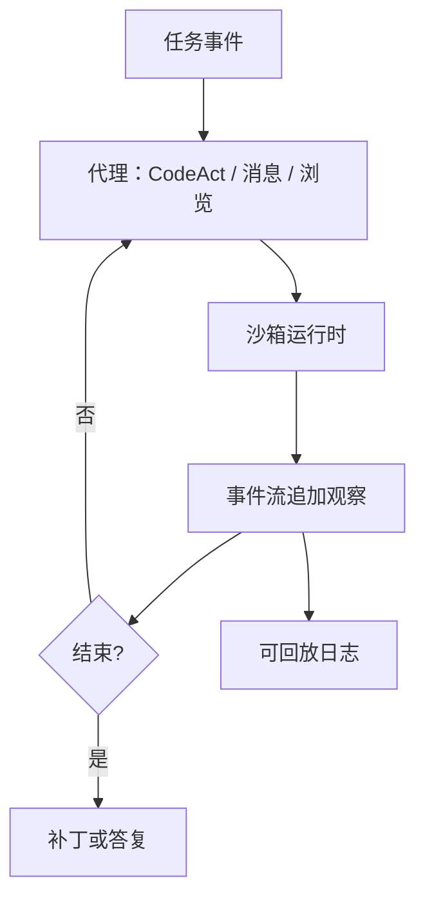

# OpenHands / OpenDevin

    
把「AI 软件开发者」做成开源平台：动作是可执行代码与命令，事件流记录每一步，运行时默认进沙箱，评测与扩展走同一套接口。

    <footer>—— Wang 等，OpenHands: An Open Platform for AI Software Developers as Generalist Agents，arXiv:2407.16741</footer>

2024 年社区里的 OpenDevin 是对闭源 Devin 演示的开源反应：要一个能读仓库、改文件、跑命令、必要时浏览文档的通用开发代理。随后项目更名为 **OpenHands**，以免与产品商标缠在一起。Xingyao Wang 等人的平台论文（arXiv:2407.16741）把这件事写成工程合同：以 **CodeAct** 为主的动作空间（模型写 Python/bash，运行时执行）、**事件流** 作为状态、Docker 等沙箱作为默认计算机、以及可插拔的评测与「微代理」技能。本篇写平台工作流与工具循环。不写攻击性利用；沙箱是隔离开发环境，不是越权目标。

## 问题

SWE-agent 证明专用 ACI 在 SWE-bench 上有效，但研究与产品还需要：**换模型、换任务（仓库 / 网页 / 数据脚本）、换运行时（本地 Docker / 远程）时不必重写 agent**。闭源演示把规划、编辑器、浏览器、记忆焊死。开源若只给一条 ReAct 提示 + 裸 shell，观察格式、权限、评测脚本各叉一路，分数不可比。OpenHands 要回答的是平台问题：通用开发代理的最小抽象是什么，才能让社区在同一事件流上加技能、跑 [SWE-bench](/llm/code-bench)、而不把每个新工具都做成一次性正则解析。

改名是引用问题。2024 年中的博客与 issue 仍写 OpenDevin；论文与现仓库写 OpenHands。同一套代码历史，两套名字。写相关工作时两者都要能检索到，但新引用用 OpenHands，并注明曾用名，避免读者以为是两个系统。

### 通用主义的代价是动作空间变大

CodeAct 让模型直接写代码当动作：开文件、打补丁、跑测试、调库，全部可以是一段 IPython。表达力高于 SWE-agent 的固定命令表，出错模式也更多——无限循环、装包、路径遍历到沙箱外（若配置错误）。平台必须把「能表达」和「默认允许」分开：运行时白名单、工作目录、网络策略是配置，不是模型自己选。论文卖通用，工程上仍要最小权限。

CodeAct 来自同一作者线的前作：用可执行代码统一工具调用，而不是为每个 API 写 JSON schema。OpenHands 把它落到软件工程运行时。不要与「写代码的模型」混名：这里代码是动作，不是最终交付物本身（交付物往往也是代码）。

## 方法

核心循环：任务进入 → 代理根据事件流历史决定下一条动作（消息给用户、执行 IPython、执行 shell、浏览 URL 等）→ 运行时执行 → 结果作为事件追加 → 直到完成、中止或步数上限。事件流是唯一事实来源：文件差异、命令输出、用户插入的补充说明，都是事件，便于回放与评测。运行时默认容器化，仓库挂到工作目录；测试与安装发生在容器内，避免污染宿主机。

扩展：技能/微代理用文档与示例教代理「这类任务先跑哪条命令」；工具以插件注册，但仍鼓励能用代码完成的事走 CodeAct，以免工具表膨胀。评测套件把 SWE-bench、网页或辅助基准接到同一 runner，冻结步数、是否给测试日志、模型名。这是平台论文相对单点 agent 论文多出来的方法：可复现的实验床，而不只是一条提示。

### 平台量过的，与演示视频不是同一合同

论文与技术报告给出在 SWE-bench Lite 等集合上、特定骨干模型与步数下的 resolved 率，并与当时其他开源代理比较。数字绑定：子集、是否 hint、模型 API 版本、最大迭代。官方演示可以看浏览器与编辑器 UI，那是前端，不是评测合同。量不出：任意私有 monorepo、需要 VPN 与生产凭证的任务——平台可以接工具，但默认沙箱无你的凭证是特性。把演示里「能打开浏览器」写成「已解决 WebArena」要另查表。

## 机制

事件流把 ReAct 的 Thought–Action–Observation 落成可序列化日志：Thought 可进消息事件，Action 进运行时，Observation 进下一条事件。回放调试时人看的是同一条流，模型下一轮条件化的也是它（经截断）。CodeAct 的机制优势是组合：没有现成「运行 pytest 某节点」工具时，模型可以写三行 Python 调 pytest——前提是环境里装了依赖。机制风险是错误组合：装错版本、改错路径。沙箱与步数上限是在环境侧做的正则，不是损失里的 KL。

### 与 SWE-agent、Aider 的接口哲学

SWE-agent：小命令集、观察为 LM 特制，自变量是 ACI。OpenHands：大表达空间、平台可插拔，自变量是事件流 + 运行时。Aider：人在回路、git 提交为节奏，地图检索减 token。OpenHands 可以跑全自动评测，也可以做成交互式；默认叙事偏研究平台与开源 Devin 替代。选接口等于选失败形态：ACI 失败是命令不够用，CodeAct 失败是代码动作本身有 bug。

沙箱网络默认应关或白名单。代理编码需要 pip install 时，应走项目规定的依赖源，而不是让模型随便拉包。配置错误把工作目录指到宿主机根路径，平台抽象帮不上忙——这是运维合同。

## 边界与工程取舍

### 名字、许可、与闭源演示的距离

OpenDevin 旧文档、旧 Docker 镜像与 OpenHands 新包名可能并存，部署以当前仓库 README 为准。许可与第三方模型 API 费用分开：平台开源不等于骨干开源。闭源 Devin 的内部 ACI 未公开，不能用 OpenHands 分数「击败 Devin」除非同一题单同一隐藏测试——通常没有。浏览器动作涉及登录页时，本篇只讨论公开文档抓取与本地前端调试，不讨论绕过认证。

上下文会被命令输出打满，需要与 SWE-agent 同类的截断策略，否则早期 issue 消失。多代理/微代理会增加协调失败：两个技能改同一文件。产品若对人展示，应把事件流译成 diff 视图，而不是给用户看原始 IPython。需要结对、小步提交，读 [Aider 工作流](/llm/aider)；需要 Cursor 类 IDE 循环，读 [代理编码](/llm/agentic-coding)。

出处：Wang et al.，*OpenHands: An Open Platform for AI Software Developers as Generalist Agents*，arXiv:2407.16741。曾用名 OpenDevin。CodeAct 前作分篇引用，不要把所有代码-当-动作论文都算成 OpenHands。

## 小结

- OpenHands 是开源软件开发代理平台；OpenDevin 是曾用名。
- 抽象是事件流 + 沙箱运行时 + CodeAct 为主的动作空间。
- 评分必须冻结子集、模型、步数；演示 UI 不是基准。
- 相对 SWE-agent 更通用、动作更大；相对 Aider 更偏自动与研究床。
- 出处：Wang et al.，arXiv:2407.16741。
