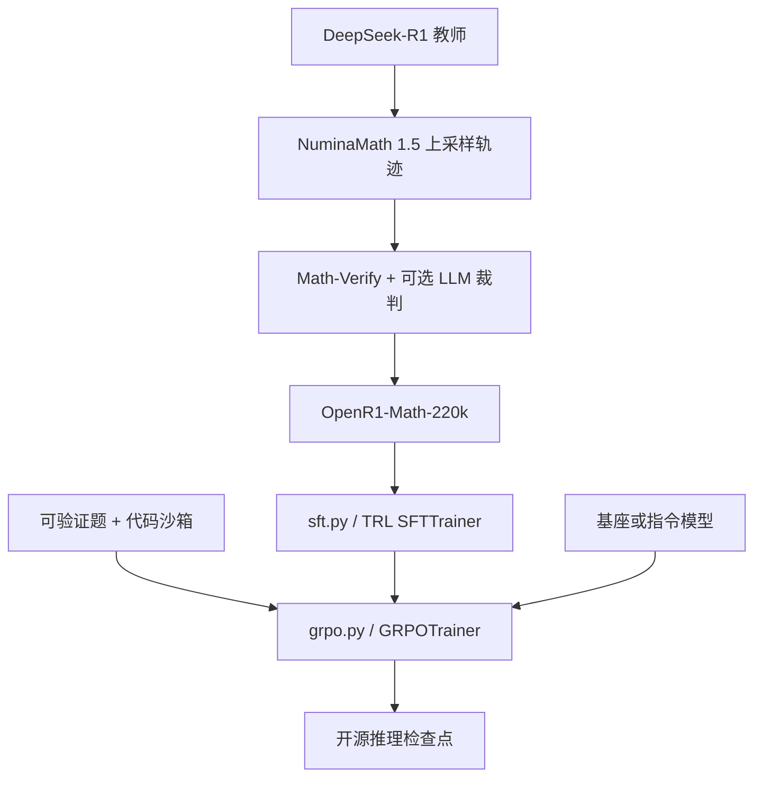

# OpenR1 训练配方

    
权重开了、数据和训练代码没开：把蒸馏轨迹、可验证奖励与 GRPO 脚本公开，社区才能在同一条流水线上改超参，而不是对着技术报告猜。

    <footer>—— Bakouch、von Werra、Tunstall 等，Hugging Face Open-R1 项目，2025</footer>

DeepSeek-R1 技术报告把「纯强化学习教推理」写清楚了，但没有放出训练脚本与轨迹。Hugging Face 在 2025 年 1 月启动 Open-R1：目标不是再训一个 671B MoE，而是把缺失的配方补成可复现的仓库、数据集与 YAML。博客作者是 Elie Bakouch、Leandro von Werra、Lewis Tunstall；代码在 `huggingface/open-r1`，组织页在 Hugging Face 的 `open-r1`。本篇按官方博客、Update #2 与仓库脚本写三条路径——蒸馏 SFT、可验证奖励上的 GRPO、多阶段 base→SFT→RL——以及它**没有**声称复现的东西。算法本身见 [GRPO 原文](/llm/grpo-paper) 与 [DeepSeek-R1 论文](/llm/deepseek-r1-paper)。

## 问题

R1 报告给出了骨架：R1-Zero 在基座上直接 GRPO，奖励主要是答案对错与格式；R1 先冷启动 SFT 再多轮 RL。社区立刻卡住三件事。第一，蒸馏用的约 80 万条轨迹（报告写约 60 万推理轨迹加非推理数据）没有公开，后来各家自造 OpenThoughts、Bespoke-Stratos、LIMO，分布彼此不可比。第二，没有训练代码，就不知道组大小、KL、vLLM 生成与 ZeRO 如何拼在一起，超参无法从论文表格反推。第三，缩放律——多少道可验证题、多长补全、多大组——报告没有给出开源可跑的网格。Open-R1 把这三件事收成工程对象：数据集、`sft.py` / `grpo.py`、以及 `recipes/` 里按模型族切开的 YAML。

它明确不是「我们已经复现了 R1」。2025 年 1 月 28 日的介绍博文写：这是项目启动，缺的一块有了再上传。把 Open-R1 写成 SOTA 推理模型名称，是把组织名和检查点混了。

### 三条路径对应报告里的三个洞

计划写在博文图里。Step 1：从 DeepSeek-R1 蒸馏高质量推理数据，复现 R1-Distill 那一类「只 SFT、不 RL」的学生。Step 2：为数学、推理、代码另造大规模可验证题，复现 R1-Zero 的纯 RL。Step 3：证明可以从基座走 SFT 再 RL 的多阶段，而不是只能二选一。合成数据让别人在现有指令模型上微调出「会想」的学生；RL 配方让人从基座或蒸馏检查点接着做在线采样。数学之外，仓库后来把代码沙箱奖励也写进 `rewards.py`，对应报告里「可验证域不限于竞赛数学」。

Open-R1 的学生通常是 Qwen2.5 量级，教师是已发布的 DeepSeek-R1。它验证的是「这条流水线在开源栈上能跑通」，不是「同样算力能追上 V3 上的 R1-Zero」。把 7B 蒸馏分数直接写进 R1 复现声明，尺度错了。

## 方法

蒸馏侧，2025 年 2 月 10 日的 Update #2 发布 **OpenR1-Math-220k**。合作方是 Numina，题干来自改进后的 NuminaMath 1.5。他们对约 40 万题用 DeepSeek-R1 各生成至少两条解答（合计约 80 万条轨迹），本地 512×H100，先 vLLM 后切 SGLang，博文给出大约每卡每小时 15→25 条、集群上每天约 18 万到 30 万条的吞吐。提示沿用模型卡：逐步推理，最终答案放进 `\boxed{}`，单条上限 16k token——他们观察到约 75% 的题在 8k 内能写完，其余常常吃满 16k。过滤用 Math-Verify 规则解析，只留「至少一条答案对」的题；对规则解析失败但格式完整的子集，再用 Llama-3.3-70B-Instruct 做等价判定，救回约 2.8 万题。最终约 22 万题带已核验轨迹。拆成 `default`（约 9.4 万，SFT 最好）与 `extended`（约 13.1 万，混入更多 `cn_k12`，他们发现 SFT 后更差，归因于题更简单）。未过滤原文在 `OpenR1-Math-Raw`。

他们用 `default` 对 Qwen2.5-Math-Instruct 做 3 epoch SFT，学习率 $5\times 10^{-5}$，线性日程、10% warmup，并把 RoPE 频率提到 30 万以把上下文从 4k 拉到 32k，得到 OpenR1-Qwen-7B。用 lighteval 对照：MATH-500 上 DeepSeek-Distill-Qwen-7B 91.6、OpenR1-Qwen-7B 90.6、OpenThinker-7B 89.6；AIME24 为 43.3 / 36.7 / 30.0；AIME25 为 40 / 40 / 33.3。声明是「匹配同尺寸蒸馏球」，不是超过官方 Distill。对同一题多条正确轨迹，他们试过只用 Qwen2.5-Math-RM-72B 对**抽出的最终答案**打分再取 top-1，消融显示并不比随机抽一条正确轨迹更好——过程信息被丢掉了。

### 仓库里 SFT 与 GRPO 如何接线

`src/open_r1/sft.py` 包 TRL 的 `SFTTrainer`：ZeRO-3、bf16、梯度检查点、可选 Liger kernel。README 示例用 `open-r1/Mixture-of-Thoughts`、最大长度 32768、学习率 $4\times 10^{-5}$、5 epoch。配方目录按「模型名 / 任务 / 变体」放 YAML，例如 `recipes/OpenR1-Distill-7B/sft/config_distill.yaml`。GRPO 脚本把 `get_reward_funcs` 的列表交给 `GRPOTrainer`，生成走 TRL 的 vLLM 后端：单机小模型用 `vllm_mode=colocate`；多机则 `trl vllm-serve` 把生成节点与训练节点拆开。组大小在配方里常见 16（数学）量级，补全可到数万 token，温度与 top-p 按 YAML，不要把 DeepSeekMath 原文的 $G=64$、最大 1024 直接抄过来——那是另一篇论文的设定。

`rewards.py` 的注册表把「可验证」写成可加权的多项：`accuracy` 解析答案；`format` / `tag_count` 约束思维标签；`reasoning_steps` 鼓励步骤结构；`cosine` 与 `length`、`soft_overlong_punishment` 管长度；代码路径有 `code`、`binary_code`、`ioi_code`、`cf_code`，经 E2B 或 Morph 一类沙箱执行。这是 Open-R1 相对报告最工程化的补充：奖励是函数注册，不是再训一张人类偏好 RM。诗歌等不可验证域有社区尝试，不在官方主配方里。

## 机制

蒸馏的机制与 R1 报告一致：教师已经会写长链，学生做 next-token 模仿，把「先写草稿再给 boxed 答案」的模板内化。Open-R1 多做的是**可机检过滤**：错链不进 SFT，避免学生模仿漂亮的错误证明。LLM 裁判只处理规则解析失败的格式问题，主信号仍是 Math-Verify。因此数据集质量绑定解析器版本（他们建议 Math-Verify 0.5.2）与金标质量；Numina 金标空或不可解析的题，再强的教师也进不了 `default`。

GRPO 路径的机制是在线组相对：同一题采多条，用规则分数的组内标准化当优势，KL 按 TRL 实现加在目标上。没有 critic，显存才能把 vLLM 生成和策略更新放在同一作业里。奖励加权是产品决策：只留 `accuracy` 会忽视格式，模型可能答对但不按标签结束思维；只留 `format` 会刷标签。代码奖励把「单测是否绿」当成结果监督，与数学 boxed 等价，过程是否作弊（硬编码、改测试）要靠沙箱策略，仓库不能单凭分数证明没有黑客。

在已蒸馏的检查点上再 GRPO，和在基座上 GRPO，不是同一个实验。前者检验「模板已在、用可验证奖励拧正确率」；后者检验 R1-Zero 命题。Open-R1 同时提供两条入口，写结果时必须写清起点检查点。

### 为何 220k 精选可以接近官方 Distill 的 7B

DeepSeek 官方 Distill 用了更大规模轨迹与更完整的域混合。OpenR1-Math-220k 只覆盖数学、且经过正确性过滤。7B 上 MATH-500 已经接近，AIME24 仍落后约 7 个百分点（43.3 vs 36.7），说明竞赛尾部对数据覆盖和拒绝采样更敏感。`extended` 更差，说明「题更多」若掺入简单中小学题，会稀释长链模板。这与 s1 的「精选 1K 优于随机大池」同方向，但 Open-R1 的尺度是十万级过滤，不是千级。

## 边界与工程取舍

教师权重来自 DeepSeek，蒸馏数据的许可、污染与评测泄漏要单独审计；AIME 题在公开论坛出现过，Update #2 也提到 AIME25 的意外泄漏风险。512 H100 生成 80 万条轨迹是他们的集群事实，不是最小复现成本。Math-Verify 误杀、LLM 裁判误放，都会进训练集。GRPO 依赖可验证器：开放对话、安全、文风没有 boxed 答案，不能直接套 `accuracy`。vLLM 与训练进程的耦合、超长补全的 KV、组内全错时标准差退化，都是工程坑，要读 TRL 文档而不是只读 R1 报告。

不要把 Open-R1 写成对 o1 的开源复现。o1 的算法未公开；Open-R1 明确对准 R1 报告里缺的数据和代码。也不要把社区在 0.5B 基座上刷 GSM8K 的 GRPO 笔记，与仓库主配方的 7B/32k 设定混报。

配方的价值是**可改**。换奖励函数、换题集、换组大小，应提交新的 YAML 与评测表，而不是口头「按 Open-R1 训的」。没有记录 `reward_funcs` 与数据集 revision，检查点不可比。

### 何时不必走完整三条路径

只要把现有指令模型变得会写长链，SFT OpenR1-Math 或 Mixture-of-Thoughts 往往够用，不必上 GRPO。已有硬检查器、要从基座诱发出自我验证，再上纯 RL。评测禁教师蒸馏、必须从自有基座冷启动时，不能用 220k 里的 R1 轨迹。服务端不改采样循环、不能跑 vLLM 组生成时，不要承诺「我们能复现 Open-R1 的 GRPO」。

## 小结

- Open-R1 补的是 DeepSeek-R1 未公开的数据与训练代码：蒸馏 SFT、可验证 GRPO、多阶段衔接，而不是再训 671B。
- OpenR1-Math-220k：NuminaMath 1.5 上约 80 万条 R1 轨迹，过滤到约 22 万题；`default` 约 9.4 万用于主 SFT。
- OpenR1-Qwen-7B 在 MATH-500 / AIME 上接近但未全面超过官方 Distill-7B；扩集掺简单题会伤。
- 训练栈是 TRL `SFTTrainer` / `GRPOTrainer` + vLLM，奖励为准确率、格式、长度与代码沙箱的加权组合。
- 出处：Hugging Face，*Open-R1: a fully open reproduction of DeepSeek-R1*，2025-01-28；*Open R1: Update #2*，2025-02-10；仓库 `huggingface/open-r1`；对照 DeepSeek-AI，*DeepSeek-R1*，arXiv:2501.12948。
