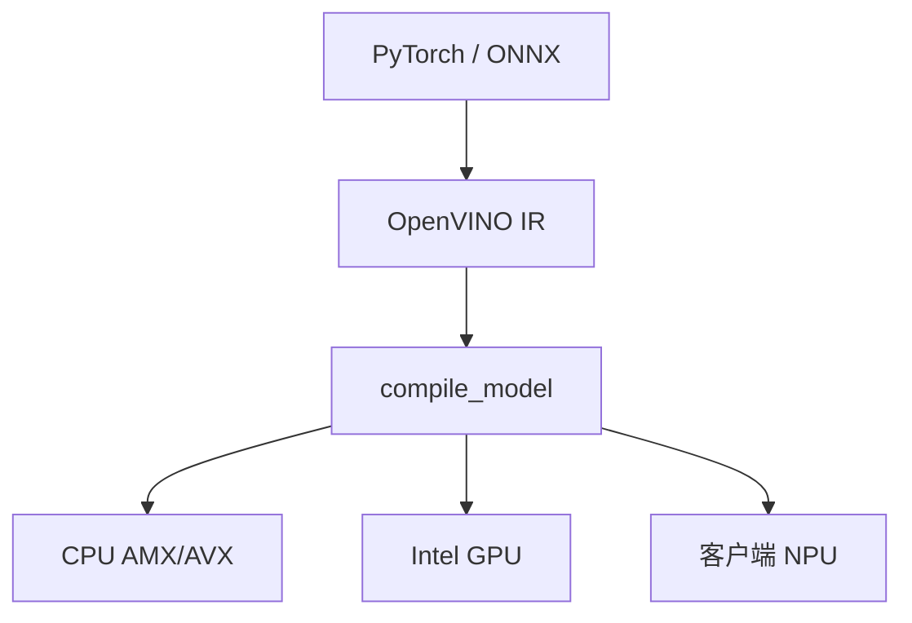

# OpenVINO

把模型编译到 Intel CPU、核显与独显的统一运行时：设备叫 CPU/GPU/NPU，编译器做的是图优化与量化，而不是再训一份权重。

<footer>—— Intel OpenVINO 文档与 NNCF 量化工具链</footer>

[上一课](/llm/onnx-runtime)用 EP 把图画到多种后端。OpenVINO 是 Intel 硬件上的专用栈：IR（XML+bin 或从 ONNX/PyTorch 读入），`compile_model` 到指定 device。LLM 路径有 Optimum-Intel、GenAI 库一类封装，处理 tokenizer 与逐步 generate。本课写它相对 ORT 的差：更贴 Intel ISA（AVX、[AMX](/llm/amx-kernel)）、核显共享内存，以及 NPU 的形状限制。不把某一代酷睿的 token/s 写成常数。

## 问题

目标设备是「没有独享 NVIDIA HBM 的机器」：服务器至强、笔记本核显、客户端 NPU。会计改写：带宽是 DDR 或 LPDDR，不是 HBM；算术是 AMX/AVX 或核显 EU。缺口是编译器必须把 Transformer 降到这些 ISA，并处理 KV 放哪——统一内存上 CPU 与 iGPU 共享，拷贝语义与 CUDA 不同。动态 $n$ 在 NPU 上往往要形状桶或 pad 到最大值，容量与碎片问题以另一种硬件回来。

量化几乎是默认：INT8/INT4 权重量化才能让 7B 进 16GB 笔记本。这与 GPU FP8 服务不是同一套核，质量要在目标设备上验收。

OpenVINO 的「GPU」多指 Intel 核显/独显，不是 CUDA。文档里的 GPU 插件不要当成能跑 CUDA FA。

## 方法

导出或用 Optimum 转 IR，指定 `device=CPU|GPU|NPU`。LLM 用官方 GenAI / pipeline 管 KV，不要自己在应用层用 numpy 拼逐步还期望 AMX 吃满。批处理在端侧常是 1，工作点永远在带宽区；优化是减 $W_{\mathrm{bytes}}$ 与更好的 matmul 核，不是堆 $B$。与 ORT 选择：Intel 硬件优先 OpenVINO；要可移植到 NVIDIA 再 ORT/CUDA。

## 机制

AMX 把 decode 的瘦 GEMM 从 AVX 点积换成 tile 乘，强度仍受 DDR 限制，但常数更好。核显共享内存减少拷贝，但算力与带宽都低于独享 HBM GPU。NPU 对静态图友好，对投机、动态掩码不友好。工作点回到[屋顶线](/llm/arithmetic-intensity-decode)，只是换了峰值数字。

## 边界与工程取舍

不要用数据中心 GPU 的 TPOT SLA 套笔记本。不要假设 NPU 支持任意自定义采样。下一课：Apple 的 MLX，统一内存故事更完整。

出处：Intel OpenVINO 与 NNCF 文档；AMX 见 Intel SDM。不发明 arXiv。

## 小结

- OpenVINO 把模型编译到 Intel CPU/iGPU/NPU；LLM 靠 GenAI 管 KV。
- 端侧 $B=1$，优化靠量化与 ISA 核，不靠堆并发。
- 设备名 GPU ≠ CUDA。
- 动态形状在 NPU 上要桶或 pad。
- 质量在目标量化路径上验收。
- 下一课：Apple MLX。
- 出处：Intel OpenVINO 文档。
