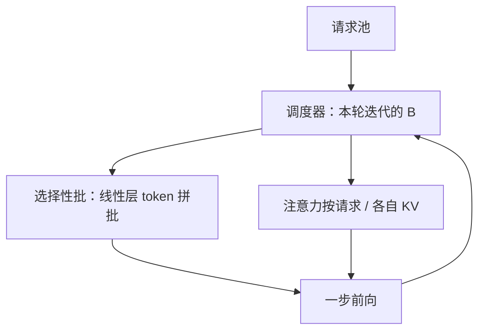

# Orca 迭代级调度论文

生成式 Transformer 的调度粒度应是一次模型迭代，而不是一条请求的完整寿命；注意力与非注意力算子再分开批，变长序列才能叠在同一趟前向上。

<footer>—— Yu et al., Orca: A Distributed Serving System for Transformer-Based Generative Models, OSDI 2022</footer>

2022 年之前，生产里服务 GPT 一类模型，常常把 NVIDIA FasterTransformer 这类引擎当成「一次跑完一批请求」的黑盒：调度器选出 $B$ 条，调用引擎，直到这 $B$ 条全部生成结束才返回。Gyeong-In Yu 等人在 OSDI 的 Orca 里指出，自回归的寿命是未知步数的循环，请求级同步屏障会制造陪跑空洞与排队延迟。他们的系统贡献是两块一起交货：**iteration-level 调度**（每次只授权一步前向，批次成员逐步替换）加上 **selective batching**（线性层按 token 拼批，注意力按请求分开以免序列维对齐）。论文针对分布式、含千亿参数设定给出扩展设计，并在与请求级系统的对照中报出大幅吞吐提升。机制拆解见 [iteration-level 调度](/llm/iteration-scheduling) 与 [连续批处理](/llm/continuous-batching)；本篇写 OSDI 原文作为服务系统论文的问题、实现契约与评测边界。名称与微软 [Orca 蒸馏](/llm/openhermes) 无关。

## 问题

分类或单次前向的服务可以假设：一次引擎调用对应一批输入，返回时每条样本的输出都已完备。自回归不满足。每条请求要 $T$ 次模型调用才结束，$T$ 高度不齐。请求级调度把「批的寿命」绑成 $\max_i T_i$：早结束者不能把槽让给新到达者，引擎在 padding 或空槽上工作，尾延迟被最长生成绑架。加大 $B$ 同时加大 $\mathbb{E}[\max T]$，空洞更凶。

要把调度推进到循环内部，必须改引擎契约。若停止条件、采样、KV 追加仍封在引擎里，调度器看不见迭代边界，成员无法在步间变更。第二个问题是变长：即使每步能换人，注意力的键长度 $s_i$ 不同，朴素 `batch` 维会 pad 到 $\max s_i$。只解决调度粒度得到「能换人但每步仍为最长序列买单」；两问一起解决，迭代级调度才变成吞吐。当时的 FasterTransformer 代表请求级路径；Orca 要证明的是系统级替代，而不是一个调度启发式。

### 调度器拥有请求池，引擎无状态于请求寿命

Orca 的模型是：调度器持有请求池、KV 的逻辑归属和本轮集合 $\mathcal{B}$；引擎是一步执行器，输入为「这些请求的这一迭代要算哪些算子」，输出为 logits。EOS、最大长度、取消都在调度器。分布式下，同一迭代必须在模型并行组上一致，否则张量并行的 All-Reduce 或流水线的微批对不上。调度因此是**集群级决策**，不是每张卡各选各的请求。这一契约后来被 vLLM 等继承：中央调度、worker 只执行。iteration 在论文里指定向解码的一步（或一次前向），不是训练的 optimizer step。读 OSDI 文本时把它译成「token 步级」，以免和日志里的 iteration 混掉。

## 方法

主循环：从池中选 $\mathcal{B}$ → 引擎执行一步 → 采样 → 追加 token 与 KV → 结束者离开并返回客户端 → 新请求在资源允许时加入。选择政策可以很简单（能放下就进），论文的机制不依赖某一条公平性算法；抢占与 SLA 是后续工作。

**选择性批处理**是让变长 $\mathcal{B}$ 仍能吃满 GPU 的那一半。QKV 投影、输出投影、FFN 的工作量按本步要算的 token 计：把各请求当前 token 拼成一条长 batch，GEMM 规整。注意力不同：第 $i$ 条的查询只能与自己的 $K_{1:s_i}$ 做点积。Orca 对算子分类——非注意力走 token 级批，注意力按请求分别做（或带各自掩码的分组）。这不是「只批一部分请求」，而是只批一部分算子。

分布式：张量并行与流水线并行下，所有卡对同一 $\mathcal{B}$、同一迭代达成一致。论文面向 GPT-3 量级给出相应切分，使迭代级调度不是单卡玩具。KV 仍按请求连续存放（分页是一年后 [vLLM](/llm/vllm-paper) 的贡献）；Orca 解决的是时间轴上的空洞与算子级批，不是 KV 池的外部碎片。

### 评测对照的是请求级引擎

原文把吞吐–延迟 Pareto 与 FasterTransformer 一类请求级系统比，而不是与 2024 年的分页系统比。报告的加速倍数钉在他们的负载（到达过程、长度分布、模型大小）上。低延迟区，请求级必须用小 $B$ 以免 $\max T$ 爆炸，GPU 更空；迭代级可以在保持尾延迟的同时维持更大的瞬时 $|\mathcal{B}|$，于是倍数更夸张。读数字时要看是哪一个延迟目标，不能把「36×」一类峰值写成任意部署的常数。

## 机制

吞吐来自两条因果链。第一，步间替换把 $\sum T_i$ 变成墙钟步数，而不是 $\max T_i$：结束即走，到达即可能在下一步上场，陪跑 padding 下降。第二，选择性批处理让非注意力 GEMM 的效率不随长度方差崩溃；注意力虽然按请求切，但不再强迫所有人 pad 到统一 $S$。两者缺一：只有迭代级、注意力仍大矩形 pad，显存与计算仍按最长键买单；只有选择性批、调度仍请求级，早结束者仍占着批不走。

连续批处理后来作为通俗名传播，指的就是这条成员可变的批。Orca 原文的技术名是 iteration-level scheduling；连续批是现象，选择性批是实现。vLLM 在同一调度粒度上换了 KV 布局，不替换 Orca 的迭代契约。

准确率与采样公式不变。Orca 不是新解码算法，也不改变 [SDPA](/llm/sdpa)。加速来自利用率：同样的权重读出摊到更多实时查询上。把 Orca 的倍数和量化、投机解码画在同一张「模型变强」表里，会混因。

### 为何必须是生成式 Transformer 论文

选择性批处理依赖「大部分 FLOPs 在按 token 计的 GEMM、注意力是少数按序列的不规则算子」这一结构。若模型换成每步都是不规则稀疏核，分类可能反过来。Orca 把范围钉在 Transformer 生成服务，是为了让算子分类成立。RNN 生成也可以做迭代级调度，但不需要同一套注意力切分。标题里的 Transformer-Based Generative Models 是范围声明。

## 边界与工程取舍

Orca 不解决 KV 预留碎片：仍可按最大长度给连续缓冲，于是并发被碎片卡住——这正是 PagedAttention 要补的洞。它也不解决 prefill 与 decode 计算密度不同造成的互相干扰；混合批次可以在迭代级下发生，PD 分离是更后的策略。公平性、抢占、前缀共享在原文里不是一等公民。

引擎实现成本高：要把融合核改成「线性层看拼接 token、注意力看每请求 KV」，分布式同步以迭代为界。许多团队后来在 vLLM / TensorRT-LLM 里吃到迭代级，而不直接部署 Orca 代码。引用时应指向 OSDI 论文的调度粒度与选择性批处理，而不是某一个仓库的类名。

不要把 Microsoft Orca（解释蒸馏）和本篇的服务系统写进同一段「Orca 表明」。前者是 13B 学生学 GPT-4 痕迹；后者是 GPU 上每步换人。同名是巧合，文献检索必须带 Yu 或 Mukherjee。

评测硬件与 2022 年的模型套件会过时；「迭代级优于请求级」这一命题在自回归服务里仍然成立，倍数随栈而变。

## 小结

- Yu 等人的 Orca 把生成服务的调度从请求寿命改到模型迭代，并配合选择性批处理以消化变长。
- 调度器拥有池与停止条件；引擎只跑一步；分布式下迭代在模型并行组内对齐。
- 线性层按 token 批，注意力按请求的 KV 批；两块缺一则空洞或 padding 仍在。
- 对照对象是当时的请求级引擎；倍数依赖延迟目标与长度分布。
- 分页 KV、PD 分离、前缀树是后续系统，不写回 OSDI 2022 的贡献清单。
- 出处：Yu et al., *Orca: A Distributed Serving System for Transformer-Based Generative Models*，OSDI 2022。机制展开见 [iteration-level 调度](/llm/iteration-scheduling)。
