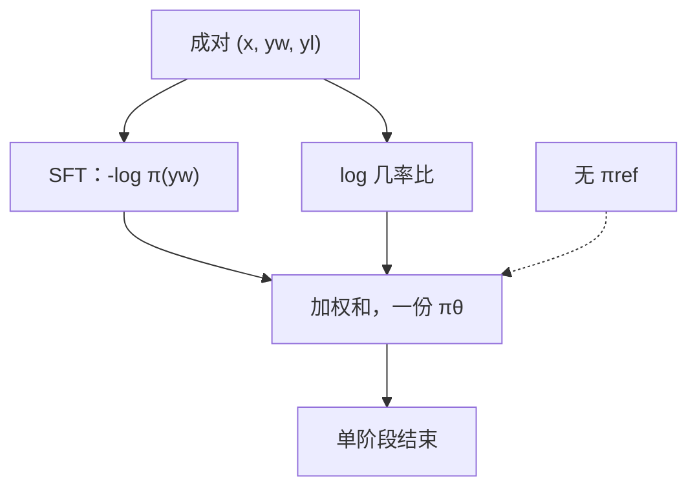

# ORPO 原文

    
单体偏好优化：同一项损失里既拟合喜欢的回答，又用几率比压低不喜欢的回答，不必另存参考模型，也不必先做完 SFT 再切 DPO。

    <footer>—— Hong, Lee, Thorne，ORPO: Monolithic Preference Optimization without Reference Model，EMNLP 2024</footer>

已有 [ORPO](/llm/orpo) 篇写几率定义、$\lambda$ 与长度陷阱、以及和 SimPO / DPO 的正则分工。本篇钉 Hong、Lee、Thorne 的 EMNLP 2024 原文（arXiv:2403.07691）：他们要替换的流程裂缝是什么、几率比相对裸对数差的理论叙事、实验在哪些模型与基准上支持「单阶段无参考」，以及哪些数字不能从 AlpacaEval 一行外推成定律。配方与掩码仍见前一篇。

## 问题

InstructGPT 式后训练拆成 SFT 再 DPO/PPO。拆开的代价有三。显存：DPO 的隐含奖励是 $\log(\pi/\pi_{\mathrm{ref}})$，训练图驻留两份模型。流程：必须先得到一份当作参照的 SFT 检查点，早停、学习率、过拟合点都要切一次。目标分裂：SFT 只抬 $y_w$ 的绝对似然，DPO 只抬相对比，衔接不好会出现「对比拉开了、喜欢的回答变糊」或「SFT 过拟合模板、DPO 再拧到另一套套话」。小团队在单卡 LoRA 上，第二份模型直接决定做不做偏好。

无参考之后，裸的 $\log\pi(y_w)-\log\pi(y_l)$ 缺少「不许整体跑飞」的锚，纯对比可以把两条似然一起压低。作者要的单体目标是：同一批成对数据、同一份权重、一次训练，既有语言建模项，又有不依赖 $\pi_{\mathrm{ref}}$ 的对比项，且对比在 $p\to 1$ 时不要像未归一对数差那样无限加码。

### 参考模型在 DPO 里实际买到了什么

参考差消掉两侧共同的模式（套话、模板），并提供 KL 意义下的偏离代价。删掉它，等于同时丢掉校准器与锚。ORPO 不否认 $\beta$ 在 DPO 里的数学角色，见 [参考模型与 β](/llm/dpo-beta-ref)；它声称的是：若把 SFT 项留在损失里，锚可以改由 $y_w$ 的 NLL 承担，校准器那一部分则放弃——这是显存与流程换来的语义变窄，原文把它写成优点，工程上必须当代价。

「无参考」不是无正则。正则从 $\mathrm{KL}(\pi\|\pi_{\mathrm{ref}})$ 换成了对数据集中 $y_w$ 的最大似然。未出现在喜欢回答里的合理变体，没有显式保护。这是单体方案的盲区，不是实现漏写 KL。

## 方法

序列概率 $p_\theta(y\mid x)$ 的几率为 $p/(1-p)$。成对样本上定义对数几率比

$$
\log\mathrm{OR}_\theta=\log\frac{\mathrm{odds}_\theta(y_w\mid x)}{\mathrm{odds}_\theta(y_l\mid x)}.
$$

总损失为喜欢回答上的因果 NLL 加上加权的 $-\log\sigma(\log\mathrm{OR})$。第一项与普通 SFT 相同，chat 模板与提示掩码相同；第二项推动 $y_w$ 相对 $y_l$ 的几率，权重 $\lambda$。没有冻结参照，没有 KL 估计。训练可以从基座或轻度指令化检查点一次做完，这就是标题里的 monolithic。

### 原文的理论叙事：几率比如何分流梯度

几率在 $p\to 1$ 时趋于无穷，已经很高的 $y_w$ 再抬绝对概率的边际下降，对比梯度更多落到压低 $y_l$。作者把这解释成：SFT 项负责「会说喜欢的话」，OR 项负责「相对拒绝样本拉开」，两者在饱和区自然分工。这与 KTO 增益侧凹神似，但推导来自几率变换，不是前景理论。序列概率用 token 乘积，实现必须在对数空间；极长序列上 $p\approx 0$，几率退化成 $p$，OR 退回普通对数差，饱和好处消失——原文以序列概率为准，长度平均是后来的工程修补。

### 实验支持什么、不支持什么

原文在 Phi-2、Llama-2、Mistral 等规模上，用指令偏好数据对照 SFT、SFT+DPO 等。叙事是：单阶段 ORPO 达到或超过「先 SFT 再 DPO」的指令跟随指标，同时省掉参考前向。AlpacaEval 一类 GPT 裁判分随裁判版本与长度控制剧烈变化，只能当论文表内相对排序，不能抄成跨年的绝对能力。安全、多语、工具调用不是主表。$\lambda$ 过小接近纯 SFT，过大则流畅性掉、开始学「只要和 $y_l$ 不同」——原文把 $\lambda$ 当需要扫的超参，没有跨模型定理值。

## 机制

SFT 项阻止为了拉大 OR 而把 $y_w$ 自己打塌：喜欢侧概率下降会立刻被 NLL 惩罚。这不是 KL 的同构物，保护集合只是数据里的 $y_w$。OR 项对噪声对敏感：若 $y_l$ 其实可接受，对比项在打压合理回答，拒绝率与多样性一起坏。单体训练容易让日志只看总损失；原文方法节隐含的监控是两项分开看——NLL 降而 OR 不降，是对比没学上；OR 降而 NLL 升，是牺牲拟合拉差距。

从已 SFT 的检查点再跑 ORPO，NLL 项会重复拟合已经学过的 $y_w$，有过拟合模板风险，应少 epoch 或加大 $\lambda$、换新偏好对。从基座直训时，NLL 是必要语言监督，不能只留 OR。这两条流程在论文的「不必先 SFT」口号下仍然分叉，落地篇写得更硬，原文实验更多是从指令模型或基座各跑一套对照。

几率比不消除长度偏置。更长的 $y_w$ 序列概率更小，odds 跟着变。论文主结果若未做长度控制的裁判，可能部分来自话多。产品监控应单列生成长度，不能把 AlpacaEval 原始胜率当成已校准偏好。

## 边界与工程取舍

省一半驻留权重，在 LoRA 微调里尤其明显。换来的是：无参照校准、对 $y_w$ 过拟合更敏感、必须成对数据、序列概率数值要 clamp。ORPO 吃不了 [KTO](/llm/kto) 的单条点赞；把无对照日志配随机负例，几率比变成「和噪声比」。也不替代奖励模型管线：要在线采样再打分，仍是 RLHF。

与 [SimPO](/llm/simpo) 同属无参考，但锚不同：ORPO 是 NLL，SimPO 是平均对数概率加间隔 $\gamma$。与 [SLiC](/llm/slic) 同有监督项，但 SLiC 用铰链、常需要多样本候选。选择应先看能不能放参考、再看要不要显式 SFT 项，而不是看 EMNLP 年份。

出处钉 Jiwoo Hong、Noah Lee、James Thorne，KAIST，EMNLP 2024，arXiv:2403.07691。标题 without a Reference Model 容易被读成「对齐不需要 SFT 分布」。正确读法是：训练图不加载第二份权重，分布锚改由喜欢回答的 NLL 承担。

### 何时不必上这篇原文

只会改 TRL 里的 `ORPOTrainer`、扫 $\lambda$，读 [ORPO](/llm/orpo)。需要引用单体流程相对 SFT+DPO 的实验表、需要向评审解释为何几率而不是裸对数差，再读原文。

## 小结

- ORPO 原文主张单阶段、无参考：NLL$(y_w)$ + 几率比对比，一份权重做完偏好。
- 几率变换在高概率区改变梯度分工；极长序列上会退化成对数差。
- 实验支持「省参考仍可达到同数据 DPO 量级的指令跟随」，不是安全对齐完备方案。
- 正则只保护数据集中的 $y_w$；长度与噪声对仍在。
- 与 SimPO、SLiC、DPO 的差别是锚的语义，不是名字新旧。
- 出处：Hong, Lee, Thorne，*ORPO: Monolithic Preference Optimization without Reference Model*，EMNLP 2024；落地对照见 [ORPO](/llm/orpo)。
