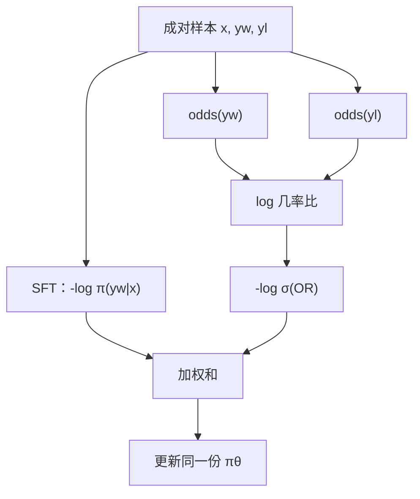

# ORPO

不必另存一份参考模型，也不必先做完 SFT 再开偏好步骤：在喜欢的回答上做负对数似然的同时，用几率比把不喜欢的回答压下去。

<footer>—— Hong, Lee, Thorne，ORPO: Monolithic Preference Optimization without Reference Model，EMNLP 2024</footer>

标准后训练拆成两段：先用喜欢的回答做监督微调，再拿成对偏好、一份冻结的 SFT 参考，跑 DPO 或 PPO。两段意味着两套超参、两份权重驻留、以及「SFT 已经把 $\pi$ 推离基座、参考却钉在 SFT」这一锚点选择。Hong 等人把偏好写成几率比（odds ratio），叠在同一项 SFT 损失上，得到 ORPO（Odds Ratio Preference Optimization）：单阶段、无参考、单调地既拟合 $y_w$ 又拉大 $y_w$ 相对 $y_l$ 的几率。它针对的是参考模型的显存与流程裂缝，不是否定 [β 与参考](/llm/dpo-beta-ref) 在 DPO 里的数学角色。

## 问题

DPO 的隐含奖励是 $\log(\pi_\theta/\pi_{\mathrm{ref}})$。前向至少要评估当前策略与参考在 $y_w$、$y_l$ 上的对数概率，训练图里等于两份模型。参考通常是 SFT 的冻结核，于是流水线必须先 SFT 再对齐，检查点管理、学习率、过拟合点都要切一次。小团队或单卡微调时，第二份模型直接决定做不做偏好。

更细的问题是目标分裂。SFT 只提高 $y_w$ 的似然，不看 $y_l$；DPO 看相对比，却不显式要求 $y_w$ 的绝对似然上升。两段衔接不好时，会出现「对比拉开了，喜欢的回答本身在变糊」或「SFT 过拟合格式，DPO 再把分布拧到另一套套话」。需要一种损失：同一批成对数据上，既有对 $y_w$ 的最大似然，又有 $y_w$ 对 $y_l$ 的对比，且对比不依赖 $\pi_{\mathrm{ref}}$。

### 无参考时拿什么当正则

删掉参考后，对数比 $\log\pi(y_w)-\log\pi(y_l)$ 仍可写，但缺少「不许整体跑飞」的锚。纯对比可以把两条序列的似然一起压低，只要差还在；也可以靠加长 $y_w$ 刷对数和。ORPO 的答案是：把 SFT 项留在损失里当锚，对比改用几率比——它在概率接近 1 时饱和性质与裸对数差不同，能减弱「把已很高的 $y_w$ 再往上推无限」的冲动。

几率比不是长度归一化。序列越长，序列概率越小，几率 $\frac{p}{1-p}$ 会跟着变。ORPO 仍可能偏爱短 $y_w$ 或长 $y_l$。长度偏置要另外用平均对数概率或长度惩罚处理，不能假设几率比已经洗掉长度。

## 方法

记序列概率 $p_\theta(y\mid x)=\pi_\theta(y\mid x)$，几率为

$$
\mathrm{odds}_\theta(y\mid x)=\frac{p_\theta(y\mid x)}{1-p_\theta(y\mid x)}.
$$

成对样本 $(x,y_w,y_l)$ 上，ORPO 损失为

$$
\mathcal{L}_{\mathrm{ORPO}}=\mathbb{E}\Bigl[-\log p_\theta(y_w\mid x)+\lambda\bigl(-\log\sigma(\log\mathrm{OR}_\theta)\bigr)\Bigr],
$$

其中

$$
\log\mathrm{OR}_\theta(x;y_w,y_l)=\log\frac{\mathrm{odds}_\theta(y_w\mid x)}{\mathrm{odds}_\theta(y_l\mid x)}.
$$

第一项是只加在喜欢回答上的因果 LM 损失，与普通 SFT 相同，[chat template](/llm/chat-template) 与掩码规则也相同。第二项把「$y_w$ 的几率相对 $y_l$ 更大」推进 logistic，权重 $\lambda$ 平衡拟合与对比。没有 $\pi_{\mathrm{ref}}$，没有 KL 估计，没有第二份权重。训练从基座或已经轻度指令化的检查点一次做完。

Hong 等人强调的是单体（monolithic）流程：不必等 SFT 早停再切 DPO。$\lambda$ 过小则接近纯 SFT，对比弱；$ \lambda$ 过大则对比压过语言建模，流畅性掉、开始学「只要和 $y_l$ 不同」。应在同一验证集上看喜欢回答的对数概率与偏好准确率，而不是只看 OR 项是否下降。

### 对数概率怎么进几率

实现里 $p_\theta(y\mid x)$ 是 token 概率的乘积，直接乘会下溢。应在对数空间算序列对数似然 $\ell=\sum_t\log\pi(y_t\mid x,y_{<t})$，再 $p=\exp(\ell)$。极长序列上 $p$ 接近 0，几率接近 $p$，OR 退化成普通对数差，几率变换的饱和好处消失。可先对 $\ell$ 做长度平均再还原成「几何平均意义下的伪概率」再进 odds，这是工程修补，原文以序列概率为准。无论哪种，训练与评估必须同一套归约，禁止训练用乘积、汇报用平均。

## 机制

### 为何 SFT 项能代替参考 KL

DPO 的参考项来自 RL 目标里的 $\beta\,\mathrm{KL}(\pi\|\pi_{\mathrm{ref}})$：偏离 SFT 要付费。ORPO 用 $-\log p(y_w\mid x)$ 把质量锚在喜欢回答的语言流形上——模型若为了拉大对比而把 $y_w$ 自己的概率打下去，第一项会立刻惩罚。这不是 KL 的同构物：它只保护数据集里出现过的 $y_w$，不保护「参考分布下所有合理回答」。于是 ORPO 对参考分布里未标注的好回答没有显式保持，遗忘面比带 $\pi_{\mathrm{ref}}$ 的 DPO 更窄也更盲。这是省掉第二份模型的代价。

几率比的梯度同时作用在 $y_w$ 与 $y_l$：提高喜欢侧几率、降低不喜欢侧。因为 odds 在 $p\to 1$ 时趋于无穷，已经很高的 $y_w$ 再提升的边际会改写为「主要靠压 $y_l$」；这与 KTO 价值函数在增益侧凹有一点神似，但推导来自几率，不是前景理论。

ORPO 的对比项假定 $y_l$ 真的更差。若成对标注噪声大，$y_l$ 其实也可接受，SFT 项仍在拟合 $y_w$，对比项却在打压一个合理回答，拒绝率与多样性会一起坏。噪声对上应先洗对，而不是加大 $\lambda$。

### 与 SimPO、DPO 的正则分工

[SimPO](/llm/simpo) 也无参考，但它用长度平均对数概率当隐含奖励，再加目标间隔 $\gamma$，没有 SFT 项。ORPO 的锚是喜欢回答的 NLL；SimPO 的锚是间隔与平均。DPO 的锚是冻结参考。三者不是同一旋钮的不同刻度。从 SFT 检查点接着训时，ORPO 的 SFT 项可能重复拟合已经学过的 $y_w$，有过拟合模板的风险，应降低 epoch、提高 $\lambda$ 或混入新偏好对。从基座直训时，SFT 项是必要的语言监督，不能只留 OR。

## 边界与工程取舍

省参考模型大约省一半驻留权重，也省参考侧的前向。这在 LoRA 微调里更明显：不必给参考挂一份适配器或一份全参。换来的是正则语义变窄、对 $y_w$ 过拟合更敏感、长度偏置仍在。$\lambda$ 没有跨模型的定理值，应与学习率一起扫。序列概率的数值稳定是实现税：`1-p` 在 $p$ 极小时就是 1，在 $p$ 因长度平均被抬到接近 1 时又会爆，需要 clamp。

ORPO 吃的是成对数据，吃不了 [KTO](/llm/kto) 那种单条点赞。没有 $y_l$ 就写不出几率比。也不替代奖励模型管线：若你仍要在线采样再打分，那是 RLHF，不是 ORPO。Hong 等人的实验建立在偏好对已经存在的设定上；把无对照的日志硬配随机负例，会把几率比变成「和随机噪声比」，梯度几乎无信息。

单体训练容易让人以为「一个 loss 解决 SFT+对齐」。日志里仍应分别打 NLL 与 OR 两项。若 NLL 降、OR 不降，是对比没学上；若 OR 降、NLL 升，是在牺牲喜欢回答的拟合去拉差距，通常该把 $\lambda$ 降下来。

### 何时不必上 ORPO

已经有稳定的 SFT 检查点、显存也放得下参考，DPO 或 [SLiC](/llm/slic) 的「参考 / 正则项」语义更清楚，便于和 $\beta$ 一起调。需要不成对反馈时走 KTO。长度偏置已经是主故障时，优先 SimPO 的平均对数概率，而不是在 ORPO 上再叠一套没校准的长度惩罚。从基座冷启动、偏好对又少，应先纯 SFT 到能说人话，再开对比项，避免 $\lambda$ 在随机初始化上打压同样随机的 $y_l$。

## 小结

- ORPO 把喜欢回答上的 SFT 与几率比对比写成一项损失，训练单阶段、不加载参考模型。
- 几率比用序列概率 $p/(1-p)$；对比项拉大 $y_w$ 相对 $y_l$ 的几率，权重为 $\lambda$。
- SFT 项代替 DPO 里参考 KL 的「别跑飞」，但只保护数据集中的 $y_w$，不是完整 KL。
- 长度会进入序列概率，几率比不自动消除长度偏置。
- 需要成对数据；不成对反馈不是 ORPO 的输入。
- 分别监控 NLL 与 OR，防止一项牺牲另一项。
- 出处：Hong, Lee, Thorne，*ORPO: Monolithic Preference Optimization without Reference Model*，EMNLP 2024。
