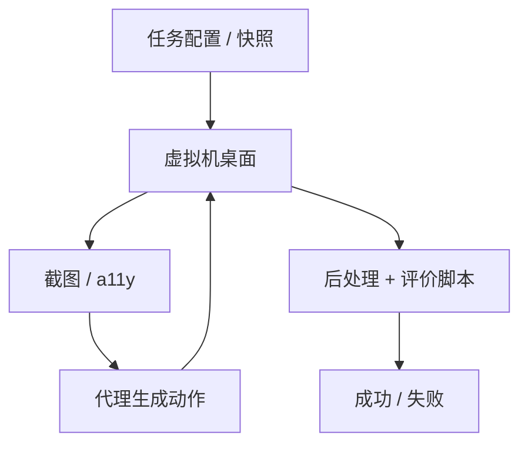

# OSWorld

    
真实虚拟机里跑开放式电脑任务：初始化给到「工作做到一半」的桌面，代理用键鼠交互，对错由任务专属的执行脚本判定。

    <footer>—— Xie et al., OSWorld: Benchmarking Multimodal Agents for Open-Ended Tasks in Real Computer Environments</footer>

网页沙箱和静态 GUI 点击数据集都只覆盖计算机使用的切片。Xie、Zhou、Zhao 等人的 OSWorld（arXiv:2404.07972，NeurIPS 2024 Datasets and Benchmarks）给出可扩展的**真实计算机环境**：用虚拟机承载 Ubuntu、Windows、macOS，支持任务初始化、交互与基于执行的验收，并在此上标注 **369** 条开放式任务——覆盖常用桌面与网页应用、操作系统文件操作、以及跨应用工作流。观察可以是截图、无障碍树或其组合；动作是完整键鼠空间（论文基线用 pyautogui 代码）。人类不熟悉软件时仍有约 **72.36%** 成功率；当时 LLM/VLM 基线大约 **0.99%–12.24%**，跨应用工作流最高约 **6.57%**。本篇写环境合同与这些数字绑定的条件。不写对宿主机或他人系统的利用；虚拟机隔离是评测设施，不是攻击面教程。

## 问题

先前基准要么只有演示轨迹、没有可执行环境（动作序列匹配会惩罚另一条正确路径），要么把环境简化到单一应用或纯网页。代理若只在 MiniWoB 或单个浏览器里训练，到了「表格已打开、还要去邮件里抄一个数字」就会断。OSWorld 要的是：同一套基础设施能配置任意应用任务，能重置，能并行，能在终态上打分。形式化是 POMDP：状态是整台电脑，观察是部分的（图或树），动作改变真实 GUI，奖励几乎只在结束时由脚本给出。

开放式还意味着验收不能是唯一像素匹配。同一「把表按某列排序」可以有菜单、快捷键、点表头三条路。论文为每条任务写初始化配置与定制评价函数，共 **134** 种独特评价例程量级，远多于先前网页基准里少数模板化检查。代价是标注成本高，任务数量相对 WebArena 的八百余条更少，但每条更接近真实桌面。

### 中间状态初始化，而不是从开机桌面开始

真实求助发生在「已经打开一堆窗口」之后。OSWorld 用快照加配置脚本：启动模拟器、下载任务文件、打开指定软件并调整布局，而不是为每条任务存整盘镜像。这样既像真实中间态，又控制存储。对代理而言，观察里会有无关窗口噪声——论文分析里这是失败源之一：模型点到错误窗口或无法处理弹窗。评测合同包含这些噪声，去掉噪声等于换题。

引用 Xie et al.，OSWorld，arXiv:2404.07972。任务数 369、人类 72.36%、基线区间 0.99%–12.24% 绑定论文设定。Anthropic computer use 后来在「只截图、不同步数」下报 14.9%/22%，是另一份实验，必须分表，不能覆盖原文 GPT-4V 行。

## 方法

环境跑在宿主机上的协调器：读配置、拉起虚拟机、按 Task Manager 做 setup。交互期把截图、a11y、可选终端输出送给代理；代理返回可执行动作字符串。结束动作包括模型声明 DONE / FAIL。评价阶段可先做后处理（激活窗口、保存文件），再从虚拟机或云端取产物，喂给该题的评价函数。无头模式与单机多实例用于规模评测。虚拟机快照保证下一条任务不继承上一条的破坏。

观察消融是一等实验：纯 a11y、纯截图、截图+a11y、Set-of-Mark。动作空间用 pyautogui 覆盖移动、单击、右键、拖拽、热键、滚轮等。基线包括 GPT-4V、Gemini、Claude-3 Opus、Qwen-Max 以及开源 CogAgent、Llama-3、Mixtral 等。论文发现额外结构（a11y、SoM）有时帮忙、有时误导，且随模型而变——不能假设「树一定比图强」。

### 执行式评价脚本，不是轨迹比对

例子：删 cookie 要查浏览器数据文件；表格对不对要解析生成的 spreadsheet；界面是否到达某页要查 a11y 或 URL。实时类任务（网上当前数字）用动态取数函数，避免把「昨天的金答案」冻死。这与 WebArena 的功能正确性同一哲学，对象从自托管网站换成整台 OS。没有脚本的开放演示不能算 OSWorld 分。

## 机制

分数低，主要不是「不会英语指令」，而是接地与应用常识。VLM 难以把「点保存」对准正确像素；LLM 拿着 a11y 仍可能对不存在的节点发点击。跨应用工作流要把剪贴板、文件路径、窗口焦点当成隐式状态，轨迹一长就丢。提高分辨率与加长历史在论文分析里可以明显抬分，但消耗上下文。人类 72.36% 说明题并非不可做，只是当时多模态代理还不是电脑助手。

### 子集比总分更能暴露缺口

按应用切开：有的类别基线接近 0%。工作流子集（多应用协作）最高约 6.57%，说明「会用一个软件」推不出「会在两个软件之间搬数据」。报 OSWorld 必须写清：全量还是子集、观察通道、步数。把办公软件题的局部成功写成「通用计算机智能体」，会掩盖工作流才是论文强调的缺口。

环境支持 Windows / macOS，但公开主结果大量在 Ubuntu 桌面配置上。迁移操作系统等于换 GUI 布局与快捷键，不能直接外推同一百分比。虚拟机是隔离与可重置，不是允许把代理指向未授权的真实账号。

## 边界与工程取舍

OSWorld 测的是开放电脑任务，不测越权、漏洞利用或绕过认证。评测脚本有时需要为 Chrome / VS Code 打开调试端口或扩展以便读状态——那是为验收准备的脚手架，应只存在于基准虚拟机。不要把这些评测钩子搬到生产用户会话里当后门。任务集以常见生产力软件为主，覆盖不到专业 CAD 或内部电子。369 条也无法对所有应用做统计功效；小子集上的「新 SOTA」方差会很大。

与 WebArena：一个是自托管网站 + DOM/树观察为主，一个是真实 OS + 像素/树。与 SWE-bench：一个交补丁过测试，一个交桌面终态。三者互补，分数不可加减。后续 computer use 产品把动作收成更干净的工具 schema，仍应用 OSWorld 脚本说话，而不是用宣传视频。

出处：Xie, Zhou, Zhao 等，*OSWorld: Benchmarking Multimodal Agents for Open-Ended Tasks in Real Computer Environments*，arXiv:2404.07972，NeurIPS 2024 D&B。

## 小结

- OSWorld 是真实虚拟机上的开放电脑任务环境与 369 题基准，验收走执行脚本。
- 人类约 72.36%；2024 年论文基线约 0.99%–12.24%，跨应用更低。
- 观察通道与步数是自变量；a11y / SoM 并非单调增益。
- 报分写 OS、观察、步数、是否全量；不要与后来的 computer use 产品卡混表。
- 出处：Xie et al.，arXiv:2404.07972。
