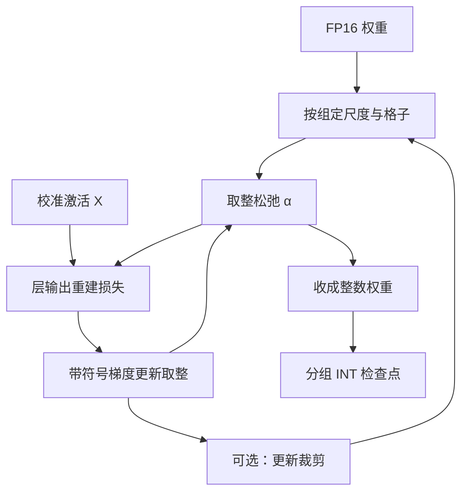

# AutoRound 与其他 PTQ

取整不必服从最近邻：把每个权重向上还是向下写成可优化的变量，用带符号的梯度去减小层输出误差，量化网格本身可以保持均匀。

<footer>—— 对照 Nagel et al., AdaRound, ICML 2020；Intel AutoRound 把同一思路做到大语言模型权重量化</footer>

训练后再量化（Post-Training Quantization, PTQ）要在**不回传全网**的前提下，把已经训好的浮点权重映到低比特格子。前面几篇把三条主路写清楚了：[GPTQ](/llm/gptq) 用 Hessian 做层输出最小二乘补偿，[AWQ](/llm/awq) 用激活幅度保护显著通道，[SmoothQuant](/llm/smoothquant) 把激活异常值迁到权重上以便 W8A8。还剩一条经常被折叠进「某种 GPTQ 变体」的路：不改网格形状、只改**每个权重该落到哪一个相邻整数**。Nagel 等人 2020 年的 AdaRound 把「向上或向下」做成可学习的松弛；Intel 的 AutoRound 用带符号的梯度下降把这套取整优化做到千亿以下常见的 LLM 权重上，并作为 Neural Compressor 一类工具链里的默认 PTQ 之一。本篇写取整优化与「其他 PTQ」的位置，不把 GPTQ 的二阶补偿或 AWQ 的通道缩放再讲一遍。

## 问题

均匀量化把浮点 $w$ 写成 $s\cdot\mathrm{clip}(\mathrm{round}(w/s-z)+z)$ 一类仿射。尺度 $s$ 与零点 $z$ 可以按张量、按通道或按组统计一次；真正把连续值钉死的，是 $\mathrm{round}$。最近邻取整（round-to-nearest, RTN）对 8-bit 往往够用，到 4-bit 或 3-bit，层输出 $\|WX-\hat{W}X\|_F$ 会先坏在那些「离两个格子几乎一样远、但乘上激活之后差很多」的权重上。误差是 $(w-\hat{w})x$，不是 $|w-\hat{w}|$ 本身。RTN 优化的是权重空间的欧氏距离，推理关心的是输出空间。

二阶重建（GPTQ）承认这一点，但它的自由度花在「量化完一列之后改尚未量化的列」。取整优化走另一条：格子已经定了，每个权重只在 $\lfloor w/s\rfloor$ 与 $\lceil w/s\rceil$ 之间选，组合数是 $2^{d}$，直接搜不行。要把这个离散选择变成能用校准激活打几轮前向就能下降的目标，才能叫 PTQ，而不是退回 [QAT](/llm/qat)。

### 三条 PTQ 轴不要叠成一种方法

权重量化至少有三根独立的轴。第一根是**格子**：均匀 INT、分位数码本、还是按组共享尺度。第二根是**误差改谁**：RTN 不改邻居；GPTQ 改未量化列；AWQ 改通道缩放。第三根是**取整本身**：在格子已定、缩放已定之后，每个元素向上还是向下。AutoRound 主要动第三根。把「Intel 出了个量化工具」理解成「又一种 4-bit 格式」，会在服务栈里找错核：它产出的往往仍是分组均匀整数，和 GPTQ 检查点在数据类型上可以很像，差的是取哪些格子点。

PTQ 的「训练」若存在，也只发生在校准前向与一小撮辅助变量上，不是对原权重做反向。AdaRound / AutoRound 的可学习对象是取整松弛或裁剪范围，不是再训一层 Transformer。把它写成「量化感知微调」会低估校准成本、高估可恢复的精度。

## 方法

AdaRound 的核心观察是：对已经选定的尺度，量化误差来自分数部分被推到 0 或 1。把第 $i$ 个权重写成

$$
\hat{w}_i = s\cdot\big(\lfloor w_i/s\rfloor + h(\alpha_i)\big),
$$

其中 $h(\alpha)\in(0,1)$ 是对学习参数 $\alpha$ 的光滑门，训练结束再收成 0/1。目标仍是层输出重建，常用

$$
\min_{\alpha}\ \|WX - \hat{W}(\alpha)X\|_F^2
$$

外加把 $h$ 推向两端的正则，以免停在 0.5。校准激活 $X$ 来自一小批文本，与 GPTQ 同类；不需要标签，也不回传进 Transformer 的原参数。Nagel 等人原先面向卷积与较小网络，证明「只学取整」在 4-bit 上可以接近更贵的量化感知训练。

### AutoRound：带符号的梯度与 LLM 尺度

离散取整的真实梯度几乎处处为零。直通估计把 $\mathrm{round}$ 的导数当成 1，噪声大。AutoRound 一类实现改用**带符号的梯度**：看重建损失对取整松弛的方向，只保留符号去更新「该上还是该下」，并可选地同时搜裁剪范围，免得个别通道的 max 把整组尺度撑爆。这样做的工程含义是：迭代次数可以比完整 QAT 少几个数量级，显存只缓存当前层的校准激活，不必为 Adam 状态再备一份全网副本。Intel 把它接到 Neural Compressor / AutoRound 工具里，面向的是「给已有 LLM 打一版可部署的低比特权重」，分组、对称与否、是否把 `lm_head` 留在更高比特，都是导出格式的选项，不是新的网络结构。

跑完一层，用已经取整的 $\hat{W}$ 把校准激活送进下一层，误差沿真实推理路径走——这一点与 GPTQ 相同，与「每层都用高精度老师激活去拟合」不同。后者会系统性低估级联误差。

## 机制

取整优化能工作，是因为相邻两个格子对输出的贡献差可以被其他尚未钉死的取整决策补偿。这和 GPTQ 的「把误差 squirt 到未量化列」同属**在离散约束下做局部补偿**，但自由度的几何不同：GPTQ 改的是连续权重在量化前的值（补偿后仍要再量化），AutoRound 改的是已经落在格子缝上的那一比特决策。校准 Hessian 若病态，GPTQ 要加阻尼；取整优化则表现为 $\alpha$ 学不动、正则把门推回最近邻，方法静默退化成 RTN。这不是实现 bug，是校准激活没能在那些方向上提供曲率。

### 与 GPTQ、AWQ 的误差预算怎么分

同一组 4-bit 均匀格子，三种方法花预算的地方不同。GPTQ 假设列与列之间还能连续补偿，适合「激活协方差估计得稳」的校准。AWQ 假设显著通道必须先被尺度保护，适合校准集与下游分布可能错位的指令模型。取整优化假设尺度已经合理、只差最近邻选错边。实践上它们经常**级联**：先做 SmoothQuant 或 AWQ 那种对角缩放，再在缩放后的权重上跑 AutoRound 或 GPTQ。级联不是论文里的单一算法，而是工具链默认；签字必须写清顺序，否则「AutoRound 的数字」其实是「AWQ+AutoRound」的数字。

不要用某次 Hugging Face 默认配置去对照另一篇论文的 perplexity。分组大小、是否排除前几层与嵌入、校准条数、是否逐层重建，都会把 4-bit 的百分位误差挪到不同位置。PTQ 方法名只标识优化对象，不标识检查点契约。

## 边界与工程取舍

AutoRound 仍是权重量化 PTQ。激活精度、KV 量化、是否走 INT8 Tensor Core，要另开旋钮，见 [W8A8](/llm/w8a8) 与 [W4A16](/llm/w4a16)。它不回答「该不该做量化感知训练」：若必须在训练分布上直接打梯度，Jacob 等人的假量化路径更诚实，代价是全网反向。校准域过窄时，学到的取整会过拟合那一批 token 的激活方向，生成任务上的实体与代码比选择题先坏——与 GPTQ 同一类签字问题。

工具链层面，Intel AutoRound 与 AutoGPTQ、llama.cpp 的量化脚本产出的文件布局不同。服务引擎认的是打包方式与尺度放置，不是算法论文的名字。换引擎要重量化或做格式转换。把「其他 PTQ」当成可以随便替换 GPTQ 的别名，会在 vLLM / TensorRT-LLM 里加载成功但数值噪声化。

### 何时该停在 RTN

8-bit 权重、激活仍用较高精度时，RTN 加逐通道尺度常常已经落在误差地板附近，再跑取整优化只买到校准时间。3-bit、2-bit 或小组数量化时，最近邻的错误边开始主导，AdaRound / AutoRound 才从「可选」变成「默认值得跑」。中间的 4-bit 是产品选择：要校准速度就 RTN 或 AWQ 搜尺度；要在固定格子上再挤一点重建，再上取整优化或 GPTQ。没有一种 PTQ 同时在所有屋顶线上最优。

Data-free 量化（Nagel 等人更早的均衡与偏置校正）和取整优化不是互斥。没有校准激活时，只能动权重均衡；有校准时，取整才有可下降的重建目标。LLM 上几乎总能拿到一小批文本，缺的是代表下游分布的文本，不是完全没有数据。

## 小结

- 除重建补偿与通道缩放外，PTQ 还可以只优化每个权重向上还是向下；AdaRound 把该选择做成光滑门。
- Intel AutoRound 用带符号梯度在 LLM 权重上做取整（及可选裁剪）优化，仍产出分组均匀整数，不是新的码本。
- 目标是层输出重建，校准前向不回传原参数；跑完一层要用量化权重继续送激活。
- 与 GPTQ、AWQ、SmoothQuant 花的误差预算不同，工具链里常级联，数字必须写清顺序。
- 8-bit 上 RTN 往往够用；低比特或细分组时取整优化才明显偏离最近邻。
- 检查点契约是分组与尺度布局，不是方法名；换服务引擎要重量化。
- 出处：Nagel et al., *Up or Down? Adaptive Rounding for Post-Training Quantization*, ICML 2020；LLM 上的取整优化见 Intel AutoRound（*Optimize Weight Rounding via Signed Gradient Descent for the Quantization of LLMs*）。对照 Frantar et al., GPTQ, ICLR 2023；Lin et al., AWQ, MLSys 2024。
