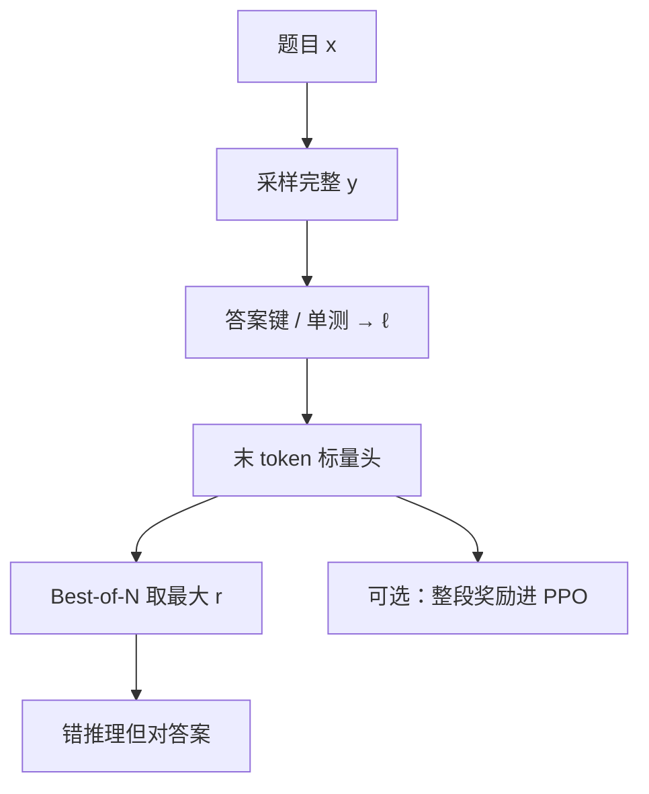

# 结果奖励模型

    
整段解答只给一个对错或一个标量：训练便宜，信用整段算在轨迹头上；验证器在候选变多时，会先被「错推理、对答案」喂饱。

    <footer>—— Cobbe 等用验证器解 GSM8K；Lightman 等把 ORM 与 PRM 对照；Uesato 等比较 outcome-based feedback</footer>

结果奖励模型（Outcome Reward Model, ORM）输入题目与**完整**解答，输出一个标量：这条轨迹最终是否正确、或有多像正确。它与 InstructGPT 式偏好 RM 共用「最后一个 token 上的头」，监督却不同：ORM 的标签来自答案键、单测、编译器，不是「哪一条更有用」。概念上的结果监督见 [结果监督](/llm/outcome-supervision)；本篇钉模型：Cobbe 的验证器、Lightman 的 ORM 基线、二元交叉熵，以及它在 Best-of-N 上为何先涨后平台。过程对照见 [过程奖励模型训练](/llm/process-reward-training)。

## 问题

竞赛数学与短代码天然有终点预言机：数字是否等于金标、测试是否全绿。人不必读中间式子也能给 $\ell\in\{0,1\}$。问题是 $\ell$ 的支撑太粗。设 $y=(s_1,\ldots,s_T,a)$，只有 $a$ 进入检查器。$s_1$ 已错、后面用错误公式凑出对的 $a$，ORM 看见正例；前 $T-1$ 步都对、最后抄写错，ORM 看见负例。Uesato 等人在 GSM8K 上已经指出：结果反馈能提高最终正确率，同时也能强化「错推导 + 对答案」的捷径。若下游只数填空对错，捷径在指标上合法；若下游要可审计的证明，捷径是事故。

另一条混淆是把偏好 RM 叫成 ORM。Ouyang 的奖励模型拟合人类比较，没有金标答案，学的是指南里的有用/无害。Llama 2 的有用 RM 同样是比较模型。ORM 在文献里特指**可自动核对终点**的那一类打分器，Cobbe 2021 的 GSM8K 验证器是早期实例：生成多条解，验证器挑一条。写「我们训了 RM」而不写标签是对错还是偏好，检查点不可比。

### 假阳性随 N 变多

Best-of-N 把覆盖交给采样、把筛选交给 ORM。$N$ 增大，真正的对解变多，**看起来像对的错解**也变多：格式完整、带检查句、boxed 数字碰巧对。ORM 若主要拟合表面相关，会把后者排到前面，曲线饱和。Lightman 等人在 MATH-500 上用同一生成器、同一候选池换验证器：PRM 随 $N$ 继续升，ORM 先升后平台。这是验证器实验，不是「结果 RL 一定差于过程 RL」。R1 后来的规则奖励仍是结果级的，但它直接用检查器、不经过学出来的 ORM，假阳性机制不同。

规则检查器 $\mathbb{I}[a=\mathrm{gold}]$ 不是 ORM。ORM 是用许多 $(y,\ell)$ 拟合出来的模型，要对未见过的 $y$ 打分。检查器没有泛化问题，但只能用于有金标或有单测的题；ORM 的卖点正是给没有当场金标的候选打分——代价是学偏。

## 方法

Cobbe 等人的验证器设定：对 GSM8K 采样多条完整解题过程，用最终数字对错训一个分类器，再在测试时对候选打分取最高。损失是二元交叉熵。Lightman 把同一思想做到 MATH，并强调 ORM 的训练分布应尽量均匀，不要用 PRM800K 那种「高分错解」偏置集——那会扭曲终点分布。他们给 ORM 的尽力设定是每题约 100 条均匀样本，集合与 PRM800K 不相交、大约大一个数量级。因此主文 ORM vs PRM **不是**等数据量消融。

形式：初始化自解题 SFT 模型，把头换成标量，$r_\phi(x,y)=\sigma(w^\top h_{\mathrm{last}})$。标签 $y_s=1$ 当且仅当抽取的最终答案与金标一致（解析失败可当 0 或丢弃）。Wang 等人在 Math-Shepherd 文中把 ORM 损失写成

$$
\mathcal{L}_{\mathrm{ORM}}=y_s\log r_s+(1-y_s)\log(1-r_s).
$$

推理时一条轨迹一个分数。Skywork-o1 的评测协议把 ORM 定义为「只用最后一步的奖励」，PRM 用各步平均——这是为了在同一套逐步头上对比两种归约，未必等于 Cobbe 那种整段池化。引用表格时要写清实现。

三条用法必须分开记账。**过滤**：只留 $\ell=1$ 做 SFT，没有 ORM。**验证器**：ORM 对固定候选排序，生成器冻结。**RL 奖励**：整段结束后把 $r_\phi$ 或 $\ell$ 当回报，中间 token 靠价值函数或蒙特卡洛分配信用，方差大。Open-R1 与 R1-Zero 走第三条的规则版：不训 $r_\phi$，直接 $\ell$。训 ORM 再 PPO，多一张会过拟合的网，还要把 KL 钉住，否则策略会为 $r_\phi$ 的捷径服务，见 [奖励黑客](/llm/reward-hacking-llm)。

### 解析与格式是隐藏的标签源

数学 ORM 的 $\ell$ 严重依赖答案抽取：`\boxed{}`、纯文本、选项字母、等价表达式。解析器把等价判成不同，正例变负例；把不同判成等价，负例变正例。Open-R1 后来用 Math-Verify 专门修这些坑，说明「对错」不是无摩擦的比特。代码 ORM 依赖测试覆盖：单测没覆盖的分支可以硬编码。预言机越硬，捷径空间越小，但不能为零。偏好 RM 没有这套解析器，却有长度与列表捷径——两类模型的黑客形态不同，治理手段也不同。

## 机制

在标签为终点对错时，ORM 的 Bayes 最优是 $p(\ell=1\mid x,y)$。表示 $h_{\mathrm{last}}$ 会抓住一切与 $\ell$ 相关的表面量：正确的推理、正确的格式、以及「这类题的常见答案」。当生成器变强，$y$ 的格式都很好，相关质量从格式挪到真正的代数；若 ORM 容量不够或数据偏格式，验证器失效。这解释了为何要用解题模型初始化：它已经把推理写进残差流，头比较容易读到「算对了没有」，而不是只读「像不像作业」。

信用广播：策略梯度若把同一 $\tilde r$ 赋给每一个 token（GRPO 的结果监督即如此），则对的轨迹上错误的中间句也被强化，错的轨迹上正确的前缀也被抑制。组内标准化减轻跨题难度差，不减轻轨迹内部的错配。这就是过程标签存在的理由，不是 ORM 实现写错。

自洽（多数票）不是 ORM。多数票用最终数字的众数，不读过程，也不训模型。ORM 读整段 $y$，可以打破「多数错解同一错数字」。两者常组合：先按答案分组，再把组内 ORM 分加总，Math-Shepherd 写过这种 SC+RM。

### 与偏好 RM 的头可以长得一样

实现上两者都是 SFT 主干加标量头。差别全在数据与损失：BT 损失比较 $(y_w,y_l)$；ORM 损失拟合 $\ell$。把偏好数据当成 ORM 标签（赢=1、输=0）会把「更有用」训成「更正确」，开放对话没有金标，模型会学腔调。反过来，把 GSM8K 对错对塞进 DPO，等于用结果对冒充偏好对，能涨填空，不保证文风。检查点命名必须分开：`orm` / `prm` / `helpful-rm`。

## 边界与工程取舍

没有自动检查器时不要硬造 ORM。开放问答的「正确」本身有争议，应走偏好或事实核对协议。ORM 作为评测器会把自身捷径写进排行榜：训练 ORM 与评测 ORM 同源时，分数上升不证明解题更好，需要金标或异构验证器。离线 ORM 对后来 RL 走远的策略会失效，分数不可比，这与偏好 RM 的分布外问题同源。

相对 PRM：ORM 标注便宜一到两个数量级，适合作为第一张网、或作为 PRM 训练里的完备器信号。相对规则奖励：有模型的 ORM 能给「格式略差但等价」的答案部分分数，也能被格式欺骗；规则奖励更硬、更可审计。产品上两者可以串联：规则过不了的直接 0，过了的再给 ORM 细排。

Lightman 主结果里 ORM 不是「训砸了」。它是当时结果监督的尽力基线。引用「PRM 优于 ORM」必须带 MATH-500、生成器规模、N 的范围；换到 GSM8K 或硬单测代码，差距会收窄，Uesato 在更易集上曾看到过程与结果终点接近。

### 何时不必训 ORM

检查器能在线跑（训练循环里就能 boxed 比对），直接用规则奖励，省一张会过拟合的网。需要逐步剪枝，训 PRM 或上搜索，ORM 给不出前缀分。只有人类偏好、没有答案键，训比较 RM 或走 DPO。评测已经用金标 pass@k，再报一个同分布 ORM 准确率，信息增量很小。

## 小结

- ORM 拟合完整轨迹的终点对错，头在末 token；标签来自答案键或单测，不是人类比较。
- Cobbe 的 GSM8K 验证器与 Lightman 的 MATH ORM 是同一类用法：冻结生成器，Best-of-N 排序。
- 信用整段广播，会奖到蒙对、罚到末步笔误；N 大时假阳性变多，曲线易饱和。
- 规则检查器 $\neq$ ORM；偏好 RM $\neq$ ORM。三者损失与黑客形态都不同。
- 出处：Cobbe 等，*Training Verifiers to Solve Math Word Problems*，arXiv:2110.14168，2021；Uesato 等，2022；Lightman 等，ICLR 2024，arXiv:2305.20050。
