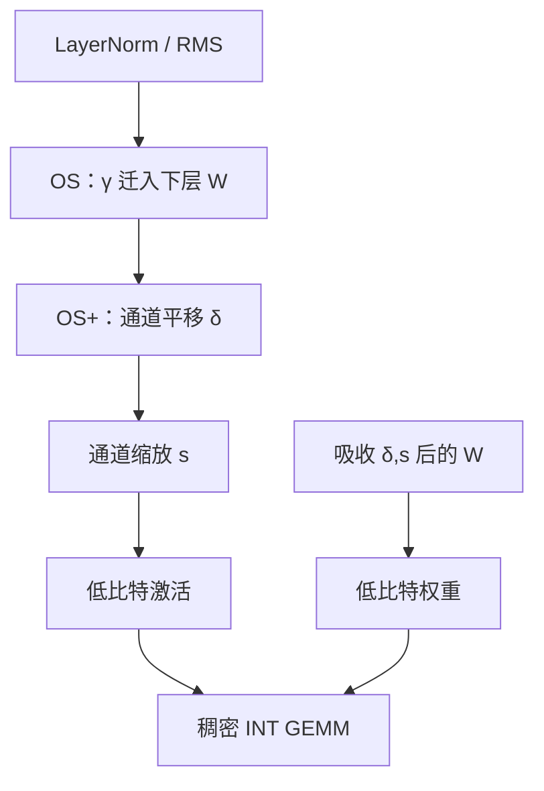

# OS+ / Outlier Suppression

    
LayerNorm 的 $\gamma$ 把少数通道放大成异常值；把缩放迁走，再对非对称激活做通道级平移，低比特格子才不必为尖峰和空半轴同时付税。

    <footer>—— Wei 等，Outlier Suppression，NeurIPS 2022；OS+，EMNLP 2023</footer>

Xiuying Wei、Yunchen Zhang、Xiangguo Zhang、Ruihao Gong 等人 2022 年的 NeurIPS 论文 **Outlier Suppression（OS）** 把 Transformer 语言模型激活难量化的原因，钉在 **LayerNorm 之后的通道尖峰**，并与 $\gamma$ 的跨通道差异对应。2023 年 EMNLP 的 **Outlier Suppression+（OS+）**（arXiv:2304.09145）把方法从 BERT / GPT-2 量级推到 OPT、BLOOM、LLaMA，补上通道级 **平移 + 缩放** 的等价变换，并讨论何种平移在量化误差上最优。两篇是同一条异常值故事的前后节：先诊断 $\gamma$，再给出可吸收的仿射校正。它们早于或并行于 SmoothQuant 的公开叙事，引用时不要把 2023 年的 LLaMA 数字写回 2022 年的 BERT 实验。

## 问题

低比特 Transformer 在 BERT 时代已经知道激活比权难。OS 的观察更具体：异常值不是随机散在 token 上，而是**固定藏在某些特征维**，并且这些维与 LayerNorm 的 $\gamma$ 大幅度重合。$\gamma$ 在浮点里是合法的逐通道增益；量化之后，同一张量共享的尺度被这些维绑架，其余维等效比特崩溃。只做逐张量 min-max，或只在 softmax 前裁剪，治不了「结构上被 $\gamma$ 放大」的通道。

到了 OPT-175B / LLaMA，通道异常值更重，W8A8 成为服务端命题。OS 的 token 级裁剪与 $\gamma$ 迁移对小模型有效，对大模型不够：激活还常常**非对称**，对称量化把一半格子浪费在几乎没有质量的负半轴或正半轴。OS+ 要回答：在等价变换类里，平移和缩放各管什么，怎样选才对量化 MSE 最优，以及能否融进下一层线性，保持稠密 INT 核。

### 第一篇 OS：$\gamma$ 迁出 LayerNorm

LayerNorm 输出 $y=\gamma\odot \hat{x}+\beta$。把 $\gamma$ 乘进下一层权重的对应输入通道，浮点函数不变，LayerNorm 的输出不再被巨大 $\gamma$ 拉出长尾。再配合 token 级的缩放 / 裁剪，压住仍残留的尖峰。这是 2022 年 BERT、GPT-2 上冲击 INT8 / INT6 的配方。它还不是大模型 W8A8 的完整解：没有系统的通道平移，也没有 175B 表格。贡献首先是**诊断**——异常值是通道级的、与 Norm 仿射相关——后来 LLM.int8()、SmoothQuant 的通道故事与此同族。

OS 的「抑制」不是把信息抹掉。$\gamma$ 迁移只是换一个坐标系表达同一仿射。真正丢信息的是随后的量化与裁剪。写「抑制异常值」时要写清：迁走的是谁、裁掉的是谁。

## 方法

OS+ 对通道 $j$ 做

$$
x'_j=\frac{x_j-\delta_j}{s_j},
$$

$\delta$ 让分布对中，$s$ 压幅度。下一层 $Y=X'W'+b'$ 通过

$$
W'_{j,:}=s_j W_{j,:},\quad b'\leftarrow b+W^\top\delta
$$

一类吸收保持 $X'W'+b'=XW+b$（按实现的左右乘约定调整）。$s$ 的角色与 SmoothQuant 同构；$\delta$ 是 OS+ 相对「只缩放」的增量。作者讨论在量化误差模型下平移的最优选择——例如与通道中位数或均值对齐——而不是只从校准 max 写一个启发式。校准估 $\delta,s$，可与逐 token 激活量化、逐通道权重量化组合。

实验合同：OS 正文以 BERT 类编码器、GPT-2 小生成模型的 GLUE / 语言模型指标为主，冲击到 4–8 bit 激活。OS+ 给出 OPT、BLOOM、LLaMA 上 W8A8、W6A6 等设定的困惑度与零样本，强调平移对非对称通道的收益，以及等价变换可完全吸收、推理不留额外核。与 SmoothQuant 同场时，OS+ 把平移写成差异化卖点；与 LLM.int8() 同场时，卖点是保持稠密整数核。不要用 BERT 的 INT4 数字去承诺 LLaMA-7B 的 W4A4。

### 非对称激活需要先对中

对称 INT8 假设 0 在动态范围中心。LayerNorm 之后若某通道几乎全为正、另一通道偏负，max-abs 尺度被长的那一侧决定，短的一侧只用到几个 bin。平移把质量移到 0 附近，同样 8-bit 的有效分辨率上升。量化成非对称（带零点）也能对中，但零点让整数 GEMM 变 $Wq_x$ 多一项纠偏，核更重。OS+ 倾向用等价平移把分布推回可对称量化的区域，好走对称 INT 核。这是工程选择，不是「零点不合法」。

## 机制

$\gamma$ 是逐通道乘子。浮点里它校正 Norm 后的尺度；量化里它与激活尖峰相乘，变成固定的难通道。迁 $\gamma$ 等于承认：难的不是「数据里的语义维」，而是「归一化仿射把数值放在了坏坐标」。平移处理的是一阶矩，缩放处理的是幅度，二者不可互相替代。等价仿射类 $\{x\mapsto (x-\delta)/s\}$ 在线性层可完全吸收，因此可以在 PTQ 里当预处理，而不改任务损失。

与 SmoothQuant 的谱系：两边都做通道缩放迁难度。SmoothQuant 用 $\alpha$ 在权重与激活的 max 之间分配；OS+ 强调平移最优性，并明确从 LayerNorm $\gamma$ 的 2022 诊断出发。实践中两套 $s$ 常常数值相近，差异主要在 $\delta$ 与是否迁 $\gamma$。与 AWQ 方向相反：OS+ 为激活量化服务，AWQ 为权重量化服务。

RMSNorm 没有独立的 $\beta$，且常把 $\gamma$ 留在 Norm 里。OS 的「$\gamma$ 迁移」在 LLaMA 上变成「吸收 RMSNorm 的 $\gamma$ 或后接仿射」。OS+ 的平移对 RMSNorm 输出仍有意义。抄 BERT 实现到 LLaMA 时要对齐 Norm 定义。

### 从 BERT 到 LLaMA 的模型合同变了

2022 年的 GLUE 掉点 0.5% 与 2023 年 LLaMA 的 WikiText PPL +0.1 不是同一签字。编码器双向、序列短、任务分类头可重新校准；解码器生成误差沿 token 累积。OS+ 必须用生成模型重新证明，不能靠 OS 的 GLUE 表外推。175B 级若出现 LLM.int8() 所述的涌现异常特征，仅迁 $\gamma$ 可能不够，还要缩放、旋转或分流。把 OS+ 写成「已经解决 4-bit 激活」超过两篇论文的主张。

## 边界与工程取舍

### 两篇论文不要合成一个超方法

引用 2022 只谈 $\gamma$ 与小模型低比特；引用 2023 再谈平移、LLaMA、W8A8。社区口头禅「OS+」常把两者混称，复现时却漏掉平移或漏掉 $\gamma$ 迁移。融合顺序与下一层是否含 bias 有关：无 bias 的线性层吸收平移要靠后接项或改下一层的等价常数，漏了就会有静默偏置。逐 token 动态量化与静态 $\delta,s$ 叠加时，通道平移仍然有用，但 token 尺度会部分替代 $s$ 的角色，消融要分开报。

OS / OS+ 不提供 2-bit 码本，也不学旋转。极低比特权重应看 GPTQ、AWQ、QuIP#。它们也不量化 KV。NPU 上若对称 INT8 核更成熟，平移对齐称的价值更大；若硬件原生支持非对称，收益缩小。指令微调模型要重估 $\delta,s$，因为 $\gamma$ 虽未改，激活通道统计会变。

出处：Wei et al.，*Outlier Suppression: Pushing the Limit of Low-bit Transformer Language Models*，NeurIPS 2022；Wei et al.，*Outlier Suppression+: Accurate Quantization of Large Language Models by Equivalent and Optimal Shifting and Scaling*，EMNLP 2023。

## 小结

- OS 把激活异常值诊断为 LayerNorm $\gamma$ 放大的通道尖峰，并用迁移 + 裁剪做低比特 PTQ。
- OS+ 补上通道平移与缩放的等价变换，面向 OPT / LLaMA 的 W8A8、W6A6。
- 平移对非对称激活、缩放对幅度、$\gamma$ 迁移对 Norm 仿射，三者职责不同。
- 2022 的 BERT 合同不能代替 2023 的生成模型合同。
- 出处：Wei et al.，NeurIPS 2022 与 EMNLP 2023。
