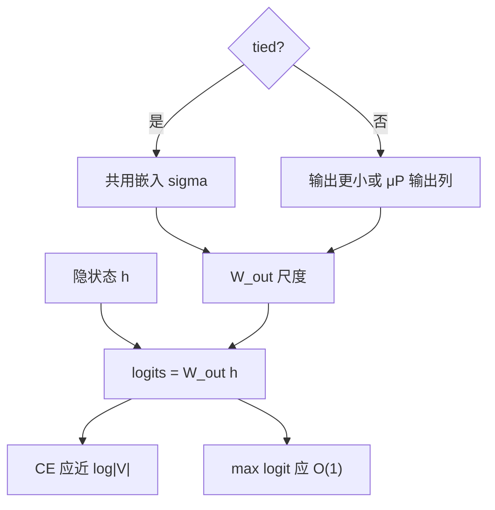

# 输出层初始化与 logit 尺度

交叉熵只约束概率，不约束 logits 的绝对幅度；输出矩阵的起步方差决定第一步是接近均匀先验，还是已经把半精度指数送进溢出区。

<footer>—— 对照 Press & Wolf, EACL 2017 的权值共享；尺度随宽度见 Yang 等 μP；训练中钉绝对幅度见 PaLM 一类 z-loss 实践</footer>

[上一课](/llm/embedding-init-scale)钉了输入表。缺口是词表投影 $W_{\mathrm{out}}\in\mathbb{R}^{|V|\times d}$：隐状态 $h$ 映成 $\ell=W_{\mathrm{out}}h$（加偏置则再加 $b$）。初始 CE 是否接近 $\log|V|$、初始 $\|\ell\|_\infty$ 是否落在 BF16 安全区，几乎由这张表与 $h$ 的尺度乘出来。主干里的 [z-loss](/llm/z-loss) 管的是**训练中途** LSE 漂移；本课管**第一步**。后课的 dropout 与标签平滑都假定初始 logits 尚未饱和。

## 问题

softmax 对平移不变：$\ell$ 加常数，$p$ 不变，CE 不变。但对缩放敏感：$\ell$ 乘 $c>1$，分布变锋利。初始化若把 $W_{\mathrm{out}}$ 放得太大，未训练模型已经接近 one-hot，梯度 $p_i(1-p_i)$ 极小，前几百 step 像冻住。放得太小，则 $p$ 接近均匀，CE $\approx\log|V|$，这其实是健康起点——优化从「没有意见」开始，而不是从「错误的自信」开始。

[Tied 嵌入](/llm/tied-untied-embedding) 令 $W_{\mathrm{out}}=E$。输入课选的 $\sigma$ 此时直接变成 logit 尺度，不能再单独把输出乘一个小因子而不改输入。untied 时常见做法是输出比输入更小，或按 μP 输出列：避免宽度增长时 logits 以 $\sqrt{d}$ 爆炸。漏掉输出列，正是宽模型「第一步 NaN」的经典原因之一。

有人用最后一层 RMSNorm 之后范数已被钉住，来为输出大初始化辩护。$h$ 的 RMS 被钉住，不表示 $W_{\mathrm{out}}$ 的行范数被钉住。行范数仍随 $\sigma\sqrt{d}$ 走；词表越大，极端行把个别 logit 拉飞的机会越多。

## 方法

**untied：输出更小。** 在输入 $\sigma$ 之外，给 $W_{\mathrm{out}}$ 单独一个更小的标准差，或显式乘 $1/\sqrt{d}$。目标是：随机 $h$（单位 RMS）下，$\ell$ 的典型幅度为 $O(1)$，CE 落在 $\log|V|$ 附近几个 nat 以内。

**μP 输出列。** 输出层把无限宽的隐藏维读到有限的词表维：初始化方差随 $d$ 降，学习率乘数也与隐藏 GEMM 不同。coord check 应画「加宽后第一步 logit 幅度是否平坦」。不平坦就是输出定标写错，不要先去调 $\eta$。

**tied：只留一套尺度。** 若必须 tying，用输入课的规则，并在配方里写明「输出不再另乘因子」。Press 与 Wolf、Inan 等人讨论的是参数共享与泛化，不是许可证把 $\sigma$ 设成 1。

偏置 $b$ 起步为 0。用词频 log-unigram 初始化偏置，会让第一步 CE 低于 $\log|V|$，有时加速，但把数据先验写进了检查点，换词表必须重做。不要默默打开。

## 机制

初始 logits 进入交叉熵的梯度为 $p-y$。$p$ 均匀时梯度是「把正确类抬一点、其余压一点」，幅度约 $1/|V|$。$p$ 已饱和且类错时，错误类梯度极小，正确类也抬不动——这是死初始化，不是数据太难。深度缩放与嵌入尺度决定 $h$；本课决定 $W_{\mathrm{out}}$ 如何读 $h$。三者乘错一个，其余两个的 coord check 会一起坏，调试时应分别打印：嵌入行范数、$h$ 的 RMS、$\|\ell\|_\infty$、CE。

训练开始后，CE 下降会推大正确类与错误类的间隔，LSE 往往跟着涨。那是 [z-loss](/llm/z-loss) 与后课「输出 logit 发散」的对象。本课只要求**第 0 step** 的间隔尚未被初始化人为拉大。

## 边界

本课不引入温度解码：推理温度作用在已训练的 $\ell$ 上，与 $W_{\mathrm{out}}$ 初始化不是同一个旋钮。也不把词表大小的缩放律提前写完——$|V|$ 变大会改变 $\log|V|$ 与极端行的统计，缩放单元再谈。Cut cross-entropy 等片上实现必须仍能读到 LSE，以便监控初始尺度；监控被实现吃掉，本课的验收就没了。

## 小结

- 健康的第 0 step：CE 靠近 $\log|V|$，logits 幅度 $O(1)$，而不是错误的 one-hot。
- tied 时输入 $\sigma$ 即输出尺度；untied 时输出通常更小，或走 μP 输出列。
- 最后一层 LN 钉的是 $h$，钉不住 $W_{\mathrm{out}}$ 的行范数。
- 训练中途 LSE 再涨，交给 z-loss 与稳定性课，不要和初始化混成一个系数。
- 出处：Press & Wolf, EACL 2017；Yang 等，μP；PaLM 对 logit 绝对尺度的训练期约束。
