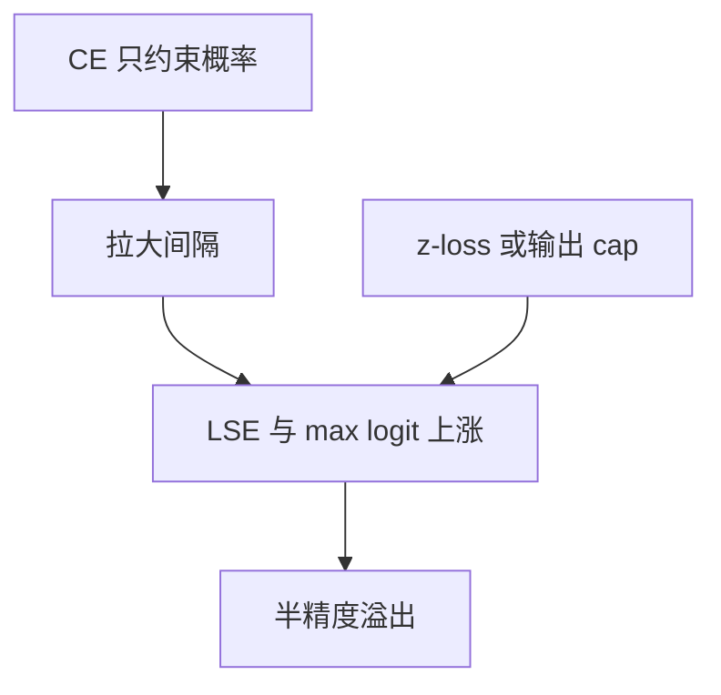

# 输出 logit 发散

概率对 logits 的公共平移不变，优化可以把整张词表的分数抬到半精度指数溢出，而交叉熵看起来仍在下降。

<footer>—— Chowdhery et al., PaLM, 2022；Rae et al., Scaling Language Models: Methods, Analysis & Insights from Training Gopher, 2021</footer>

[上一课](/llm/logit-soft-capping)给注意力与可选的词表 logits 加上界。缺口是：许多配方没有 cap，交叉熵仍然允许 $\|\ell\|_\infty$ 与 LSE 一起漂。[输出初始化](/llm/output-init-logit-scale) 只钉第 0 step；幂律段里 CE 靠拉大间隔下降，间隔常常靠抬高正确类而不是压低错误类实现。PaLM 用 z-loss 钉 $z^2$，Gopher 同样报告大模型训练里的 logit 增长。本课把「输出发散」从注意力增长里拆出来，作为独立传感器。主干 [z-loss](/llm/z-loss) 的公式不重推，只补它在稳定性叙事里的位置。

## 问题

$\ell_i=-\ell_{y}+ \mathrm{LSE}(\ell)$ 对 $\ell\leftarrow\ell+c$ 不变。Adam 可以给 $W_{\mathrm{out}}$ 与最后一层增益一个共同的放大模式：所有 logits 变大，概率几乎不变，CE 微降或持平，但 $\max\ell$ 进到 $10^3$–$10^4$。BF16 的 `exp` 大约在 88 以上溢出；稳定 LSE 先减 max，max 本身若已 Inf，整步 NaN。Cut CE 在片上归约同样怕这个尺度。

与注意力 logit 增长的差别：注意力塌缩的是**相对**路由（熵→0），输出发散常常是**绝对**尺度（熵可以仍高，只是 LSE 很大）。两者可同时发生。只看 CE 与 PPL 都看不见；必须打 $\|\ell\|_\infty$、LSE 均值与分位数。

$\|W_{\mathrm{out}}\|$ 不是合格代理。RMSNorm 之后 $h$ 的尺度被 $\gamma$ 改写，$W$ 变大不必等于 $\ell$ 变大，反过来 $\gamma$ 变大也可以让 $\ell$ 飞而 $W$ 看起来还好。直接记录 LSE。

## 方法

训练日志：每 $k$ 步在一个微批上算 $\mathrm{median}(\mathrm{LSE})$、$\mathrm{p99}(|\ell|)$、以及 CE。LSE 相对第 0 step 涨一个数量级就报警，不必等 NaN。对策分层：

1. **z-loss**：$\alpha z^2$ 加进目标，α 在 $10^{-4}$ 量级（PaLM 一类）。词表变大时 α 要重扫，主干已警告。
2. **输出 soft-cap**：上一课的 $c_o$。与 z-loss 可叠，但 α 与 $c_o$ 不要同时从零拧到头。
3. **学习率 / 衰减分组**：输出头单独更小的 $\eta$，或恢复对 $W_{\mathrm{out}}$ 的权重衰减。嵌入豁免课会谈到两边打架。

跳过坏 batch（主干 [NaN skip](/llm/nan-skip-batch)）是急救，不是尺度控制：LSE 已经系统性涨时，跳过只减少触发，不把水平拉回来。

## 机制

CE 的梯度 $p-y$ 在正确类与错误类之间拉间隔。间隔 $\Delta$ 变大时，若错误类 logits 不下降，正确类必须上升，LSE 跟上升。z-loss 的梯度给全体 logits 一个向下的公共力，迫使间隔更多靠压错误类实现。副作用是校准改变：解码温度若按未加 z-loss 的模型抄，会偏。soft-cap 则在到达 $c_o$ 后拒绝继续拉间隔，CE 可能因此平台更高——用 CE 换数值存活。

μP 输出列防止**宽度**带来的第一步爆炸；z-loss / cap 防止**时间**上的漂移。coord check 过了仍会在 10k step 后发散，说明两件事都要。

## 边界

推理不加 z-loss，但训练钉住的尺度留在权重里，对量化友好。关掉 z-loss 长训再量化，lm_head 更容易爆。MoE 路由器另有 router z-loss，不要和词表项共用 α。本课不处理注意力内部——那是前两课。

标签平滑也会略微限制间隔，但强度远弱于 z-loss，不能当本课的默认对策。下一课把传感器从 logits 转到**梯度范数**：尺度爆炸的另一次表现是 $\|g\|$ 贴 clip。

## 小结

- 输出发散是绝对尺度问题，注意力塌缩是相对熵问题，传感器分开记。
- 第 0 step 健康不能保证幂律段 LSE 不飞；z-loss 与输出 cap 管时间轴。
- 用 LSE / $\|\ell\|_\infty$，不要用 $\|W_{\mathrm{out}}\|$ 代理。
- skip batch 不回拉水平；μP 不替代训练期钉尺度。
- 出处：Chowdhery et al., PaLM, 2022；Rae et al., Gopher, 2021。
