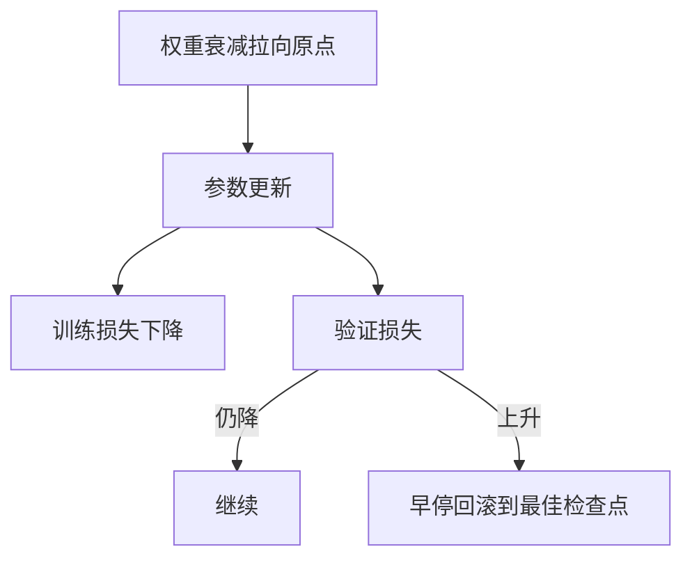

# 过拟合、权重衰减与早停

当验证损失开始上升，继续沿着训练损失走就是在记样本；停下来，或把参数往回拉，是同一问题的两种时间尺度。

<footer>—— 据 Srivastava et al., Dropout, JMLR 2014；Loshchilov &amp; Hutter, Decoupled Weight Decay Regularization, ICLR 2019；Prechelt, Early Stopping, 1998 整理</footer>

[验证集与泛化缺口](/llm/val-gen-gap)给出 $L_{\mathrm{train}}$ 与 $L_{\mathrm{val}}$ 分叉的读法。本课不重划分。缺口是：分叉之后做什么。方法有三条常用杠杆——早停、权重衰减、以及稍后才细讲的 Dropout。本课把前两条钉在优化循环里；Dropout 留在前馈单元末课，避免和注意力掩码混在一起。

## 问题

缺口扩大，说明当前 $\theta$ 正在拟合训练集的特异结构。若容量远大于数据，经验风险可以继续降，期望风险升高。优化器没有义务在「真规律」处停下，因为它看不见 $R$。缺口因此不是再换损失的代数形式，而是在更新规则或停止时间上加约束，使路径不要走得太远。

早停：监视 $L_{\mathrm{val}}$，在它不再改善后若干步，取历史上验证最好的检查点。权重衰减：在损失里加 $\frac{\lambda}{2}\|\theta\|_2^2$，或在更新里减 $\eta\lambda\theta$（与 Adam 解耦的 AdamW）。两者都在限制 $\theta$ 离开原点或离开早先较好的区域，但一个作用在时间上，一个作用在范数上。

### 权重衰减不是学习率变小

$\eta$ 缩小让每一步都短，训练与验证的拟合都会变慢。$\lambda$ 把参数往 $0$ 拉，对大权重惩罚更重，改变的是可到达的假设集合，而不只是速度。把衰减写进 Adam 的梯度里，会被二阶矩缩放，有效 $\lambda$ 随坐标而变，不再是「全体参数同一 $\ell_2$ 罚」。AdamW 把 $\theta\leftarrow\theta-\eta\lambda\theta$ 放在自适应步之后，才接近经典权重衰减。调 $\eta$ 代替调 $\lambda$，缺口对不上。

早停依赖验证集，因此对验证有轻度过拟合。权重衰减不看验证，但 $\lambda$ 本身仍要用验证来选。没有「完全不碰验证的正则」，只有「不要用测试集选 $\lambda$」。

## 方法

训练循环里同时记录：当前 $\theta$、验证指标、最佳检查点。早停耐心（patience）用步数而不是 epoch 声明，因为大语料上一个 epoch 极长。权重衰减系数 $\lambda$ 与 $\eta$ 一起报；改批量大小时，$\lambda$ 是否缩放要与更新规则一致。偏置与归一化增益有时不衰减，以免把尺度自由度一并罚掉——这是实现惯例，本课允许，但不把例外写成新理论。

## 机制

过拟合是容量与数据相对关系的现象，不是某一层写错。同一模型在更多数据上可以不过拟合；同一数据上更宽更深更容易过拟合。早停把有效容量变成「训练了多久」：停得早，相当于没用满后期那些能记样本的自由度。权重衰减则让小范数解更受偏好；在线性模型里这对应岭回归，在深度网里它更像一种尺度约束，与后面残差、LayerNorm 的尺度互动。

Dropout 稍后会在前向上随机关掉单元，迫使表示冗余。它与权重衰减可叠加，不是替代。本课不把三种杠杆比出唯一赢家；验证曲线才是裁判。

## 边界

本课不讲数据增强、标签平滑的完整菜单，也不把 Dropout 公式写完。下一单元转入[链式法则与计算图](/llm/chain-rule-graph)：优化要用的梯度从哪来。后课默认：训练必有验证监视；过拟合时先看早停与 $\lambda$，再谈改结构。

## 小结

- 过拟合表现为训练损失仍降、验证损失升；优化器不会自动停在泛化最好处。
- 早停用验证历史回滚；权重衰减用范数约束可到达的 $\theta$。
- 衰减不是把 $\eta$ 改小；与 Adam 合用应对齐 AdamW 的解耦写法。
- Dropout 是第三条杠杆，本课不展开。
- 出处：Prechelt, 1998；Loshchilov &amp; Hutter, ICLR 2019；Srivastava et al., JMLR 2014。
