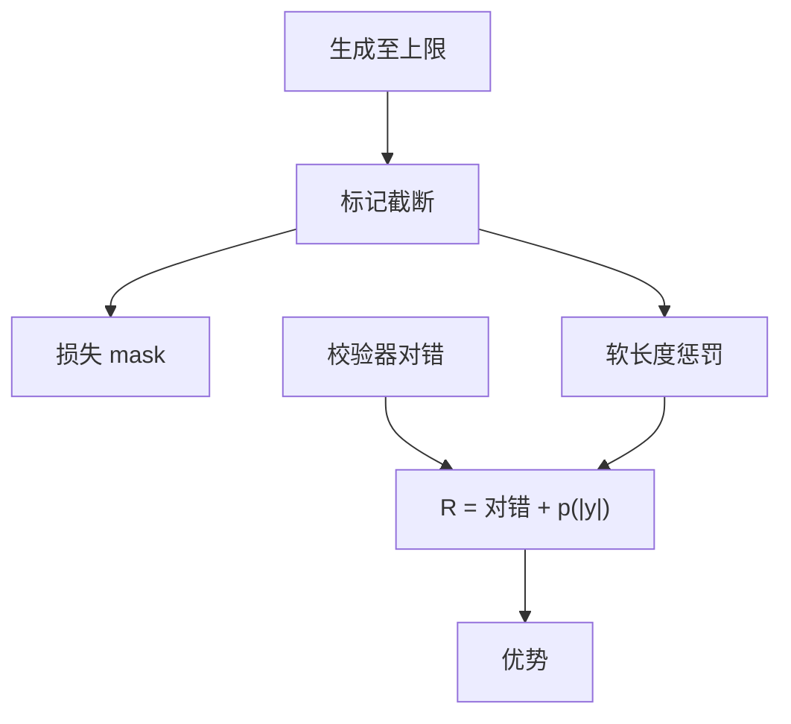

# 过长过滤

截断不是答错；把超长样本直接标成负奖励，会误伤写对但还没写完的推理。

<footer>—— Yu 等 DAPO 的 overlong filtering 与软超长塑形</footer>

[上一课](/llm/entropy-collapse)处理探索死亡。探索活着时，另一头出现：模型把链写到生成上限，被截断。缺口是：**截断轨迹的 $R$ 怎么计，会决定策略怕长度还是利用长度。** DAPO 把「超长过滤 + 软惩罚」写成从 30 分走到更高分的第一块增量。本课写过滤，不重写 [可验证奖励](/llm/verifiable-reward) 的抽取。

## 问题

生成设 `max_tokens = L`。到 $L$ 仍无 EOS，轨迹不完整：数学可能还没 boxed，代码可能还没写完测试。若抽取失败则 $R=0$，等于把「推理方向对、预算不够」标成错。梯度会惩罚这类前缀，策略学会要么极短，要么在预算内胡乱收尾。若忽略截断样本（mask 损失），则浪费生成，但至少不注入错误标签。

DAPO：先可对截断样本 mask；再给软惩罚——长度 $\le L_{\max}-L_{\mathrm{cache}}$ 不罚，中间线性到 $-1$，$|y|>L_{\max}$ 为 $-1$。主实验 $L_{\max}=16384$、$L_{\mathrm{cache}}=4096$，生成上限更大。过滤与塑形一起，消融上「+超长过滤」从 30 到 36。

### 过滤的是损失，不是数据删除

仍要记账截断率。截断率高，说明 $L$ 不够或模型在拖。只 mask 而不改 $L$，墙钟被长尾吃掉。$L$ 与塑形阈值必须一起调；预算 4K 却抄 16K 阈值，等于关掉机制。

长度惩罚与 RM 爱长对冲。可验证域没有 RM 爱长，过长主要来自重复与过度搜索，见后课过度思考。

## 方法

协议：标记 `truncated`。训练目标对截断 token 的策略损失 mask，或整条 mask。奖励侧：不把截断当答错；另加连续软惩罚 $p(|y|)\in[-1,0]$，与校验器 $R_{\mathrm{acc}}$ 相加。评测必须用与训练一致的 $L$，否则准确率不可比。不要在抽取器里对截断序列「强行抓最后一个数字」——假阳性会奖励没写完的链。

与 [长度归一化](/llm/length-normalization-bias) 的差别：这里不除 $|y|$，只在尾部加代价。中等长度的正确证明不受伤。

## 机制

mask 切断错误信用：未完成不等于 $R=0$。软惩罚提供可微的「请在预算内结束」而不污染对错几何。策略学会在 $L_{\mathrm{cache}}$ 窗口里收束 boxed。若惩罚过早，又打压必要长链——与 R1 鼓励长思考的目标冲突，阈值要按任务分位数设，而不是抄论文整数。

截断率突然上升常与熵塌后的重复循环同现。先看 n-gram 重复，再加大 $L$。

## 边界与工程取舍

服务侧 SLA 更短时，训练 $L$ 必须覆盖产品预算，否则过长过滤教的是另一套停止策略。工具调用中途截断同理，应 mask。下一课动态采样处理零梯度组；过长组若仍算出 $R$，会进 batch，不要与 0/1 准确率过滤混为一谈。

## 小结

- 截断 ≠ 答错；直接赋 0 会误伤未写完的正确推理。
- DAPO：mask 截断损失 + 尾部软惩罚，阈值与生成预算绑定。
- 不要对截断序列强行抽取答案。
- 截断率是一等监控，常与重复循环同现。
- 出处：Yu 等 DAPO overlong filtering / shaping。
