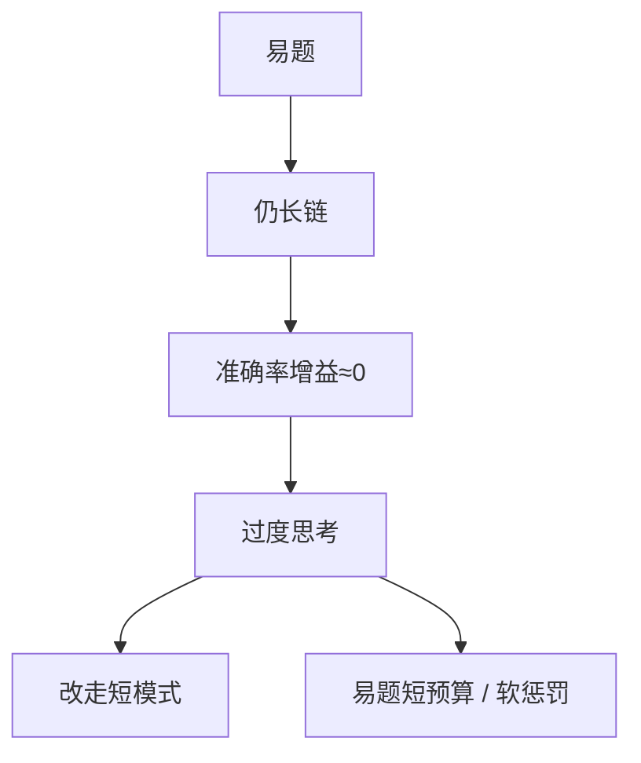

# 过度思考

简单题上继续写「等等、再验一遍」，准确率不涨，延迟先涨；这是对错奖励没有长度价格时的理性行为。

<footer>—— 对照 Chen 等对推理模型过度思考的测量；R1 长度随训练增长的现象</footer>

[上一课](/llm/hybrid-thinking-mode)希望简单题走短模式。若路由失败或没有短模式，模型会在已经会的题上循环自检。缺口是：**终局 $R$ 对「更快做对」零奖励，探索到的长链一旦曾经有用，就被固定成默认。** 本课写过度思考的诊断与抑制，接到长度控制。不把「想得少」写成普遍更智能。

## 问题

Chen 等人（及后续测量）观察到：推理模型在容易的 GSM 级题上仍生成极长链，pass@1 相对短 CoT 增益很小，token 费用大。R1-Zero 长度上涨是组内长链更容易得 $R=1$。没有负的长度项，最优是写到上限附近再停。过度思考 = 边际准确率 ≈ 0 的那一段生成。

自检循环（「wait, let me recheck」多次）是典型表面。它与后课有用的回溯不同：有用回溯改变答案；过度思考重复同一答案。

### 不要用平均长度当唯一 KPI

难题上长度有用。应按难度分桶看「准确率 vs token」。只压平均长度会伤害难题桶。这与 [难度课程](/llm/rl-difficulty-curriculum) 的分桶报告同一纪律。

产品投诉「太啰嗦」往往是过度思考 + 混合模式失败，不是 RM 爱长的文本助手病，虽然外观相似。

## 方法

诊断：分桶帕累托；重复 n-gram；答案首次出现位置 vs 结束位置。抑制：混合路由；过长软惩罚对简单题更狠（按估计难度调 $L$）；在 $R$ 里加「首次正确后继续写」的惩罚需小心——没有在线校验器时无法知道首次正确。可用：训练时对已知易题设短 $B$。推理：早停规则（答案稳定）。

与 [熵塌](/llm/entropy-collapse) 对照：过度思考时熵可以不低（一直在说新的废话）。看的是**对准确率无贡献的尾部长度**。

## 机制

可验证 RL 的最优策略在 $R\in\{0,1\}$ 下不唯一：所有做对的长度都同分。训练噪声与「长链曾经救命」使质量偏向长。要挑短的对，必须改偏序：同样正确时偏短。这是多目标，不是改校验器。

强迫短预算在难題上会制造截断错误，表现为过度思考的反面。分桶调 $B$。

## 边界与工程取舍

没有难度估计时，不要全局压长度。用基座或当前模型的通过率当难度代理，比题面星级更跟得上策略。下一课把「偏短」写成可控的长度目标，而不是只骂啰嗦。

按难度分桶看准确率–token。全局压平均长度会伤害难题桶；空转复核与答案翻转不是同一件事。

## 小结

- 过度思考是对错奖励下长度无价格、简单题尾部 token 零增益。
- 必须按难度分桶看准确率–token，不能只压平均长度。
- 抑制：混合模式、易题短预算、正确则偏短的多目标。
- 与有用回溯的差别：答案是否改变。
- 出处：Chen 等过度思考测量；DeepSeek-AI R1 长度现象；Yu 等超长塑形作工具。
