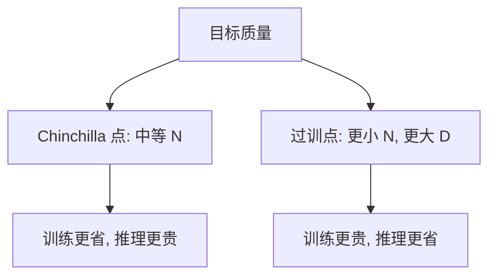

# 过度训练与推理成本

    
训练只付一次，推理付无数次。把小模型多看许多倍 token，常常比把同计算做成欠训的大模型更适合真正上线。

    <footer>—— Gadre 等人关于过度训练标度的工作；Llama 3 技术报告中的训练配方思路</footer>

Chinchilla 回答的是：若你只在乎训练 FLOPs 换到的损失，参数与 token 应大致对半涨。上线之后，账单结构反过来。一次预训练的计算再大，也是常数；每个用户请求都要再跑一遍前向，代价随活跃参数量和生成长度线性累积。于是出现一种刻意偏离计算最优的策略：选更小的 $N$，把 $D$ 推到远超每个参数二十个 token，用「过度训练」把损失再往下压。Gadre 等人表明，这种过训区间里，损失与下游指标仍然可预测；Llama 3 一类配方则公开把 8B 级模型训在数万亿 token 上，远超 Chinchilla 点。本篇讲为什么过训能换推理成本，以及它在什么时候不划算。

## 问题

记训练计算 $C_{\mathrm{train}}\approx 6ND$，单次推理（按处理的 token 计）约与 $N$ 成正比。若一个模型在生命周期里被调用 $R$ 次、每次平均产生或编码 $T_{\mathrm{inf}}$ 量级的 token，推理侧总计算大约随 $R\,T_{\mathrm{inf}}N$ 走。当 $R$ 很大，最优不再是最小化 $C_{\mathrm{train}}$ 下的损失，而是最小化「达到目标质量」时的 $N$，训练侧愿意多付 $D$。

这与「更大总是更强」不矛盾。更大的模型在充分训练后往往仍有更低损失，但若你的质量目标是「够用」，用过训的小模型达到同一目标，服务成本可以低一截，延迟与显存也更友好。问题变成：过训还能降多少损失？降幅是否可外推？还是会在重复数据或目标饱和处提前停止？

### 过训是相对 Chinchilla 点而言

过度训练不是「训太久所以过拟合」的贬义。它指定量上 $D/N$ 明显大于计算最优比例。一个 8B 模型按约 20 token/参数只需约 160B token；训到 2T 或 15T，就是十几倍到上百倍的过训。Llama 3 报告里 8B 与 70B 都走了远长于 Chinchilla 的 token 预算，明确是为了小模型也能强，从而使部署更便宜。Gadre 等人则在受控实验里把过训当作标度轴：固定 $N$ 拉长 $D$，看损失是否仍幂律下降，以及下游是否跟着走。训练损失继续下降，不等于你关心的任务还在涨。过训曲线应同时看验证损失和一组下游探针。探针饱和后，多出来的 token 只是在买更平滑的生成或别的能力，应单独记账，不要自动写成「还在按扩展律变强」。

## 方法

规划上先选目标质量，再选最小的 $N$ 使得该 $N$ 在可承受的 $D$ 内能达到目标。可承受的 $D$ 受独特数据量、重复次数上限、以及训练墙钟时间约束。Gadre 等人的结果表明，在相当宽的过训倍率内，损失仍可用对 $D$ 的幂律或相关拟合描述，下游平均分也未立刻崩溃。这给了配方作者一种外推：不必每个倍率都做满规模扫描，可以在中等过训上拟合，再决定是否把 8B 拉到数 T token。

与单纯重复数据不同，过训可以发生在数据仍未耗尽时：独特 token 充足，只是故意不升级 $N$。数据约束下的重复（Muennighoff 等人）是另一条轴：独特数据不够时被迫多 epoch。两条轴可以叠：小模型、多 epoch、再加新数据，都会把 $D$ 相对 $N$ 拉大。会计时要分开写独特 $U$ 与总看到的 $D$。

### 把推理成本写进目标函数

一个极简的比较是：达到同一验证损失，方案 A 用 $N_1,D_1$ 接近计算最优，方案 B 用 $N_2<N_1$ 且 $D_2\gg D_1$。若 $6N_2D_2$ 更大，训练更贵；但若服务期 $R N_2 T_{\mathrm{inf}}$ 省下的计算超过差额，B 胜。延迟与显存还没写进这个式子：小模型可以更大的批、更少的节点、更简单的并行。Llama 3 把同一套数据配方同时喂给 8B 与 70B，等于在过训轴上提供两个部署点，而不是只交一个计算最优的中间尺寸。

## 机制

过训仍然服从「更多数据降低估计误差」这一面：固定容量 $N$，多看 token 能把经验风险往下推，直到逼近该容量下的近似误差。Chinchilla 的三项式里，$B/D^{\beta}$ 一项在 $D$ 很大时变小，损失逼近 $E+A/N^{\alpha}$。过训吃的是数据项的尾巴：对小 $N$，容量项 $A/N^{\alpha}$ 较高，所以即使用极多数据，也追不上充分训练的大模型上限；但若目标损失高于那个上限，小模型的尾巴足够用。

Gadre 等人强调的「可可靠标度」，指过训区间里下游指标并不突然乱掉，仍可随损失或随 $D$ 外推。这降低了「把 7B 训到数 T 会过拟合到训练语料」的恐慌，但没有取消去重与污染控制。过拟合风险在独特数据很少、epoch 极多时更大，那是数据约束论文的核心，不是单纯过训的核心。推理成本还取决于解码算法、量化、投机解码与缓存。过训降低的是「同一精度、同一解码器下因 $N$ 引起的那一项」。若你已经把 70B 量化到与 8B 相近的显存，账会改写。过训策略应和推理栈一起比，而不是只比稠密 BF16 的 FLOPs。

### 为什么小模型更吃过训红利

服务期的显存墙、TP 通信、以及每 token 延迟，都随 $N$ 变差。把质量从「不够」推到「够用」，在 8B 上加 token 往往比把基线换成 70B 更划算。大模型也可以过训，Llama 3 的 70B 同样看了远超 20 token/参数的数据；此时动机变成「把大模型也训充分」，与「为推理而故意保持小 $N$」是同一光谱上的不同点。光谱的一端是 Chinchilla 谷底，另一端是几乎把容量项当常数、拼命砸 $D$。

## 边界与工程取舍

数据墙会截断过训。独特数据耗尽后，继续加 $D$ 就是加重复，收益按数据约束曲线衰减。优化墙也会截断：极长训练需要稳定的学习率尾巴（WSD、常数尾巴或极慢余弦），以及对抗损失尖峰。过训不是把同一短日程循环播放。

质量目标若随时间上涨，过训小模型会先碰到容量天花板。那时必须加 $N$，或改架构（MoE 用活跃参数换总容量）。把所有产品线都锁死在过训 8B 上，会在下一个质量台阶付出更贵的重启成本。报告过训时要同时写 $N$、$D$、$D/N$、独特数据比例，以及推理侧假设的 $R$。只写「我们训了 15T token」无法判断是在买推理还是在补欠训。相对的参照点是同一 $N$ 的 Chinchilla token 数，以及同一计算下更大模型的损失。

最后，过训改变检查点选择：早期检查点更接近计算最优，晚期检查点更适合部署。同一趟训练可以交出两个产物，不必把「科研最优」和「服务最优」训两遍。

## 小结

- 过度训练指 $D/N$ 明显大于 Chinchilla 计算最优，用更多 token 换更小、更好部署的模型。
- 动机是推理次数极大时，$N$ 进入每一次请求的成本，训练侧的超额 FLOPs 可以被摊销。
- Gadre 等人表明过训区间内损失与下游仍可预测；Llama 3 等配方把小模型训到数 T token。
- 过训吃的是三项式里数据项的尾巴，小 $N$ 仍有容量上限。
- 独特数据耗尽后，过训并入重复数据的衰减曲线。
- 应与量化、解码栈一起比较，不能只比训练 FLOPs。
- 出处：Gadre 等人关于过度训练与下游标度的研究；Meta, *The Llama 3 Herd of Models*, 2024。Chinchilla 对照见 Hoffmann et al., 2022。
