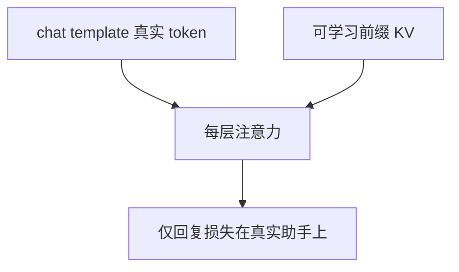

# P-tuning v2

可训练的不是任务描述句子，而是插在每一层的前缀键值；深度提示让提示调参在大模型与硬任务上追上全参微调的量级。

<footer>—— Liu 等，P-Tuning v2: Prompt Tuning Can Be Comparable to Fine-tuning Universally Across Scales and Tasks，ACL 2022</footer>

[BitFit](/llm/bitfit) 不改 $W$，只平移激活。提示调参也不改 $W$，但在序列前端（或每层）插入可学习的「虚 token」。Liu 等人的 P-Tuning v2 针对 v1 / Lester 式 Prompt Tuning 的失败：只在输入嵌入层加前缀，小模型或难任务上远弱于全参。v2 把前缀做到每一层的注意力，作为深度提示。缺口：与 [LoRA](/llm/lora) 同属 PEFT，但侵入的是 KV 缓存与序列长度，不是矩阵加法。后课合并冲突默认你已能区分「适配器」与「前缀」。

## 问题

离散 prompt 要人工写；连续 prompt 把 $n$ 个虚向量当参数，经嵌入层进入注意力。只插在第 0 层时，后续层看到的是被冻结 Transformer 变换过的提示，能调控的自由度随深度衰减。大模型上 Lester 等人曾显示仅输入前缀就够；中小模型与序列标注上不够。P-Tuning v2 要恢复深度上的控制：每层自己的前缀 KV，使注意力在每一层都能「看见」任务提示。

指令 LLM 还有[chat template](/llm/chat-template)：真实特殊 token 与虚前缀并存。虚前缀不进词表、不进用户可见字符串，但占序列位置、进 KV。推理必须加载同一份前缀，否则条件 OOD——与模板不一致同构。

### 前缀长度是序列税，不是参数税

$n$ 个前缀 token 每层增加 $n$ 的 KV。长上下文里这与[长微调](/llm/long-context-finetune)抢预算。LoRA 合并后不占序列。任务极多时，前缀按任务存小，但 decode 每步都要带着任务 KV。这是服务差异，不是准确率差异。

原文覆盖 NLU 与序列标注，强调「跨尺度、跨任务可与微调相比」。生成式助手 SFT 上，实践更常选 LoRA；P-tuning 仍是合法 PEFT，尤其在不能改权重文件、只能加前缀缓存时。

## 方法

对每层注意力，拼接可学习前缀 $P_K,P_V$（长度 $n$）到真实序列的 K、V 上，再做 SDPA。参数量约 $L\times n\times d$ 量级（或再经小 MLP 重参数化，v1 常用）。冻结原 $W$。初始化前缀为小随机，避免初期注意力全被前缀吸走。学习率偏适配器侧。SFT 时[仅回复损失](/llm/response-only-loss)只在真实助手 token 上；前缀位置始终是条件，不计损失。

与对话模板：先渲染 messages，再在模型内部插前缀，不要把前缀写成用户可见的「系统提示替代」——除非你有意让二者合一。推理 `add_generation_prompt` 仍按模板；前缀作为额外 KV 加载。

$n$ 从 8–64 扫。过大则过拟合短指令，且税重。可与 LoRA 同用，但很难归因，默认二选一做主。

## 机制

前缀 KV 提供与位置无关（或有独立位置编码）的任务记忆：查询真实 token 时可以读到这些键。深度前缀让每一层都能重新读任务，不依赖第 0 层把提示信息无损传下去。这比 BitFit 更能引入「新的可寻址记忆」，比 LoRA 更少改内容通道 $W$。失败时表现为：模型会说对任务口头禅，却改不好计算，因为 FFN 权重冻结。

多任务切换只换前缀 KV，基座唯一。前缀之间相加没有良好定义——应切换而不是平均，除非做了专门的组合训练。这点接到[LoRA 合并](/llm/lora-merge-conflict)：前缀冲突同样存在，只是发生在 KV 里。

P-tuning 不替代系统提示。系统提示是离散、人写、进模板的；前缀是连续、训练出来的。混用时两者都是条件，调试要对齐加载。

## 边界与工程取舍

权重必须能在每层注入前缀接口；闭源 API 做不到 v2。生成长度很长时，前缀占的 KV 恒定，相对税下降，但首包延迟仍在。领域术语内化仍弱，应 [DAPT](/llm/domain-adaptation-ft) 或 LoRA。v2 论文早于 ChatGPT 对话栈，迁移时把「CLS 头」换成 LM 头即可，不要复用分类超参当生成超参。

## 小结

- P-Tuning v2 在每一层插入可学习前缀 KV，冻结 $W$。
- 深度提示补上「只在嵌入层加 prompt」的表达力缺口。
- 前缀占序列与 KV，服务税与 LoRA 不同。
- 损失不计前缀位置；须与 chat template 一起加载。
- 适合多任务切前缀、不能写权重时；生成 SFT 默认仍常选 LoRA。
- 出处：Liu 等，P-Tuning v2，ACL 2022。
