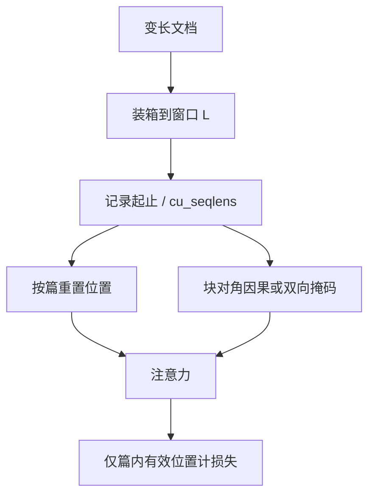

# 跨文档 packing 掩码

把短序列装进同一窗口可以去掉大半 padding；若不在自注意力里切断文档之间的边，packed 模型在数学上就不再等于原来那条样本。

<footer>—— Krell, Kosec, Perez, Fitzgibbon, Efficient Sequence Packing without Cross-contamination, arXiv:2107.02027；预训练拼接实践见 Raffel 等 T5</footer>

[Packing](/llm/sequence-packing) 解决的是长度分布偏斜：窗口是 $L$，文档却大量短于 $L$。Krell 等人把 BERT 类数据上的 padding 比例写到 50%，极端设定（如 GLUE-cola、长度 128）可到 89%，并证明用装箱算法拼接之后，必须加**块对角注意力掩码**，否则跨序列污染会改准确率。他们把这件事叫 without cross-contamination：packed 模型与逐条样本在注意力可达性上等价。T5、PaLM、GPT 式因果预训练同样把多文档拼进固定长度，但早期实现常「只 concat 加个 EOS」，跨篇可见性是未声明的配方。本篇写 packing **必须附带的那张掩码**，以及稠密块对角与 FlashAttention `cu_seqlens` 两条实现；掩码对象本身见 [document attention mask](/llm/document-masking)。

## 问题

独立成批时，有效 token 比是 $\ell_i/L$。注意力与 GEMM 仍按 $L$ 付费。Packing 把若干篇装进容量 $L$ 的桶，padding 只留在装不满的残差。装箱是组合优化：Krell 等把它形式化成 bin packing，并给出可在百万条上秒级跑完的确定性算法；T5 用更贪心的拼接。效率不是本文的新点。新点是：拼接之后，标准因果或 BERT 双向注意力会把上一篇的 token 当成合法上下文。

对双向编码器，跨篇边等于把无关文档写进每一层的混合。对因果 LM，第二篇的第一个 token 能看见第一篇全文，训练任务从「文档内语言建模」变成「语料相邻伪文档条件」。位置编码若跨篇连续增长，RoPE 相位还会把篇首标成「很深的位置」。因此 **concat 不是实现 packing，掩码才是。** Krell 的消融：去掉跨序列掩码会伤准确率，掩码不是可选加速开关。

### 「故意允许跨篇」是另一种配方

有的预训练明确允许跨文档注意力，把 packing 当廉价多文档上下文。那必须写进数据卡，并且位置是否重置、损失是否在边界切断，都要另定。本篇默认目标是 **与未 packing 的逐文档样本等价**，即 Krell 的 contamination-free。两种配方都存在，数字不可互相引用。

Raffel 等在 T5 里拼接 C4 样本以提高利用率；他们讨论的是数据流水线。Krell 等把「等价性」钉在注意力掩码与位置重编号上。引用 packing 加速比时，应声明是否保持等价。

## 方法

预处理：按 $L$ 装箱，插入分隔 token，记录每篇起止下标。模型侧三件事一起做，缺一则不等价：

1. **注意力**：块对角（BERT 双向则块内全 1；GPT 因果则块内下三角），块间为 0。加在 softmax 之前，无效位置写大负数。
2. **位置**：每篇从 0 或从 BOS 计，绝对位置与单独训练该篇时一致。
3. **损失**：padding 不计；跨边界的「下一 token」若已进入下一篇，因果 LM 仍可在篇内计，但 [MTP](/llm/multi-token-prediction-training) 的远头必须掩掉跨篇标号。

Krell 针对 BERT 还写了 NSP 等按序列而不是按 pack 计的损失，以及超参如何随「每步有效序列数变化」调整，否则收敛曲线与未 packing 对不齐。

### 稠密掩码 vs 变长核

物化 $L\times L$ 掩码把复杂度从 $\sum_i \ell_i^2$ 抬回 $(\sum_i \ell_i)^2$，pack 越满越亏，还会限制可 pack 的总长。NVIDIA NeMo 等实现改为 FlashAttention / TransformerEngine 的变长接口：传入 `cu_seqlens`（累积长度），核按段计算，**段间边根本不算**，复杂度回到 $\sum_i \ell_i^2$，HBM 也不存二次表。这与「构造块对角再乘」数学目标相同，IO 不同。THD 布局把整个 microbatch 收成一条变长序列。没有变长核时，退回稠密掩码是正确性优先，不是性能最优。

在线 packing（流式、多源混合）维护未满桶，新文档进第一个能装下的桶。填充率低于离线 best-fit decreasing，但掩码逻辑相同：桶内仍按文档边界切。动态上下文课程下旧 pack 要重切，`cu_seqlens` 文件与 tokenizer 版本绑定。

## 机制

掩码恢复条件独立：块对角使 $\log p(x^{(2)})$ 不依赖 $x^{(1)}$，语言建模似然回到「文档近似 i.i.d.」。位置重置使相对位置统计与未 packing 对齐，模型不会把 pack 内偏移当成语义。Krell 强调数学等价之后，学习率与 batch 含义仍变了——每步有效序列更多，应调超参，否则「加速 2×」混进了优化轨迹变化。BERT phase 2 上他们给出约 2× 的例子，该数字绑定装箱质量与是否保持等价。

FlashAttention 变长按真实长度计 FLOPs，但同 batch 里各 pack 都接近 $L$ 才利于占用率。掩码正确而桶长差一个数量级，仍会在核启动与负载上浪费。这是 packing 与 microbatch 组成，不是掩码公式的一部分。

### 和只加 EOS、和 document-id

只加 EOS、不掩码：模型可以学到分隔符当「话题切换」，但注意力边仍在，信息泄漏是硬的。document-id 进入 FlexAttention 一类接口时，等价于生成块对角：id 不同则边为 0。实现可以不物化布尔矩阵，但语义仍是本篇的跨文档掩码。不要把「有 EOS」当成「已掩码」。

## 边界与工程取舍

编译死的 SDPA 后端若不接受任意掩码或 `cu_seqlens`，团队会用纯 concat 换吞吐——那是明确放弃等价。评测与训练政策应一致：预训练长期跨篇泄漏、微调单文档，领域迁移会怪。指令 SFT packing 还要保证问答不被切断到两个窗口，或切断时回答侧有完整上文；这比网页预训练更严。

长于 $L$ 的文档必须切段。切段边界与 packing 边界都要进 `cu_seqlens`。尾段丢弃比例要记账。多语言桶若要求语言分批，packing 只在桶内发生，以免课程被装箱打乱。发现下游掉点，先查掩码是否坏、位置是否未重置，再查配比。

出处：Krell et al., *Efficient Sequence Packing without Cross-contamination*，arXiv:2107.02027；Raffel et al., T5 / C4 packing；Dao et al. FlashAttention 变长接口；NVIDIA NeMo packed sequence 文档。PaLM 等报告中的拼接实践是工程谱系，未必写了块对角。

## 小结

- 跨文档 packing 掩码让拼接样本在注意力可达性上等于逐文档，避免 cross-contamination。
- 必须同时处理掩码、按篇位置、损失有效位；只 concat 或只加 EOS 不够。
- 稠密块对角正确但二次代价高；`cu_seqlens` 变长核按 $\sum \ell_i^2$ 计。
- 故意跨篇可见是另一配方，不能与 Krell 的加速比混用。
- MTP 远头、NSP 等按序列计的损失要在 pack 内重定义。
- 出处：Krell et al., arXiv:2107.02027；T5 packing；FlashAttention varlen。
