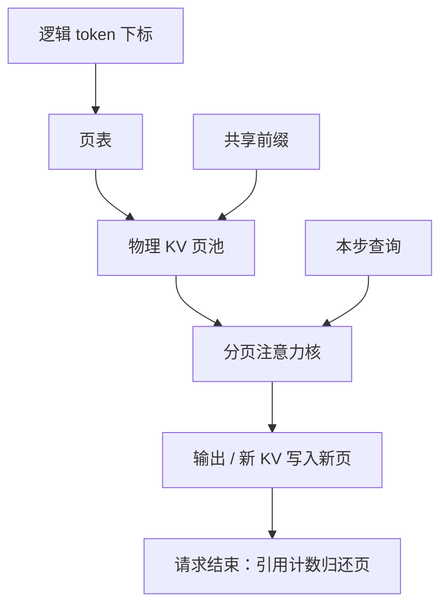

# PagedAttention

    
把键值缓存当成虚拟内存：逻辑上的连续 token 槽映射到固定大小的物理页，从而消灭按最大长度预留造成的碎片，并让前缀可以按页共享。

<footer>—— Kwon et al., vLLM / PagedAttention, SOSP 2023</footer>

解码服务的显存账单里，模型权重相对固定，KV 随并发、层数、长度线性涨，而且来得不规则：有的请求 20 个词就结束，有的生成到上限。若为每条请求预留「最大序列长度 × 层 × 头 × 维」的连续缓冲，平均占用远低于预留，碎片却让新请求进不来——系统在「显存还有空」的同时拒绝服务。PagedAttention 借用操作系统的分页：KV 切成固定 token 数的页，请求持有页表而不是一整段连续张量。注意力核按页表gather 键值。它是存储布局与内存管理，不是压缩算法，也不改变 softmax 定义。

## 问题

连续批处理让请求在迭代间加入、结束即退，吞吐依赖「随时有空槽接新请求」。槽若按最坏长度静态预留，结束得早的请求留下无法被别人使用的空洞（外部碎片），或页内用不满（内部碎片）。预留过短则长生成中途要 realloc 并拷贝，延迟尖刺。复制系统提示、多条采样共享同一前缀时，连续布局往往复制整段 KV，容量再乘一份。

注意力核习惯假设 $K,V$ 在序列维连续。分页之后，逻辑位置 $t$ 的物理地址是 `block_table[t // B] 的第 t % B 槽`，$B$ 是页大小（以 token 计）。没有对应的 gather 核，分页只是把碎片从 KV 缓冲挪到「无法计算」。vLLM 的命题因此是算法加系统：PagedAttention 核 + 页分配器 + 与迭代级调度的配合。

### 碎片的两种形态

外部碎片：空闲字节总量够一个新请求的当前长度，但没有足够长的连续段。分页后空闲页可以拼给任何请求，外部碎片基本消失。内部碎片：最后一页没填满，平均浪费半页。$B$ 越大，核越好写、浪费越多；$B$ 越小，页表越长、内核间接引用越多。这是显式权衡，不是缺陷隐瞒。OS 里页大小的故事在这里缩小到「16 个 token 还是 64 个」这类尺度。

分页不减少「正在使用的 token」对应的 KV 字节。 concurrent × 长度 的峰值该多大仍由模型宽和 KV 头决定。它消灭的是预留和碎片，不是 MLA/GQA/量化所减的那一截宽度。

## 方法

每层的 KV 池是一堆固定形状的物理页。请求的逻辑长度增长时，分配器抓空闲页挂到该请求的页表末尾；请求结束，页还回池，除了仍被前缀共享引用的页。注意力计算时，查询（通常本步新增的那些）带着页表进入核：对逻辑键位置译址，把对应页装入 SRAM，做 [Flash](/llm/flashattention) 式分块与在线 softmax。页可以在物理上不相邻，逻辑上仍是因果前缀。

前缀共享用引用计数。相同的系统提示或相同的提示前缀，页可以只存一份，多条请求的页表指向同一物理页。写时复制发生在生成开始分叉之后：解码要追加的新 token 不能改共享页，需新页。束搜索、并行采样、会话复用系统提示，都吃这一套。Copy-on-write 的正确性取决于不要在共享页上做就地更新。

### 与连续批、分块前填的接口

迭代级调度每拍看哪些请求还活着、需要多少新页。分页使「这一拍新来一条短请求」不必找到一段连续空洞。 [Chunked prefill](/llm/chunked-prefill) 每块追加若干页，部分完成的前填只占用已写的页，而不是整段 $L_p$ 的预留。[混合批次](/llm/splitfuse) 里同一拍的查询来自不同请求、KV 页表各异，核必须是变长+分页的，而不是一个大矩形。这些调度技术可以没有分页（用别的分配器），但生产里常捆在一起，因为碎片和 stall 是同时出现的容量问题。

## 机制

虚拟内存能工作，是因为注意力只关心逻辑位置上的键值内容，不关心它们在 HBM 上是否 stride 为 1。译址是一层额外的整数索引，相对 GEMM 是小开销；真正的风险是随机 gather 打散了合并访问。页够大时，页内仍是连续的，加载可按页对齐，接近连续布局。页过小，gather 变成近似标量加载，解码本已带宽受限，会再伤 ITL。

共享前缀降低的是容量期望值：十个用户同一系统提示，KV 只付一份前缀再加各自后缀。命中依赖调度把这些请求放到同一副本，以及提示字节级相同（或哈希相同）。会话中途改系统提示，共享立刻失效。不要把前缀共享写成「任意语义相似的对话都省 KV」——那是检索或压缩，不是页表。

Radix 树一类前缀缓存是查找结构，PagedAttention 是物理页管理。前者决定「能不能命中」，后者决定「命中后页怎么挂」。可以组合，但不是同一个原语。本篇只写分页注意力本身。

### 核与 CUDA Graph 的摩擦

分页使每条请求的页表每步可能变长，张量形状与间接表都在变。CUDA Graph 喜欢静态形状。实践中常对解码步做「最大并发、最大页数」的 padding 式图，或在页数变化时重建。图捕获的加速与分页的灵活性互相拉扯：锁死最大配置则内部碎片回潮。服务引擎的默认值是这条张力上的点，不是理论最优。

## 边界与工程取舍

PagedAttention 不加速单步 FLOPs，有时因 gather 略慢于精心排布的连续 KV；收益在更高并发、更少拒绝、更好的前缀复用。没有配套核时，把 KV 拷回连续缓冲再调 FlashAttention，分页的优点会被拷贝吃掉。多机之间页池不共享，分离式服务搬的是逻辑 KV，到对端仍要重新分页或走连续传输格式。

页大小、是否启用前缀共享、块表放设备还是主机，都是可调超参。评测吞吐必须写最大长度、并发和是否共享系统提示，否则「相对连续预留 2× 容量」无法复现。它也不处理专家权重的碎片，那是另一套缓存。MoE 与分页 KV 同时存在时，显存池要划分，避免 KV 页把最后一点专家空间吃光。

出处写 Kwon 等，SOSP 2023，系统名为 vLLM。后来的引擎各有分页或块表变体，块大小与 API 不同。写「我们用了 PagedAttention」时应指向具体运行时，而不是把 2023 年论文的实验数字当成本集群容量。

## 小结

- PagedAttention 用固定大小的 KV 页和页表管理缓存，消除按最大长度连续预留造成的外部碎片。
- 注意力按逻辑下标译址，softmax 仍在完整合法前缀上精确计算。
- 内部碎片由页大小决定；页太小伤害加载合并，页太大浪费槽位。
- 引用计数使相同前缀可共享物理页，分叉后写时复制。
- 与连续批、分块前填、混合批次互补：调度管时间轴，分页管空间轴。
- 不压缩每 token 字节，也不替代 FlashDecoding 的 KV 维并行。
- 出处：Kwon et al., *Efficient Memory Management for Large Language Model Serving with PagedAttention*, SOSP 2023。
