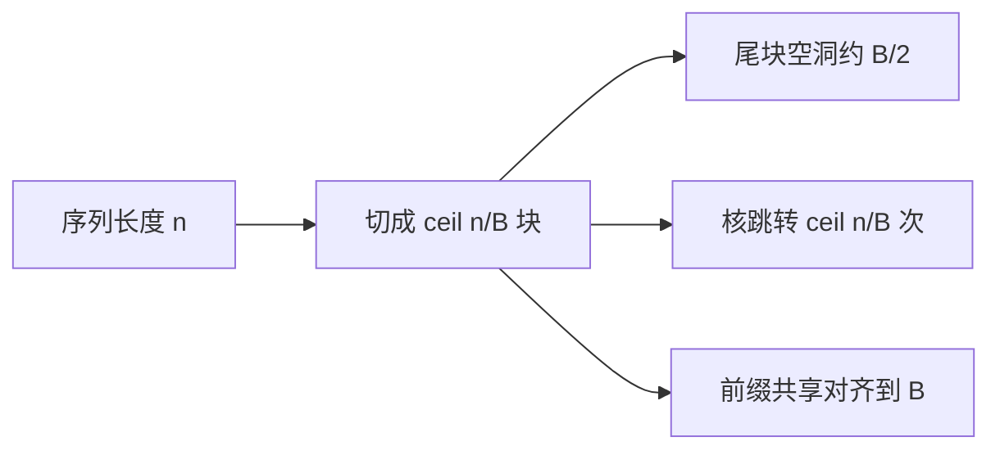

# 分页 KV 与块大小

    
块太小，翻译次数把核拖瘦；块太大，每条请求末尾那截空槽把批次吃掉。块大小是碎片与间接寻址之间的显式交易。

    <footer>—— 对照 Kwon 等 PagedAttention 的块表，以及后续服务栈里的默认 16 / 32 token</footer>

PagedAttention 把每条请求的 KV 切成固定长度的块，用块表把逻辑 token 下标映射到物理槽。这样不必按最大上下文预留，解码增长时再要一块即可。剩下一个看起来像常数的超参：一块装多少 token。它同时决定内部碎片、块表长度、注意力核的内层循环、以及前缀能共享到多细。本篇只讨论这个粒度；虚拟连续的替代见 [vAttention](/llm/vattention)，前缀如何挂到块上见 [前缀缓存](/llm/prefix-caching) 与 [RadixAttention](/llm/radix-attention)。

## 问题

静态预留的内部碎片来自「按上限分配、实际用到一小截」。分页之后，碎片缩到**最后一块的空洞**：长度为 $n$ 的序列、块大小 $B$，浪费的 token 槽是 $B-(n \bmod B)$（整除时为零）。期望浪费大约 $B/2$ 个 token 槽，再乘层数、头数、元素字节。$B$ 越大，这条尾巴越长；并发请求一多，尾巴加总仍能挡住一个可观的批次。

另一端，$B$ 越小，一块只覆盖很短的连续段，注意力核要按块跳转的次数变多，块表本身变长，CPU 侧维护与 GPU 侧间接加载都变重。Prabhu 等人在讨论分页核时观察到：块大小能让同一种分页注意力的时间差出近两倍——这不是边角，而是核实现与 $B$ 耦合的证据。于是块大小不是「调一调再说」的魔法数，而是把碎片上界和间接寻址频率写进同一条式子。

外部碎片在分页里通常很小，因为物理槽大小相同、可任意拼接。真正要盯的是内部碎片（尾块空洞）和「逻辑连续、物理跳跃」带来的核开销。

## 方法

### 块表把逻辑下标译成物理槽

逻辑位置 $t$ 落在第 $\lfloor t/B\rfloor$ 块，块内偏移 $t \bmod B$。块表 `block_table[seq][i]` 给出第 $i$ 个逻辑块的物理编号。注意力核按逻辑序遍历，每次换块就换基址。Kwon 等人在 PagedAttention 里用这张表同时支持：增长（追加新物理块）、抢占（把块换出到 CPU）、共享（两张表指向同一物理块）。$B$ 是这张表的单位，也是共享的单位：两请求只能在块边界上分叉或汇合，不能在块中间把后半截借走。

### 默认档位与直觉

开源服务栈里常见 $B=16$ 或 $B=32$。$16$ 对碎片更友好：平均尾巴八个 token，短请求不至于为对齐浪费一整截长块；核仍能在块内做一点向量化。$32$ 或 $64$ 让块内序列更长，HND 布局下更像稠密核的一小段，间接跳转更少，但尾巴和前缀对齐都变粗。极小的 $B=1$（SGLang 早期 RadixAttention 叙述里一页一 token）让前缀可以在任意位置切开，树最灵活，核则几乎退化成纯间接访问，需要靠别的融合来补。

选择时用三条尺子一起量，而不是只看显存占用：

$$
W_{\mathrm{frag}} \approx \frac{B}{2}\cdot L\cdot h_{\mathrm{kv}}\cdot d\cdot 2\cdot b, \qquad
N_{\mathrm{lookup}} \approx \lceil n/B\rceil.
$$

$W_{\mathrm{frag}}$ 是每条请求期望浪费的字节（量级），$N_{\mathrm{lookup}}$ 是一次注意力要换基址的次数。再叠加前缀命中：共享长度若必须向下对齐到 $B$ 的倍数，有效命中是 $\lfloor p/B\rfloor\cdot B$，余数要重算。

### 与布局、量化一起选

块内布局是 [BSHD 还是 HND](/llm/kv-layout)，决定 $B$ 个 token 在物理上怎么排。HND 下增大 $B$ 直接加长每头的连续段，解码核更受益；BSHD 下增大 $B$ 对解码合并帮助较小。KV 量化后每 token 变瘦，$W_{\mathrm{frag}}$ 的字节变小，可以略微容忍更大的 $B$；但块表与跳转次数不随量化变，核时间仍可能被小 $B$ 卡住。

## 机制

分页注意力的正确性不依赖 $B$：softmax 仍沿逻辑时间。$B$ 只改变访存图。块内连续时，warp 可以一次吃满一条 cache line；跨块时必须重新算基址，指令与延迟槽都会露出来。预填充 $n$ 大，块数多，跳转占比相对计算可能还好；解码 $n$ 逐步变大、每步计算很少，跳转和块表驻留在 L1/L2 的压力更明显。这就是为什么同一套分页核，预填充与解码对 $B$ 的敏感度不同。

抢占与卸载也以块为原子。$B$ 太大，一次换出带走过长的上下文，PCIe 突发变大、但灵活性变差；$B$ 太小，传输次数变多，启动开销吃掉带宽。前缀共享则要求哈希或树节点与块对齐：vLLM 一类自动前缀缓存按块内容哈希，父块哈希串成链；$B$ 越大，两段「只差几个 token」的提示越难在中途分叉。

把 $B$ 当成「页大小」时，不要和操作系统 $4\,\mathrm{KiB}$ 或 GPU $2\,\mathrm{MiB}$ 混为一谈。这里的单位是 token，字节数还要乘 $H,D$ 和层数。一层一块的字节 $=$ $B\cdot h_{\mathrm{kv}}\cdot d\cdot 2\cdot b$。

## 边界与工程取舍

没有对所有模型都最优的 $B$。头数多、头维大时，一块的字节很快涨到几十 KB，再增大 $B$ 会让尾块浪费在显存上很显眼；GQA 把头砍少之后，同样 $B$ 的字节变小，可以略增 $B$ 去喂核。长上下文、低并发，碎片不痛，核更痛，倾向大块；高并发短对话，碎片痛，倾向小块。

前缀很重的负载（系统提示数 KB、少样本）值得单独测：把 $B$ 从 $32$ 降到 $16$，有时吞吐上升不是因为核更快，而是共享变细、预填充少做了。反过来，几乎无共享的补全服务，小 $B$ 只留下跳转税。换注意力核时必须重测：$B$ 是核常量，不是与核无关的分配器细节。vAttention 把这个问题推回硬件页大小，用户态 $B$ 消失，但硬件页过粗会把碎片换一种形式送回来。

不要在运行中频繁改 $B$。块表、哈希、已缓存的前缀全部作废。把它当作部署常量，和模型、并行度一起写进配置，而不是请求级参数。

调试碎片时，打印「已分配块数 × $B$ − 实际 token 数」，不要只看 HBM 占用。后者还混进了权重和工作区，看不出尾巴。

## 小结

- 分页 KV 用固定 token 块和块表做逻辑到物理的翻译；块大小 $B$ 同时约束尾块碎片、核跳转次数和前缀对齐。
- 期望内部碎片约 $B/2$ 个 token 槽；查找次数约 $\lceil n/B\rceil$。
- 服务栈常见 $16$ 或 $32$；一 token 一页最利于树形共享，却最伤核。
- $B$ 与布局、量化、并发形态耦合，换核或换负载都要重测。
- 共享与卸载都以块为原子，不能在块内再切开。
- 运行期不要改 $B$；它是集群配置，不是采样参数。
- 出处：Kwon 等，*Efficient Memory Management for Large Language Model Serving with PagedAttention*，SOSP 2023；块大小对核时间的敏感性亦见 Prabhu 等 vAttention 文中对分页核的测量。
