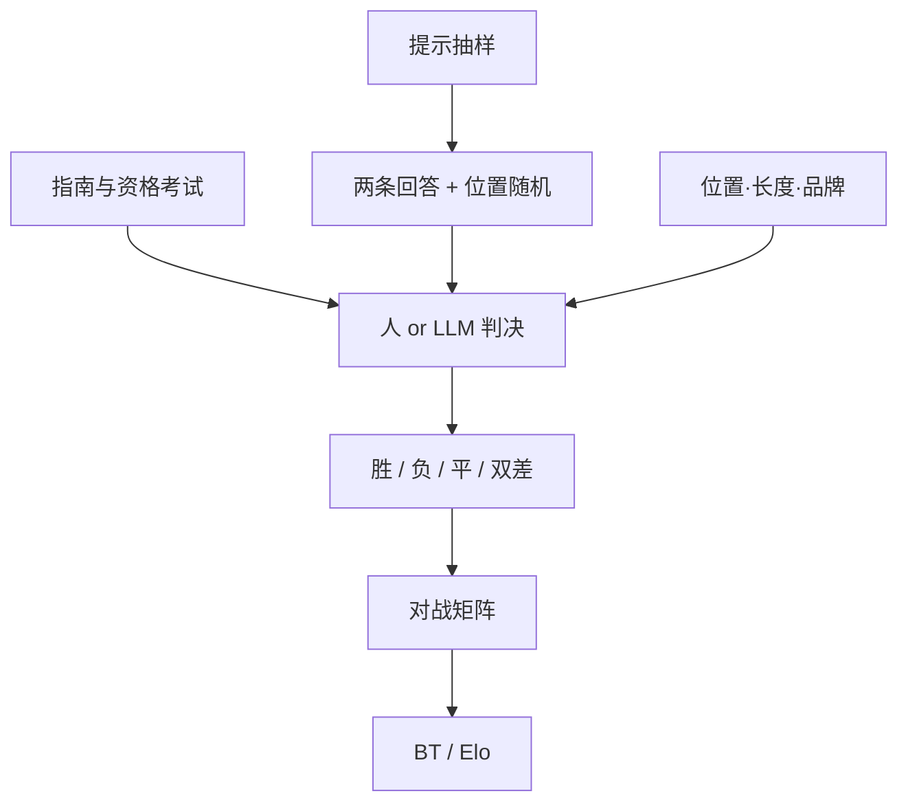

# 成对比较协议

成对标签不是「让人随便选一个更好」；展示顺序、平局选项、匿名、指南里的优先级，以及这对回答来自哪一个提示，全部都是测量仪器的一部分。

<footer>—— 成对偏好是 InstructGPT 与 Arena 的数据层；统计模型见 Bradley-Terry；法官偏差见 Zheng 等</footer>

把两条回答变成一个「谁赢」，看起来是最薄的标注。薄的是界面，不是协议。同一对 $(y_a,y_b)$，先出示 A 还是先出示 B、是否允许平局、指南要求先安全还是先有用、标注员是否看得见模型名，得到的伯努利参数可以不同。Ouyang 等人用成对（及排序拆对）训练奖励模型，LMSYS Arena 用成对人票估 Elo，Zheng 等人指出 LLM 法官在成对里有位置与冗长偏差。这些系统共享同一数据型，却常把协议细节写进附录甚至不写。本篇只写**标签怎么采集**：仪器、偏差、一致性与图连通；从标签到分数的模型见 [Bradley-Terry](/llm/bradley-terry)，绝对分路线见 [Likert 与绝对评分](/llm/absolute-rating-prefs)。

## 问题

绝对量表上，标注员各有锚点：有人的 4 分是另一个人的 7 分。成对把问题收成二选一，方差下降，信息也下降——不知道赢多少，两个都差仍会决出胜者。若不把采集协议钉死，下降的方差只是把不可复现的偏差锁进了数据：位置偏好、长度偏好、品牌光环、疲劳后乱点。下游 RM、DPO、Arena 分数会把这些偏差当成「人类偏好」。

提示 $x$ 是成对的语境。离开 $x$ 谈 $y_a \succ y_b$ 没有意义。协议必须规定 $x$ 从哪来（内部用户、众包命题、Arena 直播）、如何抽样、是否过滤违法与无意义提示。题的分布就是偏好的定义域；在创意写作上标的对，推不到代码审阅。

### 仪器比指南口号更决定数据

写「选择更有帮助、真实、无害的一条」而不规定冲突时的词典序，标注员会各自发明词典序。有人永远选更长的，有人永远选更拒答的。协议要把冲突例写进培训：安全 > 真实 > 有用，或产品自己的另一套序，并在考试题上过关才发正式任务。没有资格考试的成对数据，噪声结构不明，BT 拟合会很稳地拟合噪声。

允许平局、允许「两条都不可接受」，会改变胜率的含义。强制决胜会把「都差」写成假偏好，RM 会学到在两条坏回答里挑文风。

## 方法

一次有效标注至少包含：提示 $x$、两条回答、随机化后的左右位置、标注员 ID、时间戳、选项集合 $\{\succ, \prec, \mathrm{tie}, \mathrm{both\text{-}bad}\}$（按项目裁剪）、以及可选的「赢多少」有序档（远好 / 略好）。位置必须对期望随机：固定「模型 A 永远在左」会把模型效应与位置效应混在一起。LLM 法官同样要 A/B 对换，Zheng 等人已测过位置偏差的幅度。

匿名：对标注员隐藏模型名、隐藏「这是新 checkpoint」。做不到对内容水印匿名。指南应明确「不要因为像某产品的列表风格就给胜」。抽查能认出模型的样本，估计品牌泄漏率。

抽样图要连通。若模型 $i$ 只和弱基线比、从不和强模型比，BT 分数的可识别性差、区间宽。Arena 式全对或瑞士轮、实验室式固定对照加随机对手，都应报告对战矩阵的密度。稀疏图上的名次是插值，不是测量。

$$
\hat{P}(A\succ B\mid x)=\frac{n_{AB}^{\mathrm{win}}+\alpha}{n_{AB}+\ 2\alpha}
$$

即使最终用 BT 全局拟合，也应公布原始 $n_{AB}$。样本极不均衡时，点估计名次没有意义。

### 人标与 LLM 法官是两种仪器，协议要分写

人：班次长度、时薪、是否专家、是否看见工具执行结果（代码能不能跑）。看不见执行时，编程成对比的是「像好代码」；看见了，才是任务成功。LLM 法官：模型版本、温度、是否强制 JSON 判决、评分规则原文、是否长度控制。把两种标签混进同一个 BT，等于混合两台未校准的秤。可以都采，必须分列或显式加权。

## 机制

位置偏差来自阅读顺序与注意力：先读的一条建立锚，后读的一条被当成修订。人与 LLM 都有，LLM 往往更重。对换并平均，是在估计对称化后的偏好，不是消除阅读效应——有的对在两个方向上判决矛盾，应记为噪声或平局，而不是强行平均成 0.5 再当高置信。

冗长偏差来自「努力」启发式：更长像更认真。协议层的对抗是长度控制、截断再标、或在界面显示词数警告。不在协议层处理，就在模型层处理（LC 胜率），后者是事后修补，改不了已写入 RM 的长度梯度。

不可传递：岩石剪刀布式的三元循环在真实偏好里存在（A 文风赢 B，B 正确性赢 C，C 简洁赢 A）。BT 假定可传递的潜在分，会把循环当成噪声抹平。协议若只采附近的对，循环被采样不到，问题被藏起来。应定期做三元闭合检查，过大则说明指南把多维质量压成一维时已经失真，该拆轴（安全单独标）。

### 拆轴比加更多对更重要

有用性和无害性经常反相关。成对若强制合成一维，标注员的隐含权重会漂。InstructGPT 后来把安全比较分开，是协议承认多维。Arena 的分类榜是同一思想在提示维上的拆分。协议文档应写清：这一对比较在哪一轴上问「更好」，禁止在同一界面上问没定义的「总体更好」还指望可复现。

「略好」与「好得多」若被压成同一比特，BT 会把微弱多数文风差当成巨大质量差。有序档可以进加权似然；不用档时，至少让平局容易点，避免强迫决胜。

## 边界与工程取舍

成对协议解决不了定义域外推：在公开聊天上标的偏好，推不到医疗。也解决不了标注员非随机：Arena 用户、众包工人、内部专家是三个总体。报告必须写总体，不能写「人类偏好」四个字了事。

成本上，人对贵、慢、质量可控；LLM 法官便宜、可对换、偏差结构不同。用 LLM 法官生产训练数据，是在用另一模型的偏好蒸馏，不是在采人。可以是合法的蒸馏流程，不能写成 RLHF 的 H。混合时，人标做校准集，用来测法官与人的一致（同意率、κ），低于阈值就停用该法官版本。

法律与安全：成对界面仍会展示有害候选。协议要有跳过、举报、以及不把违法内容送给众包的过滤器。这不是统计细节，但决定数据能不能采集。

连通性会随模型退役变差。旧模型退出 Arena 后，新模型只通过少数桥与历史分数相连，跨年 Elo 不可直接减。协议应规定何时重拟合全局、何时另起时间切片。

## 小结

- 成对标签的仪器包括位置随机、平局与双差选项、匿名、指南词典序和提示抽样，缺任何一项都在测别的东西。
- 对战图要连通并公布 $n_{AB}$；人与 LLM 法官必须分协议。
- 位置、冗长、品牌与不可传递是结构偏差，应对换、控长、拆轴、做三元检查。
- 强制决胜会把「都差」写成假偏好。
- 从标签到 Elo / RM 的模型是下一层，不能用拟合漂亮反过来证明采集干净。
- 出处：Ouyang et al., InstructGPT 的比较采集；Zheng et al., LLM-as-judge 偏差；LMSYS Arena 的盲成对票；Bradley & Terry 的成对模型。
