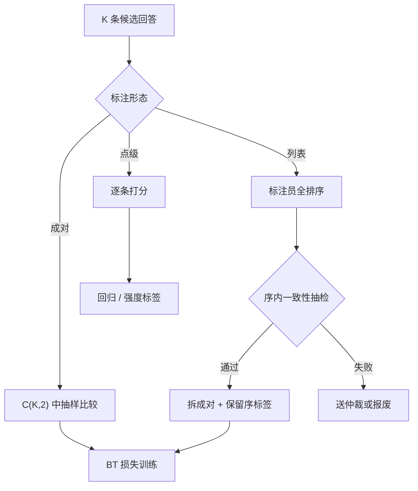
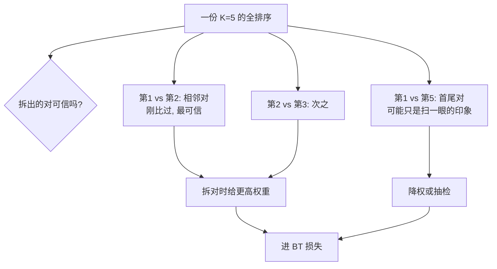

# 成对、列表与点级标注

标注形态不是界面偏好：成对、列表、点级对应三种损失、三种噪声结构与三种信息量，选错形态等于选错测量。

<footer>—— 排序学习的点级/成对/列表级分类见 Liu, Learning to Rank for IR, 2009；列表概率模型溯至 Luce 1959 与 Plackett 1975</footer>

[上一课](/llm/rm-data-mix)把各源各域的份额钉成配比矩阵，配比回答「标多少」，本课回答「怎么标」。主干已有[成对比较协议](/llm/pairwise-label-protocol)、[成对对逐点](/llm/pairwise-vs-pointwise)与 [Likert 与绝对评分](/llm/absolute-rating-prefs)，把三种形态各自介绍过；本课做深钻层的工程收拢：一次采集里怎么选形态、怎么混形态，以及列表怎么安全地拆成对。后课的一致性检验与强度标定都建立在形态选择之上。

## 问题

三种形态的本质差异在信息量与噪声的交换率。点级（Likert 打分）：单条样本信息最多，可训练回归，但绝对分数在标注员之间几乎不可校准——「4 分」对你是不错、对我是敷衍，[Likert 课](/llm/absolute-rating-prefs)已给出这个结论。成对：判断最稳，一次比较只含一比特量级的序信息，要分辨 $K$ 个候选的完整序需要 $\binom{K}{2}$ 量级的比较。列表（对 $K$ 条做全排序）：一次给出最多结构，隐含传递性假设，但标注成本与认知负荷最高，且真实偏好充满不可传递循环——A 胜 B、B 胜 C、C 胜 A 在文风比较里常见。不这么做会错在哪：把该用成对的题发成 Likert，噪声会把信号淹掉；把该用 Likert 的标度题发成成对，丢掉强度，第五课的标定就没原料。

数字实例：$K=5$ 条候选要排全序——成对形态最多要 $\binom{5}{2}=10$ 次判断，列表形态 1 次拖拽全搞定，点级 5 次独立打分。但列表的 1 次隐含了 $10$ 个对的传递性假设，只要序里有一个循环，拆出来的对就开始互相打架。

### 列表怎么拆成对

列表标注的真实用途不是直接训列表损失，而是数据增广：一份 $K$ 条的排序拆出 $\binom{K}{2}$ 个对，成本一次、成对多条。但拆对有前提——标注员给出的序要内部一致。若序里已有循环或平局，拆出的对互相矛盾，等价于人为注入翻转标签。所以采集协议要带一致性检查：拆对后抽检「序内相邻对」的标签是否仍被判为同向，不一致的整条列表报废或送仲裁（下一课的流程）。

## 方法

默认形态是成对：与 BT 损失 $\mathcal{L}=-\log\sigma(r_w-r_l)$ 直接对接，[Bradley-Terry](/llm/bradley-terry) 的概率语义让标签翻转率可以直接读成噪声上界。列表用在两个地方：一是候选天然成组的场景（Best-of-N 的 $N$ 条、同一个提示多版本），排序的边际成本低于两两比较；二是要喂强度信息时，序位置自带粗粒度强度（第五课用）。点级用在有外部锚的域：代码测试通过数、事实核对计数——一旦「分」能锚到客观量，绝对标尺就能校准，回归才有意义；纯主观域不要发 Likert。

要混形态时，统一到对层面再进损失：列表拆对、点级只在同标注员内部转序（同一人打的分可以比大小，跨人的分不能）。混采比单采贵在协议管理：每条数据要带形态标记，后续消融才知道信号来自哪种测量。

术语翻译：BT 损失就是「把两条回答的分数差喂进 sigmoid 函数」——分数差越大，赢的概率越接近 1；$\sigma(0)=0.5$ 对应完全打平。这样「标签翻转率」能直接读成噪声上界，这是成对形态与 BT 直连的工程红利。

## 机制

拆对为什么会引入额外噪声：PL 模型 $P(y_1 \text{ 排首})=\exp(r_1)/\sum_j \exp(r_j)$ 假定存在一致的潜在分。标注员真实做的是局部比较，序列末端的判断可靠性通常低于前端（注意力与记忆衰减），所以拆对时给对加权是合理的机制补偿：相邻位置的对（$1\text{ vs }2$）权重高于首尾对（$1\text{ vs }K$），后者的序更可能来自「扫一眼的印象」而不是比较。另一个机制面是支撑：列表一次锁死 $K$ 条的相对名次，序约束比独立成对更强地约束 $r$ 的尺度，这让列表数据在分数校准（衔接 [RM 校准](/llm/rm-calibration)）上格外有用。

常见误区：初学者容易把一份列表拆出的 $\binom{K}{2}$ 个对当成 $\binom{K}{2}$ 条**独立**成对数据直接混进训练集。它们共享同一次排序判断，高度相关；不分权重、不做一致性抽检地合并，等于把一次判断的噪声放大了十倍。

信息量账：二选一最多一比特；$K=5$ 的全排序从 $\binom{5}{2}=10$ 个对里挑了一个一致事件，信息更多，前提是序无循环——循环一出现，多出的比特全是矛盾的标签。

## 边界

本课的形态选择不解决标注质量问题：再稳的成对形态，标注员不看指南也是噪声，那是下一课的题。列表假设也提示了它的边界：候选差异悬殊时列表退化成「把最好的挑出来」，尾部位次的序不可信，此时只信头部拆对。点级的边界最硬：没有客观锚的域，Likert 的跨人方差不可修复，只能降级为同员内序。最后，形态影响后续一切分析的口径——一致率、翻转率、强度都要按形态分层报告，混在一起的统计等于把三种测量搅成一锅。

## 小结

- 成对是默认形态：判断最稳、与 BT 损失直连；信息量靠对数补。
- 列表用于成组候选与数据增广，拆对必须过序内一致性抽检，相邻对权重更高。
- 点级只在分数有客观锚的域使用，跨人的绝对分不可比。
- 混形态统一到对层面进损失，每条数据带形态标记。
- 出处：Liu, Learning to Rank for Information Retrieval, 2009；Luce 1959 与 Plackett 1975 的公理化排序模型。
