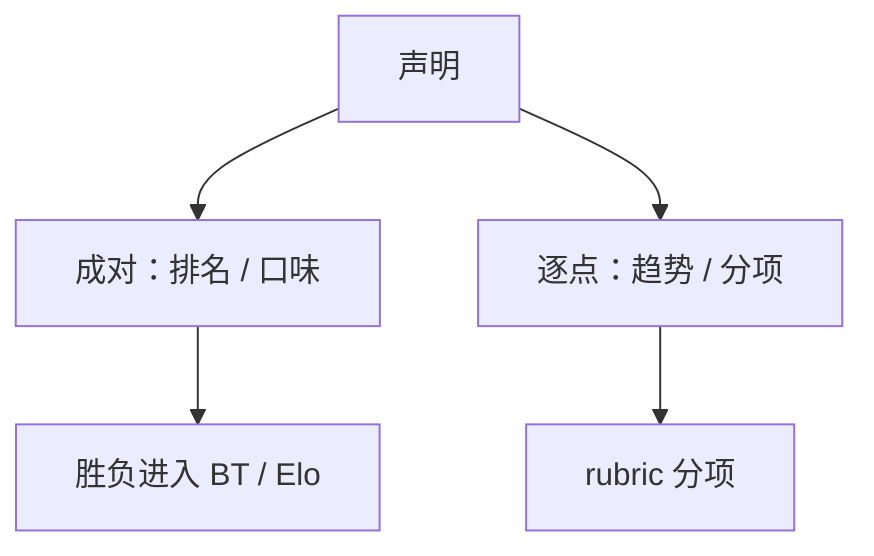

# 成对对逐点

「A 比 B 好」降低校准负担；「给 7 分」才能画趋势。两种数字回答不同的问题，不能互相换算却不声明模型。

<footer>—— 对照 Thurstone / Bradley-Terry 的成对传统，与 Likert 绝对量表</footer>

[上一课](/llm/llm-judge-bias)的偏差在成对协议里用换序处理，在逐点协议里则变成尺度漂移。本课把两种仪器分开。缺口不是再讲 Arena，而是：选成对还是逐点，先看你要排名还是要追版本。后课 Elo 默认输入已经是成对胜负。

## 问题

成对：同一提示下两条回复比一次，输出胜/负/平。标注员不必把「7 分」的含义在人之间对齐，因此众包更稳，适合口味与开放生成。[LMSYS Arena](/llm/lmsys-arena) 建立在这个选择上。代价是：没有绝对零点，不能说「这个版本 7.2 分」；新模型要和旧模型打够场次才有位置。

逐点：对单条回复打 Likert 或 rubric 分。适合看回归趋势、适合分项（事实 / 无害 / 格式）。代价是评分员漂移、尺度使用不一致、与成对胜率相关但不等于单调变换。

用逐点均值去排序模型，等于假设分数是等距的。多数 rubric 不是等距。要用成对或有序模型，不要把 1–5 当摄氏度。

## 方法

声明「谁更好」：成对，盲，随机左右。声明「这一版是否在事实项上掉了」：同一题库上的分项逐点，固定评分员池或金标锚定。混合：先逐点筛明显失败，再对边界样本成对——与人机分工课一致。

LLM 法官同样分两套提示，不要把 MT-Bench 的比分提示改几个字当 Likert 用完就发榜。

## 机制

成对比较估计的是相对效用差，绝对水平被差掉。逐点估计的是与内部尺度的距离，尺度本身会走。因此「逐点平均高的模型」在成对里仍可能输：平均分被少数极高分拉起，而成对在中位提示上更常输。报告应选与决策匹配的聚合，而不是两种都算完取好看的。

## 边界

安全危害不适合纯口味成对：漏拒一条比「文风稍差」严重得多，应用分项逐点或分级严重度。下一课把成对胜负收成 Elo / Bradley-Terry 评分。

## 小结

- 成对服务排名，逐点服务趋势与分项；不可无模型换算。
- Likert 非等距，禁止当连续分排序的唯一依据。
- 安全用严重度分级，不用口味对战。
- 出处：Bradley-Terry / Thurstone 传统；Arena 成对协议；rubric 人评实践。
